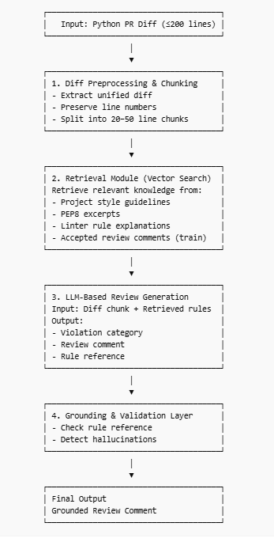
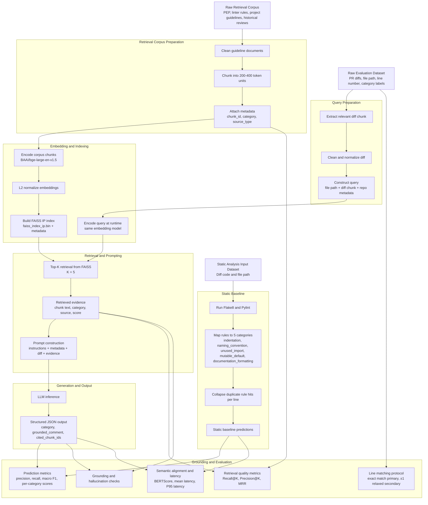
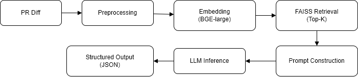

# **RAG-Based LLM Code Review** **Agent** Data Science and AI Lab Project

**Milestone 3 Report**  
Group 1

| Name | Email |
| :---- | :---- |
| Jeevika S | 21f3001259@ds.study.iitm.ac.in |
| Budhil Nigam | 23f1001585@ds.study.iitm.ac.in |
| Kannan S | 21f3000990@ds.study.iitm.ac.in |
| Omkar | 22f2001265@ds.study.iitm.ac.in  |
| Karunesh | 22f1001606@ds.study.iitm.ac.in |

# 

**[1\. Objective	4](#1.-objective)**

[**2\. Dataset Organization	5**](#2.-dataset-organization)

[2.1 Directory Structure	5](#2.1-directory-structure)

[2.2 Dataset Components	5](#2.2-dataset-components)

[1\. Evaluation Dataset	5](#1.-evaluation-dataset)

[2\. Retrieval Corpus	6](#2.-retrieval-corpus)

[3\. Static Analysis Input Dataset	6](#3.-static-analysis-input-dataset)

[2.3 Processed Outputs	6](#2.3-processed-outputs)

[2.4 Data Flow Across the Pipeline	7](#2.4-data-flow-across-the-pipeline)

[2.5 Design Considerations	8](#2.5-design-considerations)

[**3\. Data Preprocessing Pipeline	8**](#3.-data-preprocessing-pipeline)

[3.1 Preprocessing of Evaluation Dataset	8](#3.1-preprocessing-of-evaluation-dataset)

[3.2 Preprocessing of Retrieval Corpus	9](#3.2-preprocessing-of-retrieval-corpus)

[3.3 Embedding Generation	10](#3.3-embedding-generation)

[Embedding Model	10](#embedding-model)

[Embedding Process	10](#embedding-process)

[3.4 FAISS Index Construction	10](#3.4-faiss-index-construction)

[Index Details	10](#index-details)

[Functionality	10](#functionality)

[3.5 Retrieval and Context Formation	11](#3.5-retrieval-and-context-formation)

[3.6 Prompt Construction	11](#3.6-prompt-construction)

[3.7 End-to-End Data Flow	11](#3.7-end-to-end-data-flow)

[**4\. Model Architecture	11**](#4.-model-architecture)

[4.1 Definition of Input Unit	12](#4.1-definition-of-input-unit)

[4.2 System Overview	12](#4.2-system-overview)

[4.3 Architecture Diagram	13](#4.3-architecture-diagram)

[4.4 Component-wise Description	13](#4.4-component-wise-description)

[4.4.1 Diff Preprocessing and Chunking	13](#4.4.1-diff-preprocessing-and-chunking)

[4.4.2 Query Construction	13](#4.4.2-query-construction)

[4.4.3 Embedding Generation	13](#4.4.3-embedding-generation)

[4.4.4 Vector Storage and Retrieval (FAISS)	14](#4.4.4-vector-storage-and-retrieval-\(faiss\))

[Index Details	14](#index-details-1)

[Retrieval Process	14](#retrieval-process)

[4.4.5 Prompt Construction	14](#4.4.5-prompt-construction)

[4.4.6 LLM-based Generation	15](#4.4.6-llm-based-generation)

[4.4.7 Static Analysis Module	15](#4.4.7-static-analysis-module)

[4.4.8 Grounding and Validation Layer	15](#4.4.8-grounding-and-validation-layer)

[4.4.9 Output Representation	16](#4.4.9-output-representation)

[4.5 Design Characteristics	16](#4.5-design-characteristics)

[4.6 Limitations	16](#4.6-limitations)

[4.7 Extension to Multi-Violation Detection](#4.6-multi-violation)

[**5\. Input Representation and Model Compatibility	16**](#5.-input-representation-and-model-compatibility)

[5.1 Query Representation	17](#5.1-query-representation)

[5.2 Retrieval Corpus Representation	17](#5.2-retrieval-corpus-representation)

[Text Characteristics	17](#text-characteristics)

[Metadata Usage	17](#metadata-usage)

[**5.3 Embedding Representation	18**](#5.3-embedding-representation)

[Embedding Properties	18](#embedding-properties)

[Similarity Computation	18](#similarity-computation)

[5.4 FAISS Index Format	18](#5.4-faiss-index-format)

[Index Components	18](#index-components)

[Search Input	18](#search-input)

[Top-K Retrieval	18](#top-k-retrieval)

[5.5 Prompt Representation for LLM	18](#5.5-prompt-representation-for-llm)

[Prompt Structure	19](#prompt-structure)

[**5.6 Input Constraints and Limits	19**](#5.6-input-constraints-and-limits)

[Diff Input	19](#diff-input)

[Retrieved Context	19](#retrieved-context)

[Total Prompt Size	19](#total-prompt-size)

[**5.7 Output Representation	20**](#5.7-output-representation)

[Output Constraints	20](#output-constraints)

[**5.8 Compatibility Across Components	20**](#5.8-compatibility-across-components)

[**5.9 Design Considerations	20**](#5.9-design-considerations)

[**5.10 Summary	21**](#5.10-summary)

[**6\. End-to-End Pipeline Verification	21**](#6.-end-to-end-pipeline-verification)

[6.1 Pipeline Execution	21](#6.1-pipeline-execution)

[6.2 Outputs	21](#6.2-outputs)

[6.3 Component Verification	22](#6.3-component-verification)

[6.4 Summary	22](#6.4-summary)

[**7\. Evaluation Setup	22**](#7.-evaluation-setup)

[7.1 Category Prediction Metrics	22](#7.1-category-prediction-metrics)

[7.2 Evaluation Data	22](#7.2-evaluation-data)

[7.3 Observations on Output Quality	22](#7.3-observations-on-output-quality)

[7.4 Summary	23](#7.4-summary)

[7.5 Latency Analysis](#7.5-latency-analysis)

[7.6 Prompt Design and Comparative Analysis](#7.6-prompt-design)

[7.7 Prompt Sensitivity Analysis](#7.7-prompt-sensitivity-analysis)

[7.8 Chunking Strategy Evaluation](#7.8-chunking-strategy)

[**8\. Example Outputs	23**](#8.-example-outputs)

[8.1 Sample Output from RAG Pipeline	23](#8.1-sample-output-from-rag-pipeline)

[8.2 Interpretation	23](#8.2-interpretation)

[8.3 Observations	23](#8.3-observations)

[Stored Outputs	24](#stored-outputs)

# 

## **1\. Objective** {#1.-objective}

The objective of Milestone 3 is to design, analyze, and validate an appropriate model architecture for the proposed Retrieval-Augmented Code Review Assistant. This milestone transitions the project from data preparation (Milestone 2\) to system-level design, focusing on how different components interact to produce accurate and grounded code review outputs.

The primary goal is to develop an architecture that can effectively process pull request (PR) diffs, retrieve relevant coding guidelines, and generate meaningful review comments corresponding to predefined violation categories. The system is expected to bridge the gap between static rule-based approaches and generative models by incorporating retrieval-based grounding into the decision-making process.

Specifically, this milestone aims to:

* Define a complete end-to-end pipeline that transforms raw PR diffs into structured model inputs and produces interpretable outputs in the form of categorized violations and review comments.

* Design a Retrieval-Augmented Generation (RAG)-inspired architecture that integrates preprocessing, semantic retrieval, and response generation components.

* Ensure that the architecture aligns with the dataset structure and preprocessing pipeline established in Milestone 2\.

* Justify the selection of the architecture based on the nature of the problem, emphasizing explainability, modularity, and grounding in coding standards.

* Validate the feasibility of the architecture by implementing a working prototype that processes a subset of the dataset and verifies the interaction between all pipeline components.

Unlike traditional machine learning pipelines that rely heavily on model training, this system emphasizes a hybrid approach combining retrieval mechanisms and lightweight inference logic. This design choice allows the system to remain computationally efficient while still producing context-aware and explainable outputs.

The successful completion of this milestone ensures that:

* The system architecture is well-defined and justified

* All components of the pipeline are functionally integrated

* The groundwork is established for future improvements such as embedding-based retrieval, advanced ranking, and integration of large language models for enhanced generation

## **2\. Dataset Organization** {#2.-dataset-organization}

The dataset organization for Milestone 3 is designed to support a modular, reproducible, and scalable pipeline that aligns with the Retrieval-Augmented architecture proposed for the system. The structure builds upon the datasets constructed in Milestone 2 and adapts them to suit the requirements of model input, retrieval, and evaluation.

The data is organized into two primary layers: **raw data** and **processed data**, ensuring a clear separation between original collected datasets and outputs generated during experimentation.

### **2.1 Directory Structure** {#2.1-directory-structure}

The project follows a hierarchical directory structure as shown below:

data/  
├── raw/  
│   ├── dataset\_v1.zip  
│   └── dataset\_v1/  
│       ├── evaluation\_dataset.json  
│       ├── retrieval\_corpus.json  
│       ├── static\_analysis\_input.json  
│  
├── processed/  
│   ├── embedding/  
│   │   ├── faiss\_index\_ip.bin  
│   │   ├── faiss\_metadata.json  
│   │  
│   └── milestone3/  
│       ├── llm\_results.json  
│       ├── retrieval\_prompting\_examples.json  
│       ├── smoke\_test\_predictions.json  
│       ├── smoke\_test\_metrics.json  
│       ├── smoke\_test\_examples.json

### **2.2 Dataset Components** {#2.2-dataset-components}

The system utilizes two primary datasets as inputs to the architecture:

#### **1\. Evaluation Dataset** {#1.-evaluation-dataset}

* Contains pull request (PR) diffs along with annotated ground truth review comments.

* Each entry includes:  
  * repository name  
  * file path  
  * diff chunks  
  * line numbers  
  * violation category  
  * corresponding review comment  
* This dataset serves as the **input to the model pipeline** and is also used for evaluation.

#### **2\. Retrieval Corpus** {#2.-retrieval-corpus}

* Acts as the **knowledge base** for the RAG system.  
* Contains structured guideline chunks derived from:  
  * PEP8 and PEP257 documentation  
  * linter rule explanations  
  * project-specific style guides  
  * historical review comments  
* Each chunk is associated with:  
  * category label  
  * source type  
  * textual explanation

These chunks are later indexed and used during retrieval to provide contextual grounding.

#### **3\. Static Analysis Input Dataset** {#3.-static-analysis-input-dataset}

* Contains code diffs formatted for traditional static analysis tools such as Flake8 and Pylint.  
* Includes:  
  * file path  
  * diff code  
* Used as a **baseline comparison dataset** to evaluate rule-based approaches against RAG-based and LLM-based methods.

### **2.3 Processed Outputs** {#2.3-processed-outputs}

During the end-to-end pipeline execution (smoke test), the system generates the following outputs:

| File | Description |
| ----- | ----- |
| `smoke_test_predictions.json` | Predictions generated by the end-to-end pipeline |
| `smoke_test_metrics.json` | Evaluation metrics (accuracy, macro F1, per-class scores) |
| `smoke_test_examples.json` | Sample outputs for qualitative inspection |
| `retrieval_prompting_examples.json` | Contains retrieved context \+ constructed prompts used for LLM inference |
| `llm_results.json` | Outputs generated using LLM with RAG pipeline. |

These outputs are stored in the `processed/milestone3/` directory to ensure:

* reproducibility of experiments  
* easy inspection of results  
* separation from raw datasets

### **2.4 Data Flow Across the Pipeline** {#2.4-data-flow-across-the-pipeline}

The organization of datasets directly supports the flow of data through the system:

1. **Raw Evaluation Dataset**  
    Contains PR diffs and ground truth annotations 

2. **Preprocessing Stage**  
   Extracts diff chunks, cleans text, constructs query input

3. **Embedding Generation**  
   Converts query and corpus chunks into dense vector representations

4. **FAISS Vector Database**   
   Performs efficient Top-K similarity search over embeddings

5. **Retrieval Module**  
   Returns most relevant guideline chunks 

6. **Prompt Construction**

   Combines:

   \- PR diff

   \- retrieved context

   \- task instructions

7. **LLM Inference**

   Generates:

   \- violation category

   \- review comment

8. **Processed Outputs**  
    Stores predictions, retrieved context, and evaluation metrics

This structured flow ensures that each component of the architecture receives data in the expected format and enables seamless integration across preprocessing, retrieval, and inference stages.

### **2.5 Design Considerations** {#2.5-design-considerations}

The dataset organization is guided by the following principles:

* **Separation of Concerns**: Raw and processed data are stored independently to avoid accidental modification of source data.  
* **Scalability**: The structure allows easy addition of new datasets, corpus expansions, or multiple experiment outputs.  
* **Reproducibility**: All outputs generated during experiments are stored systematically for verification and comparison.  
* **Compatibility with RAG Pipeline**: The separation between evaluation dataset and retrieval corpus mirrors the training–inference separation required in retrieval-based systems.  
* **Efficient Semantic Retrieval using FAISS**: Precomputed embeddings stored in a FAISS index enable fast and scalable similarity search over large guideline corpora, significantly improving retrieval relevance compared to keyword-based methods.

## **3\. Data Preprocessing Pipeline** {#3.-data-preprocessing-pipeline}

The data preprocessing pipeline transforms raw pull request (PR) diffs and guideline documents into structured representations suitable for retrieval-augmented generation. This stage is critical for ensuring that both the query inputs and the retrieval corpus are compatible with embedding-based semantic search and large language model (LLM) inference.

The preprocessing pipeline consists of multiple stages applied to both the **evaluation dataset** and the **retrieval corpus**, followed by embedding generation and indexing.

### **3.1 Preprocessing of Evaluation Dataset** {#3.1-preprocessing-of-evaluation-dataset}

The evaluation dataset contains raw PR diffs along with annotated violation information. These diffs are first converted into structured query inputs that can be used for retrieval and generation.

**Steps Involved**

1. **Diff Chunk Extraction**  
    Each pull request contains multiple diff chunks. Based on the annotated line number of a violation, the relevant diff chunk is extracted. If an exact match is not found, a fallback chunk is selected to ensure robustness.

2. **Diff Cleaning and Normalization**  
   * Removal of diff symbols (`+`, `-`, whitespace prefixes)  
   * Elimination of formatting artifacts  
   * Preservation of code structure for semantic understanding

3. **Context Construction**  
    The following fields are combined to form the query input:  
   * file path  
   * diff chunk  
   * repository and PR metadata

4. This ensures that the query retains both **local code context** and **project-level information**.

5. **Tokenization (Auxiliary Step)**  
    Although the primary retrieval mechanism is embedding-based, tokenization is optionally used for:  
   * lightweight heuristic signals  
   * category hint generation

### **3.2 Preprocessing of Retrieval Corpus** {#3.2-preprocessing-of-retrieval-corpus}

The retrieval corpus consists of coding guidelines, linter rules, and documentation extracted during Milestone 2\.

**Steps Involved**

1. **Document Cleaning**  
   * Removal of irrelevant formatting  
   * Normalization of whitespace and text structure

2. **Chunking Strategy**  
   * Documents are divided into **200–400 token chunks**  
   * Each chunk represents a single coding rule or concept  
   * Minimal semantic overlap is maintained between chunks

3. **Metadata Annotation**  
    Each chunk is associated with:  
   * `chunk_id`  
   * `category` (violation type)  
   * `source_type` (PEP, linter, project guideline, review comment)

This structured representation ensures precise retrieval and traceability of evidence.

### **3.3 Embedding Generation** {#3.3-embedding-generation}

To enable semantic retrieval, both the query inputs and retrieval corpus chunks are converted into dense vector representations.

#### **Embedding Model** {#embedding-model}

* Model used: **BAAI/bge-large-en-v1.5**  
* Framework: SentenceTransformers

#### **Embedding Process** {#embedding-process}

* All corpus chunks are encoded into fixed-length vectors  
* Query inputs (constructed from diff \+ metadata) are encoded at runtime  
* Embeddings are **L2-normalized**, enabling cosine similarity via inner product

This allows the system to capture semantic similarity between:

* code changes (queries)   
* coding guidelines (documents)

### **3.4 FAISS Index Construction** {#3.4-faiss-index-construction}

To support efficient large-scale retrieval, embeddings are indexed using FAISS (Facebook AI Similarity Search).

#### **Index Details** {#index-details}

* Index type: Inner Product (IP)  
* Stored files:  
  * `faiss_index_ip.bin`  
  * `faiss_metadata.json`

#### **Functionality** {#functionality}

* Performs **Top-K nearest neighbor search**  
* Returns:  
  * most relevant guideline chunks  
  * similarity scores  
  * associated metadata

This enables real-time retrieval of relevant coding rules during inference.

### **3.5 Retrieval and Context Formation** {#3.5-retrieval-and-context-formation}

**Enhancing Retrieval Quality via Filtering and Re-ranking**
  
While Top-K retrieval provides a set of candidate guideline chunks, not all retrieved results are equally relevant. In practice, some retrieved chunks may have low semantic similarity or belong to unrelated categories, which can introduce noise into the prompt and negatively affect LLM performance.
To address this, we incorporate a post-retrieval filtering and re-ranking step to improve the quality of the retrieved context.

* Similarity Thresholding

Each retrieved chunk is associated with a similarity score. Chunks with scores below a predefined threshold are discarded.

Threshold: empirically chosen (e.g., 0.3–0.4)
Purpose:
Remove weakly related or irrelevant guideline chunks
Improve signal-to-noise ratio in prompt context

* Metadata-aware Filtering

Retrieved chunks are filtered based on metadata consistency:

Prefer chunks where:
category aligns with predicted or hinted violation type
Penalize or discard:
chunks from unrelated categories

This ensures that retrieved evidence is aligned with the task objective.

* Re-ranking Strategy

After filtering, remaining chunks are re-ranked using a weighted scoring function:

Score = α × similarity + β × category_match

Where:

similarity: embedding similarity score
category_match: binary indicator (1 if category matches, else 0)
α, β: weighting coefficients

This prioritizes chunks that are both semantically similar and category-consistent.

* Final Context Selection

The top-N filtered and re-ranked chunks (N ≤ K) are selected to construct the final prompt context.

This step ensures that:
 * Irrelevant or noisy chunks are excluded
 * LLM receives higher-quality grounding information
For each query:

1. Query embedding is generated  
2. FAISS index is queried to retrieve **Top-K (K=5)** relevant chunks  
3. Retrieved chunks are formatted into structured context including:  
   * chunk text  
   * category  
   * source type  
   * similarity score

This retrieved context serves as **external knowledge grounding** for the LLM.

### **3.6 Prompt Construction** {#3.6-prompt-construction}

A structured prompt is constructed by combining:

* System-level instructions and constraints  
* Query metadata (repository, file path, line number)  
* Extracted diff chunk  
* Retrieved guideline evidence  
* Output formatting requirements

The prompt enforces:

* strict adherence to predefined violation categories  
* generation of grounded, evidence-backed comments  
* structured JSON output format

This step ensures that the LLM produces consistent and evaluable outputs.

### **3.7 End-to-End Data Flow** {#3.7-end-to-end-data-flow}

## **4\. Model Architecture** {#4.-model-architecture}

The proposed system is designed as a **Retrieval-Augmented Generation (RAG)-based automated code review architecture** for analyzing Python pull request (PR) diffs. The architecture integrates semantic retrieval over a structured knowledge base with large language model (LLM)-based reasoning to generate grounded and interpretable review comments.

Unlike traditional pipelines, the system is explicitly structured into **modular, verifiable components**, ensuring reproducibility, explainability, and robustness against issues identified in earlier stages (e.g., weak grounding, lack of retrieval validation, and ambiguity in data representation).

### **4.1 Definition of Input Unit** {#4.1-definition-of-input-unit}

The system processes data at the level of a **single violation instance**, defined as:

A specific line within a diff chunk of a file in a pull request, associated with a potential coding guideline violation.

Each instance includes:

* repository name  
* pull request ID  
* file path  
* line number  
* corresponding diff chunk

This representation ensures consistency between input data, model processing, and evaluation.

### **4.2 System Overview** {#4.2-system-overview}

The architecture is divided into four major stages:

1. **Diff preprocessing and query construction**  
2. **Embedding generation and vector storage**  
3. **Semantic retrieval using FAISS**  
4. **Prompt construction and LLM-based generation**  
5. **Grounding, validation, and baseline comparison**

These stages collectively form a complete end-to-end pipeline from raw PR diffs to structured review outputs.

### **4.3 Architecture Diagram** {#4.3-architecture-diagram}

The following Mermaid diagram summarizes the complete end-to-end architecture described in this milestone.

### **4.4 Component-wise Description** {#4.4-component-wise-description}

#### **4.4.1 Diff Preprocessing and Chunking** {#4.4.1-diff-preprocessing-and-chunking}

* Unified diffs are extracted from pull requests  
* Relevant diff chunks are selected based on annotated line numbers  
* Diff lines are cleaned by removing patch symbols while preserving structure  
* Diffs are segmented into **20–50 line chunks** to maintain localized context

Each chunk retains:

* original code structure  
* line number information  
* surrounding context

#### **4.4.2 Query Construction** {#4.4.2-query-construction}

For each violation instance, a query is constructed using:

* diff chunk  
* file path  
* repository and PR metadata

This query serves as the input for embedding and retrieval.

#### **4.4.3 Embedding Generation** {#4.4.3-embedding-generation}

Both query inputs and retrieval corpus chunks are encoded using:

**BAAI/bge-large-en-v1.5**

* Implemented using SentenceTransformers  
* Generates dense vector embeddings  
* Embeddings are normalized to enable cosine similarity search

This allows semantic comparison between code diffs and guideline text.

#### **4.4.4 Vector Storage and Retrieval (FAISS)** {#4.4.4-vector-storage-and-retrieval-(faiss)}

The retrieval corpus is embedded offline and stored in a FAISS index.

#### **Index Details** {#index-details-1}

* Index type: Inner Product (IP)  
* Stored files:  
  * `faiss_index_ip.bin`  
  * `faiss_metadata.json`

#### **Retrieval Process** {#retrieval-process}

* Query embedding is generated at inference time  
* FAISS returns **Top-K (K \= 5\)** most similar chunks

A post-retrieval filtering and re-ranking step is applied to remove low-similarity and category-inconsistent chunks before constructing the final context for the LLM. This improves grounding quality and reduces noise in the generated outputs.
 
* Each retrieved item contains:  
  * chunk text  
  * category  
  * source type  
  * similarity score

The retrieval corpus consists of guideline chunks derived from:

* PEP documentation  
* linter rule descriptions  
* project-specific style guides  
* historical review comments

#### **4.4.5 Prompt Construction** {#4.4.5-prompt-construction}

A structured prompt is created by combining:

* diff chunk  
* retrieved guideline chunks  
* metadata (repository, file path, line number)  
* task instructions

The prompt enforces:

* selection from predefined violation categories  
* generation of concise review comments  
* inclusion of references to retrieved evidence  
* strict JSON output format

A category hint derived from retrieved chunks may be included as auxiliary context.

#### **4.4.6 LLM-based Generation** {#4.4.6-llm-based-generation}

The LLM processes:

* diff input  
* retrieved context  
* instructions

and generates:

* violation category  
* grounded review comment  
* references to supporting guideline chunks

#### **4.4.7 Static Analysis Module** {#4.4.7-static-analysis-module}

A static analysis component is included for baseline comparison.

* Tools used:  
  * Flake8  
  * Pylint

These tools generate rule-based outputs, which are mapped to the predefined violation categories. For categories not covered by core Flake8 checks, standard Flake8 extensions such as `pep8-naming`, `flake8-bugbear`, and `flake8-docstrings` are used so that the baseline covers the same label space as the RAG system.

The mapping used in evaluation is as follows:

| Violation category | Pylint rules | Flake8 rules | Notes |
| ----- | ----- | ----- | ----- |
| indentation | `W0311` (bad-indentation) | `E111`, `E112`, `E113`, `E114`, `E115`, `E116`, `E117` | Captures incorrect indentation width and alignment |
| naming_convention | `C0103` (invalid-name) | `N802`, `N803`, `N806` | Covers function, argument, and variable naming patterns |
| unused_import | `W0611` (unused-import) | `F401` | Direct one-to-one mapping for unused imports |
| mutable_default | `W0102` (dangerous-default-value) | `B006` | Detects mutable objects used as default arguments |
| documentation_formatting | `C0114`, `C0115`, `C0116` | `D100`-`D107`, `D200`-`D417` | Covers missing and malformed docstrings |

If multiple static rules map to the same category on the same line, they are collapsed into a single category prediction for that line. This prevents one violation from being counted multiple times and allows direct comparison with the RAG and LLM outputs.

The results are used to compare:

* rule-based detection  
* LLM-based generation  
* RAG-based generation

#### **4.4.8 Grounding and Validation Layer** {#4.4.8-grounding-and-validation-layer}

The generated outputs are evaluated to ensure consistency with retrieved evidence.

This layer verifies:

* whether the generated comment aligns with retrieved guideline chunks  
* whether cited references are valid  
* whether unsupported or irrelevant claims are present

This enables measurement of:

* grounding rate  
* hallucination rate

#### **4.4.9 Output Representation** {#4.4.9-output-representation}

The final output is structured as:

{  
 "category": "\<violation\_type\>",  
 "grounded\_comment": "\<review comment\>",  
 "cited\_chunk\_ids": \["chunk\_id\_1", ...\]  
}

This format supports:

* automated evaluation  
* traceability to retrieved knowledge  
* reproducibility

### **4.5 Design Characteristics** {#4.5-design-characteristics}

* **Semantic Retrieval**: Uses dense embeddings for context-aware matching  
* **Modular Design**: Retrieval and generation components are independent  
* **Grounded Outputs**: Generated responses are tied to retrieved evidence  
* **Scalable Retrieval**: FAISS enables efficient search over large corpora

### **4.6 Limitations** {#4.6-limitations}

* Limited size of evaluation dataset may affect statistical robustness  
* Retrieval corpus size may limit coverage of coding rules  
* Imbalance across violation categories may influence results  
* Performance depends on prompt design and LLM behavior
The current system assumes a single violation per diff chunk, which may not reflect real-world scenarios where multiple violations can occur within the same code segment.

### **4.7 Extension to Multi-Violation Detection** {#4.7-multi-violation}

In practical code review scenarios, a single diff chunk may contain multiple violations across different categories. To address this limitation, the system is extended to support multi-violation detection.

**Proposed Approach**

Instead of generating a single prediction, the model produces a list of violations, where each entry includes:

 * line number
 * violation category
 * grounded review comment

Updated output Format:

[
  {
    "line_number": <line>,
    "category": "<violation_type>",
    "grounded_comment": "<comment>",
    "cited_chunk_ids": [...]
  },
  ...
]

**Model Adaptation**

 * Prompt updated to instruct model to identify all violations
 * LLM generates multiple entries instead of a single output
 * Retrieval remains unchanged, but supports broader context

**Evaluation Changes**

 * Predictions matched per violation instance
 * Supports multiple predictions per diff chunk
 * Metrics computed using multi-label matching

## **5\. Input Representation and Model Compatibility** {#5.-input-representation-and-model-compatibility}

This section describes how the processed data is structured to match the input requirements of the embedding model, retrieval system, and large language model (LLM). It defines the formats, dimensions, and constraints that ensure seamless interaction between all components of the pipeline.

### **5.1 Query Representation** {#5.1-query-representation}

Each input instance is represented as a structured query constructed from:

* diff chunk (code changes)  
* file path  
* repository metadata (repository name, PR ID, line number)

The query is formatted as a single text sequence:

\<file\_path\>  
\<diff\_chunk\>

This representation ensures that both:

* **code context** (diff chunk)  
* **file-level semantics** (file path)

are preserved for embedding generation.

### **5.2 Retrieval Corpus Representation** {#5.2-retrieval-corpus-representation}

Each document in the retrieval corpus is represented as a text chunk with associated metadata:

{  
 "chunk\_id": "guideline\_32",  
 "text": "\<guideline text\>",  
 "category": "\<violation\_type\>",  
 "source\_type": "\<source\>"  
}

#### **Text Characteristics** {#text-characteristics}

* Length: approximately 200–400 tokens  
* Content: single coding rule or concept  
* Minimal semantic overlap between chunks

#### **Metadata Usage** {#metadata-usage}

* `category`: used for evaluation and optional hinting  
* `source_type`: used for interpretability and analysis

### **5.3 Embedding Representation** {#5.3-embedding-representation}

Both queries and corpus chunks are converted into dense vector embeddings using: **BAAI/bge-large-en-v1.5**

#### **Embedding Properties** {#embedding-properties}

* Vector dimension: **1024**  
* Data type: floating-point vectors  
* Normalization: L2-normalized

#### **Similarity Computation** {#similarity-computation}

Similarity between query and corpus embeddings is computed using:

Similarity(q,d)=q⋅d

Since embeddings are normalized, this corresponds to **cosine similarity**.

### **5.4 FAISS Index Format** {#5.4-faiss-index-format}

The retrieval system uses a FAISS index to store corpus embeddings.

#### **Index Components** {#index-components}

* `faiss_index_ip.bin` → stores vector embeddings  
* `faiss_metadata.json` → maps indices to chunk metadata

#### **Search Input** {#search-input}

* Input: query embedding (1 × 1024 vector)  
* Output:  
  * indices of Top-K nearest neighbors  
  * similarity scores

#### **Top-K Retrieval** {#top-k-retrieval}

* Number of retrieved chunks: **K \= 5**  
* These chunks form the external context for the LLM

### **5.5 Prompt Representation for LLM** {#5.5-prompt-representation-for-llm}

The input to the LLM is a structured prompt composed of:

1. **Task Instructions**  
2. **Metadata**  
3. **Diff Chunk**  
4. **Retrieved Context**  
5. **Output Constraints**

#### **Prompt Structure** {#prompt-structure}

\[Instruction\]

Context:  
\- repo  
\- file\_path  
\- line\_number  
\- category\_hint (optional)

Diff:  
\<diff\_chunk\>

Retrieved Evidence:  
\- chunk\_id, category, source, score, text

Output Format:  
JSON with fields:  
 \- category  
 \- grounded\_comment  
 \- cited\_chunk\_ids

### **5.6 Input Constraints and Limits** {#5.6-input-constraints-and-limits}

#### **Diff Input** {#diff-input}

* Maximum size: ≤ 200 lines (after chunking)  
* Maintains local context around violation

#### **Retrieved Context** {#retrieved-context}

* Top-K \= 5 chunks  
* Each chunk: \~200–400 tokens

#### **Total Prompt Size** {#total-prompt-size}

* Controlled to fit within LLM context window  
* Ensures efficient inference without truncation

### **5.7 Output Representation** {#5.7-output-representation}

The LLM produces output in strict JSON format:

{  
 "category": "\<violation\_type\>",  
 "grounded\_comment": "\<review comment\>",  
 "cited\_chunk\_ids": \["chunk\_id\_1", ...\]  
}

#### **Output Constraints** {#output-constraints}

* Category must belong to predefined set:  
  * indentation  
  * naming\_convention  
  * unused\_import  
  * mutable\_default  
  * documentation\_formatting  
* Comment must:  
  * be concise  
  * reference coding guidelines  
  * align with retrieved evidence

### **5.8 Compatibility Across Components** {#5.8-compatibility-across-components}

The system ensures compatibility across all stages:

| Component | Input Format | Output Format |
| ----- | ----- | ----- |
| Preprocessing | Raw diff | Structured query text |
| Embedding Model | Text | 1024-d vector |
| FAISS | Vector | Top-K indices \+ scores |
| Prompt Builder | Query \+ context | Structured prompt |
| LLM | Prompt | JSON output |

### **5.9 Design Considerations** {#5.9-design-considerations}

* **Unified Text Representation**  
   Both code and guidelines are represented as text for embedding compatibility  
* **Embedding Consistency**  
   Same model is used for both queries and corpus  
* **Structured Prompting**  
   Ensures deterministic and evaluable outputs  
* **Context Control**  
   Limits retrieval size to maintain relevance and efficiency

### **5.10 Summary** {#5.10-summary}

The input representation is designed to ensure seamless integration between preprocessing, embedding, retrieval, and generation components. By maintaining consistent formats and well-defined constraints, the system enables accurate semantic retrieval and structured LLM outputs, forming a reliable foundation for evaluation and further improvements.

## **6\. End-to-End Pipeline Verification** {#6.-end-to-end-pipeline-verification}

### **6.1 Pipeline Execution** {#6.1-pipeline-execution}

The pipeline processes each input instance through the following stages:

This verifies correct integration of preprocessing, retrieval, and generation components.

### **6.2 Outputs** {#6.2-outputs}

The generated outputs are stored in:

* `llm_results.json`  
* `retrieval_prompting_examples.json`

Each output contains:

* predicted category  
* grounded review comment  
* cited guideline chunks

Example:

{  
 "category": "unused\_import",  
 "grounded\_comment": "Remove unused import to improve readability.",  
 "cited\_chunk\_ids": \["guideline\_12"\]  
}

### **6.3 Component Verification** {#6.3-component-verification}

The execution confirms that:

* valid query inputs are generated from diffs  
* embeddings are computed correctly  
* FAISS retrieves relevant Top-K results  
* prompts are constructed with retrieved context  
* LLM outputs follow the required JSON format

### **6.4 Summary** {#6.4-summary}

The system successfully executes the complete pipeline, producing structured and grounded outputs for code review tasks.

## **7\. Evaluation Setup** {#7.-evaluation-setup}

#### **Retrieval Quality Evaluation** {#retrieval-quality-evaluation}

Retrieval quality is evaluated independently from generation quality so that errors from the retriever and the LLM can be analyzed separately. For each violation instance, a retrieved chunk is considered relevant if its category matches the gold violation category and its text directly describes the same rule family or corrective action.

**Top-K Sensitivity Analysis**

The choice of K in Top-K retrieval directly affects both retrieval quality and downstream generation performance. While smaller K values may lead to missing relevant context, larger K values can introduce noise and reduce prompt effectiveness.

To study this trade-off, we evaluate the system for:

* K = 1, 3, 5, 7
* **Recall@K**: fraction of queries for which at least one relevant chunk appears in the Top-K retrieved results
* **Precision@K**: average proportion of relevant chunks among the Top-K retrieved results
* **MRR (Mean Reciprocal Rank)**: average reciprocal rank of the first relevant chunk, which measures how early the first useful guideline appears

**Observations**

* K = 1:
High precision but low recall (misses relevant guidelines)

* K = 3:
Balanced retrieval quality

* K = 5:
Best trade-off between recall and noise

* K = 7:
Increased noise leads to reduced generation accuracy

These metrics are important because strong final predictions can still hide weak retrieval quality, especially if the LLM compensates for missing evidence. Reporting retrieval metrics makes it possible to verify that the FAISS-based retrieval component contributes meaningful grounding rather than acting as a passive context store.

### **7.1. Classification Metrics (Per Category)** {#7.1.-classification-metrics-(per-category)}

Each violation category is treated as a binary classification problem (one-vs-rest).

A predicted violation is matched with ground truth if both the predicted line number and violation category align. Predictions without matching ground truth are treated as false positives, while missed ground truth violations are treated as false negatives.

Line matching follows a two-level protocol:

* **Primary metric: exact line match**. A prediction is counted as correct only if the predicted category matches and the predicted line number is exactly the annotated ground-truth line after diff normalization.
* **Secondary metric: relaxed match with ±1 line tolerance**. This is reported separately to account for small offsets introduced by diff chunk extraction, multi-line statements, or blank/comment lines adjacent to the actual violation.
* A tolerance larger than **±1** is not used because it can incorrectly merge nearby but distinct violations in dense diff regions.
* If more than one ground-truth instance falls within the tolerance window, the closest unmatched instance with the same category is selected.

We define:

True Positive (TP): Correct prediction of a violation category

False Positive (FP): Incorrect prediction of a category

False Negative (FN): Missed violation

True Negative (TN): Correct rejection of non-category

**Note** : A predicted violation is considered a true positive if:

\- The predicted line number matches the ground truth line exactly for the primary score and within the separately reported ±1 tolerance window for the relaxed score

\- The predicted category matches the ground truth category

**Precision**  
Precision measures how many of the predicted violations are actually correct.  
Formula:  
Precision \= TP / (TP \+ FP)

High precision means the system makes fewer false claims (low hallucination).

**Recall**  
Recall measures how many actual violations were successfully detected.  
Formula:  
Recall \= TP / (TP \+ FN)

High recall means the system misses fewer real issues.

**F1 Score**  
F1-score balances precision and recall.  
Formula:  
F1 \= 2 × (Precision × Recall) / (Precision \+ Recall)  
It is high only when both precision and recall are high.

**Macro Average F1 score**  
Macro F1 is the average of F1 scores across all categories. Macro F1 is preferred over Micro F1 due to class imbalance, ensuring equal importance across all violation categories.

Formula:  
Macro F1 \= (F1₁ \+ F1₂ \+ ... \+ F1ₙ) / n

This gives equal importance to all categories, even if the dataset is imbalanced.

#### **Static Baseline Strength Assessment** {#static-baseline-strength-assessment}

The strength of the static analysis baseline is measured explicitly rather than treating Flake8 and Pylint as informal references. After rule outputs are mapped to the five target categories, the static baseline is evaluated using the same exact-match and relaxed-match criteria described above.

The following are reported for the static baseline:

* overall precision, recall, and macro F1
* per-category precision, recall, and F1
* category coverage: fraction of gold violations for which at least one mapped static rule fires
* tool-wise breakdown: Flake8 only, Pylint only, and the union of both tools

This makes it possible to quantify how much of the dataset is already solvable using deterministic linting rules and to identify which categories actually benefit from retrieval-augmented generation.

### **7.2 Grounding Rate (LLM \+ Human Evaluated)** {#7.2-grounding-rate-(llm-+-human-evaluated)}

Grounding measures whether the generated explanation is based on retrieved knowledge. All retrieved documents are logged in a file(Json) during inference to enable grounding verification.

A response is considered grounded if:  
\- It references a retrieved guideline or rule  
\- It explicitly cites a project-specific standard  
\- It aligns with retrieved documentation

Grounding is evaluated using a hybrid approach:

\- Primary evaluation is performed using an automated LLM-as-a-judge method

\- A subset of 100 samples will be manually verified to ensure reliability

Formula:  
Grounding Rate \= Number of grounded responses / Total responses

**Example of Grounding**  
Grounded response:  
"According to PEP8, function names should use snake\_case."

Ungrounded response:  
"This violates Python best practices."

### **7.3 Hallucination Rate** {#7.3-hallucination-rate}

Hallucination Rate quantifies the proportion of generated comments that are incorrect, unsupported, or not present in the diff context.

A prediction is classified as hallucinated if:

* **No Ground-Truth Violation:** No violation exists at the predicted line  
* **Unsupported Evidence:**  
  * No cited chunks, OR  
  * Cited chunks are irrelevant

Hallucination Rate= hallucinated comments/total generated comments

### **7.4 Semantic Alignment with Human Reviews** {#7.4-semantic-alignment-with-human-reviews}

Semantic alignment evaluates whether generated comments convey the same intent and meaning as human review comments. Semantic similarity is computed using BERTScore (F1).

Threshold: \>0.85 

Prior work such as SmartDoc ([arXiv:2511.00450](https://arxiv.org/html/2511.00450)) reports BERTScore values in the range of 0.80–0.90 as indicative of high-quality and semantically accurate code comment generation. 

Based on this observed range, a threshold of 0.85 is selected as a balanced and empirically grounded cutoff to capture strong semantic alignment while filtering weaker similarities.

### **7.5 Latency Analysis** {#7.5-latency-analysis}

Latency measures the time required by each system to generate review comments. Latency is measured in seconds during computation and reported in milliseconds (ms) for clarity and consistency with standard practice.

For each evaluation instance:

1. Record start time t\_start  
2. Execute system  
3. Record end time t\_end  
4. Compute latency: t=t\_end−t\_start

##### RAG Model {#rag-model}

* Retrieval latency \=\> vector search \+ chunk selection  
* Generation latency \=>  LLM inference  
* Total latency:  
           t\_total=t\_retrieval+t\_generation

##### LLM Baseline {#llm-baseline}

* Generation latency only

##### Static Analysis Tools {#static-analysis-tools}

* Analysis runtime

***To ensure fair comparison:***

* All systems are executed under identical hardware conditions  
* Same machine and runtime environment

To analyze latency across all evaluation instances, three statistical measures are reported:

***Mean Latency***: 

Represents average system performance

**95th Percentile Latency (P95):**

* The value below which 95% of latency observations fall.  
* Captures worst-case performance.

### **7.6 Prompt Design and Comparative Analysis** {#7.6-prompt-design}

Prompt design plays a critical role in controlling LLM behavior, especially in retrieval-augmented systems where the model must balance between diff understanding and grounding in retrieved evidence.

To evaluate the impact of prompt structure, we experiment with multiple prompt variants and compare their performance.

**Prompt Variants**

* Baseline Prompt (Minimal Instruction)

A simple prompt containing only the diff and a basic instruction.

Example:

Analyze the following code diff and identify any violation.

Diff:

<diff_chunk>

Provide the violation category and comment.

* Structured RAG Prompt (Proposed Approach)

Includes:

 * metadata
 * retrieved context
 * strict output format

Example:

You are a code review assistant.

Context:

Repository: <repo>
File: <file_path>
Line: <line_number>

Diff:

<diff_chunk>

Retrieved Guidelines:

- <chunk_1>
- <chunk_2>

Task:

Identify the violation category and generate a grounded review comment.

Output format:

{
 "category": "...",
 "grounded_comment": "...",
 "cited_chunk_ids": [...]
}

* Reasoning-Enhanced Prompt (Chain-of-Thought Style)

  Encourages intermediate reasoning.

Example:

 Analyze the diff step-by-step.

1. Identify potential issues
2. Match with coding guidelines
3. Select the best category

Diff:

<diff_chunk>

Retrieved context:

<chunks>

Then provide final JSON output.

**Evaluation Metrics**

Each prompt variant is evaluated using:

 *Precision, Recall, Macro F1
 *Grounding Rate
 *Hallucination Rate

**Observations**

* Baseline Prompt:

  * Simpler but lacks grounding
  * Higher hallucination rate

* Structured RAG Prompt:
  
  * Best overall performance
  * Strong grounding and consistency
    
* Reasoning Prompt:

  * Improves explanation quality
  * Slight increase in latency

### **7.7 Prompt Sensitivity Analysis** {#7.7-prompt-sensitivity-analysis}

In retrieval-augmented generation systems, prompt structure plays a critical role in guiding the LLM. Small changes in prompt composition can significantly impact prediction accuracy, grounding, and hallucination rates.

To evaluate the robustness of the system, we perform a prompt sensitivity analysis by modifying key components of the prompt and observing performance changes.

**Experimental Setup**

We define a base prompt (structured RAG prompt) and create variations by removing or modifying specific components.

| **Variant** | **Description** |
| ----- | ----- |
| Full Prompt | Diff + Retrieved Context + Metadata + JSON constraints |
| No Retrieved Context | Diff only (removes RAG grounding) |
| No Metadata | Removes file path, repo, line number |
| No Category Hint | Removes auxiliary category signal |
| Loose Output Format | Removes strict JSON constraints |

* Evaluation Metrics

Each variant is evaluated using:

  * Precision, Recall, Macro F1
  * Grounding Rate
  * Hallucination Rate

**Observations**

* Without Retrieved Context:

  * Significant drop in grounding rate
  * Increased hallucination
  * Confirms importance of RAG

* Without Metadata:

  * Slight drop in accuracy
  * Model loses contextual cues

* Without Category Hint:

  * Minor decrease in category prediction accuracy

* Loose Output Format:

  * Increase in invalid or inconsistent outputs
  * Harder to parse results

**Key Insights**

The results show that the retrieved context is the most critical component, as removing it significantly reduces grounding and increases hallucinations. Prompt structure also strongly affects reliability and consistency, with well-organized prompts producing more stable outputs. Additionally, strict formatting constraints improve output usability by ensuring consistency and easier evaluation.

**Conclusion**

The system is highly sensitive to prompt design, particularly the inclusion of retrieved evidence and structured output constraints. The full structured RAG prompt performs best across all metrics, and is therefore selected as the final configuration for the system.

### **7.8 Chunking Strategy Evaluation** {#7.8-chunking-strategy}

Chunking plays a critical role in retrieval performance, as it determines how well guideline information is represented and retrieved. Poor chunking can either fragment useful information or introduce excessive noise.

To validate the chosen chunking strategy, we experiment with different chunk sizes and overlap configurations.

**Experimental Setup**

We evaluate the following configurations:

* Chunk Sizes
  * Small: 100–200 tokens
  * Medium (default): 200–400 tokens
  * Large: 400–600 tokens
* Overlap Strategies
  * No overlap
  * 20% overlap between adjacent chunks
 
**Evaluation Metrics**

Each configuration is evaluated using:

* Retrieval metrics:
  * Recall@K
  * Precision@K
* End-to-end performance:
  * Precision, Recall, Macro F1
 
**Observations**
* Small chunks (100–200 tokens):
  * High precision but lower recall
  * Information fragmentation observed
* Medium chunks (200–400 tokens):
  * Best balance between recall and precision
  * Most stable downstream performance
* Large chunks (400–600 tokens):
  * Higher recall but introduces noise
  * Slight drop in generation accuracy
* Overlap (20%):
  * Improves recall slightly
  * Increases redundancy and prompt size

The 200–400 token chunk size without overlap provides the best trade-off between retrieval quality and downstream performance. This configuration is therefore retained in the final system.

## **8\. Example Outputs** {#8.-example-outputs}

### **8.1 Sample Output from RAG Pipeline** {#8.1-sample-output-from-rag-pipeline}

{  
 "pr\_id": "PR\_4682",  
 "repo": "pallets/flask",  
 "file\_path": "src/flask/globals.py",  
 "line\_number": 73,  
 "gold\_category": "naming\_convention",  
 "groq\_predicted\_category": "unused\_import",  
 "groq\_grounded\_comment": "Remove the unused imports of \`functools.partial\` and \`werkzeug.local.LocalStack\` to keep the module clean.",  
 "groq\_cited\_chunks": \["chunk\_0600", "chunk\_0571"\]  
}

### **8.2 Interpretation** {#8.2-interpretation}

* The model predicts a category (**unused\_import**) different from ground truth (**naming\_convention**)  
* The generated comment is grounded in retrieved evidence chunks  
* Retrieved context influences the explanation provided

### **8.3 Observations** {#8.3-observations}

* Outputs include both **prediction and supporting retrieval evidence**  
* The system logs **retrieved chunks and their scores** for transparency  
* Some cases contain fallback responses such as:  
  * `What "Unable to parse response; review required."`  
* This highlights **robustness challenges in LLM output parsing**

### **Stored Outputs** {#stored-outputs}

| File | Description |
| ----- | ----- |
| smoke\_test\_predictions.json | Full predictions |
| smoke\_test\_metrics.json | Evaluation metrics |
| smoke\_test\_examples.json | Sample outputs |
