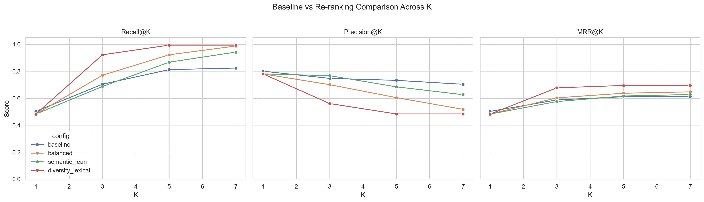
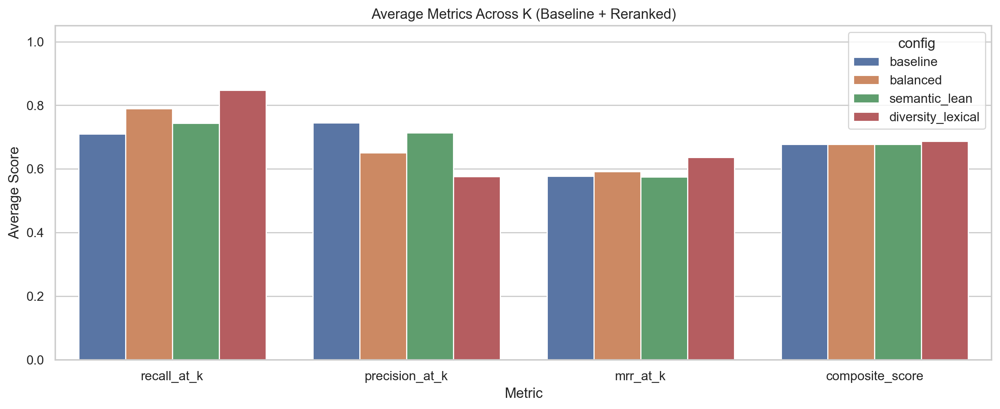
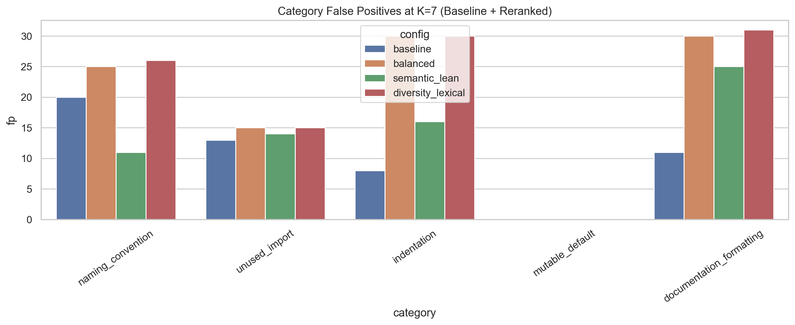
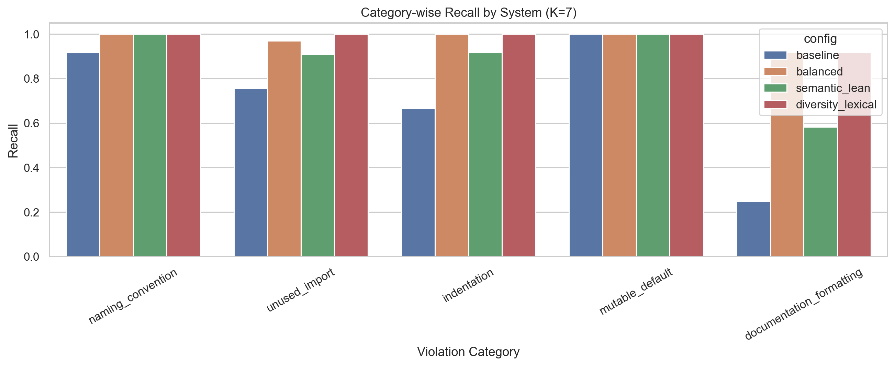
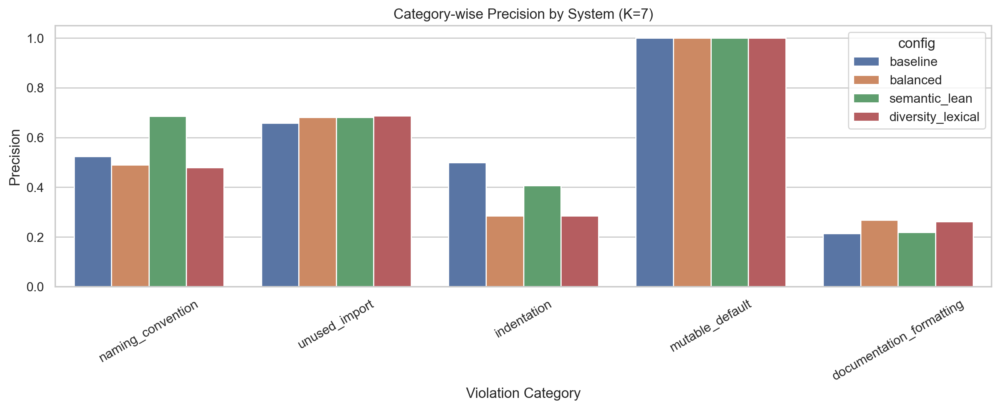

# Milestone 5 Consolidated Report

## Master Table of Contents

1. [Synthetic Data Generation Strategy](#part-1--synthetic-data-generation-strategy)
2. [Retrieval Strategy Analysis](#part-2--retrieval-strategy-analysis)
3. [Static Analysis Tool Evaluation](#part-3--static-analysis-tool-evaluation)
4. [Prompt Engineering & Model Evaluation](#part-4--prompt-engineering--model-evaluation)
5. [Additional Retrieval Strategy Evaluation](#part-5--additional-retrieval-strategy-evaluation)
6. [Additional Static Analysis Tool Evaluation](#part-6--additional-static-analysis-tool-evaluation)
7. [Additional Prompt and LLM Evaluation](#part-7--additional-prompt-and-llm-evaluation)
8. [Integrated Local Model Analysis](#part-8--integrated-local-model-analysis)

---

# Part 1 - Synthetic Data Generation Strategy

# Synthetic Data Generation Strategy: End-to-End Explanation

This project builds synthetic training-style and evaluation-style data for a RAG-based Python code review system. The goal is not to generate arbitrary Python code, but to create a controlled dataset where each code change is tied to one or more known guideline violations, and where those violations can be paired with realistic review comments. The five target categories are:

1. `unused_import`
2. `indentation`
3. `naming_convention`
4. `documentation_formatting`
5. `mutable_default`

The synthetic pipeline is spread across the notebook `notebooks/data_preprocessor.ipynb` and three main scripts:

- `scripts/create_synthetic_repos.py`
- `scripts/fetch_review_comments.py`
- `scripts/create_evaluation_dataset.py`

The process has four major stages:

1. Build the guideline-based retrieval corpus.
2. Create framework-specific synthetic repositories with clean code, then inject known violations and attach review comments.
3. Extract those review comments and merge them into the retrieval corpus as an additional knowledge source.
4. Create a separate evaluation dataset with multi-violation examples and store their ground-truth review annotations.

What follows is the complete strategy, step by step.

---

## 1. Overall Design Intent

The system is designed around a simple idea: if the final code-review model is expected to detect localized style and best-practice violations, then the data generation process must make those violations explicit, structured, and easy to evaluate.

Instead of scraping random noisy pull requests, the project creates synthetic GitHub repositories for different Python ecosystems:

- Flask
- FastAPI
- Django
- pandas-style utility modules
- scikit-learn-style utility modules

This gives the project three important advantages:

1. **Control** over the exact violation category inserted into code.
2. **Context** over repository and framework context, which matters for retrieval.
3. **Reliable ground truth**, because the project itself creates the bad code and the associated review comments.

The synthetic strategy is intentionally split into two dataset roles:

- **Retrieval/training knowledge source:** mostly single-category PRs and their review comments.
- **Evaluation set:** more difficult multi-category PRs with file snapshots and structured ground-truth review annotations.

---

## 2. Stage A: Building the Initial Retrieval Corpus from Guidelines

The notebook begins by defining two large in-memory lists:

- `COMMON_GUIDELINES`
- `REPO_GUIDELINES`

These are serialized into `data/processed/retrival_corpus.json`.

The retrieval corpus is therefore not only based on generated review comments. It starts from curated guideline chunks extracted from authoritative sources such as:

- PEP 8
- PEP 257
- Ruff
- Flake8 / pycodestyle
- Pylint
- Django coding style guidance
- pandas contribution and docstring guidance
- scikit-learn developer guidance
- Flask contribution guidance

Each chunk is stored as a dictionary with fields such as:

- `text`
- `category`
- `source_type`
- `source_path`
- `chunk_id`

This design matters because the final RAG system retrieves not just comments, but guideline evidence. The corpus therefore mixes:

- Generic Python rules
- Framework-specific conventions
- Later, synthetic review comments from PR discussions

The notebook writes this first version of the corpus before any synthetic GitHub repository generation starts.

---

## 3. Stage B: Creating Synthetic Repositories with Clean Baseline Code

The script `scripts/create_synthetic_repos.py` is responsible for generating the synthetic repositories and populating them with realistic clean files.

### 3.1 Repository Scope

For each framework, the script targets a repository named:

- `synthetic-flask`
- `synthetic-fastapi`
- `synthetic-django`
- `synthetic-pandas`
- `synthetic-sklearn`

These repositories are created under the authenticated GitHub user given by the repo token. The script checks whether the repository already exists. If it does, it skips repository creation and moves on.

### 3.2 Baseline File Templates

The script contains a `FILE_LISTS` constant. For each framework it defines around 20 realistic Python file paths and short descriptions. Examples include:

- Flask blueprints, forms, models, middleware, tests
- FastAPI routers, schemas, CRUD modules, dependencies, tests
- Django settings, views, serializers, signals, template tags, tests
- pandas ETL and utility modules
- scikit-learn preprocessing, evaluation, pipeline, model utilities

The important point is that the project does not generate meaningless toy files. It generates modules that look like plausible framework-specific project code.

### 3.3 Clean Code Generation with an LLM

For each file description, `generate_python_file()` asks an LLM to produce clean, idiomatic Python code. The prompt explicitly requests:

- Syntactically valid Python
- PEP 8 style
- 4-space indentation
- `snake_case` naming
- Organized imports
- Docstrings
- Type hints where appropriate
- A realistic module matching the given framework and file purpose

The script uses an `LLMClient` that calls the GitHub Models API with a model cascade. If one model is rate-limited or fails, the client rotates through the configured models and tokens.

### 3.4 Validation and Fallback Strategy

The generated code is validated with `compile()`. If validation fails, the script:

1. Retries once with an error-aware regeneration prompt, and
2. If that also fails, falls back to a minimal stub module.

This is an important quality-control step. The pipeline wants the repository's main branch to contain clean baseline code before any violations are injected.

### 3.5 Guidelines File per Repository

Each synthetic repository also receives a `guidelines.md` file. The script tries to build it from JSON guideline chunk files in `data/raw/guidelines_raw`. If such files are unavailable, it falls back to LLM-generated Markdown guidelines.

This gives each repository an explicit local coding-guideline document, which is consistent with the project's aim of repo-aware code review.

### 3.6 Commit to Main

Once `README.md`, `guidelines.md`, and all generated Python files are ready, the script commits them to the main branch using GitHub's low-level blobs, trees, commits, and refs APIs. At this point each repository represents a clean code base with no intentional violations on main.

---

## 4. Stage C: Injecting Single Violation Types into PR Branches

After creating the clean repository, the same script creates synthetic pull requests that intentionally introduce one violation category per PR.

This single-category PR generation is the core training-style synthetic data strategy used for review-comment collection.

### 4.1 PR Count and Rotation

The script takes a target number of PRs per repository, defaulting to 20. It counts existing PRs and only creates the missing number. Violation categories are assigned cyclically across PRs using the fixed order:

- `unused_import`
- `indentation`
- `naming_convention`
- `documentation_formatting`
- `mutable_default`

This ensures coverage across categories instead of letting the distribution be random or skewed.

### 4.2 File Selection

For each PR, the script chooses a Python file from the repository and creates a branch named like:

- `violation/unused-import-7`
- `violation/naming-convention-13`

The branch name matters later because `fetch_review_comments.py` parses the branch name to recover the violation category.

### 4.3 LLM-Based Violation Injection

The function `inject_violations()` takes the clean file content and instructs the LLM to rewrite the full file while introducing one specific violation type.

The violation prompts are category-specific:

- **`unused_import`:** add unused imports at the top of the file.
- **`indentation`:** change some blocks to 2-space, 6-space, or mixed indentation.
- **`naming_convention`:** rename functions or variables to camelCase.
- **`documentation_formatting`:** break or remove docstrings and create malformed formatting.
- **`mutable_default`:** replace `None` defaults with `[]`, `{}`, or `set()`.

The LLM is asked to output two things:

1. The full modified file, and
2. A JSON array listing the violated lines and descriptions.

This is important because the pipeline needs not only bad code, but also a structured mapping from changed lines to intended violations.

### 4.4 Deterministic Fallback Injection

If the LLM is unavailable or produces unusable output, the script falls back to deterministic transformations in `_fallback_inject()`. Examples:

- Prepend unused imports
- Convert `snake_case` names to `camelCase`
- Change `=None` to `=[]`
- Alter indentation on selected lines
- Break one-line docstrings into malformed multi-line versions

This fallback keeps the pipeline robust. Synthetic data generation does not stop just because the LLM response is invalid or rate-limited.

### 4.5 Validation Policy

Most injected files are still validated with `compile()`. Indentation violations are the exception because they may intentionally create syntax-breaking code.

This design is deliberate. Some categories, especially indentation, are defined by structural mistakes that can make code unparsable. The project accepts that because the goal is to evaluate review detection of localized style issues, not to preserve executable behavior.

---

## 5. Stage D: Generating Synthetic Review Comments for the Violations

Once the violated file is created, `create_synthetic_repos.py` also generates the corresponding review comments that simulate human PR feedback.

### 5.1 Comment Generation Strategy

For each detected or declared violation, the script extracts a small code window around the target line and asks the LLM to produce a short, constructive, human-sounding code review comment.

The prompt instructs the model to behave like a senior reviewer and explicitly discourages robotic language such as mentioning a violation label directly.

### 5.2 Review Style Constraints

The comments are intended to be:

- Concise
- Localized to a specific line
- Phrased like PR review feedback
- Grounded in what is visible in the code snippet

This matters because the final downstream system is not evaluated only on rule detection. It also needs to produce realistic review language.

### 5.3 Fallback Review Comments

If the LLM cannot generate a comment, the script uses category-specific comment templates. For example:

- **Unused import** comments say the import is not used and should be removed.
- **Mutable default** comments explain that mutable defaults persist across calls.
- **Naming** comments point back to PEP 8 `snake_case` conventions.

Again, the pipeline is designed to be robust under API failures.

### 5.4 Posting Comments to GitHub PRs

The modified file is committed on the PR branch, a pull request is opened, and the review comments are posted back to GitHub as review comments.

If inline PR review posting fails, the script falls back to a standard issue comment headed by `"Code Review Comments:"`. That fallback format is later parsed by `fetch_review_comments.py`.

### 5.5 Why This Stage Exists

This step converts raw synthetic code edits into synthetic reviewer discourse. That is critical because the retrieval corpus later includes previously accepted review comments as a knowledge source, not just rule text.

---

## 6. Stage E: Extracting Review Comments into a Review-Comment Dataset

The next script, `scripts/fetch_review_comments.py`, converts the GitHub PR discussions into a structured local JSON dataset.

### 6.1 What It Reads

For each repository, the script fetches:

- All pull requests
- Inline review comments on each PR
- Issue comments on each PR

It only keeps PRs whose branch names match the pattern `violation/<slug>-<number>`.

This means the review-comment extraction stage is intentionally aimed at the single-violation PRs, not the evaluation PRs.

### 6.2 How the Category Is Recovered

The branch slug is mapped back to one of the five categories through `BRANCH_CATEGORY_MAP`. That means the category label for each review comment is not inferred semantically after the fact. It is recovered from the controlled PR generation process.

This is one of the main reasons the synthetic strategy yields reliable labels.

### 6.3 Inline and Fallback Comment Handling

The script supports three kinds of comments:

- Inline PR review comments
- Fallback issue comments created when inline review posting failed
- General issue comments if they are long enough to be useful

Fallback issue comments are parsed with a regular expression that extracts:

- `file_path`
- `line_number`
- `comment_text`

### 6.4 Deduplication and Output Format

All collected comments are deduplicated using a tuple of:

- `text`
- `category`
- `framework`
- `file_path`
- `commit_sha`

The output is written to `data/raw/review_comments/review.json`.

Each entry contains fields such as:

- `text`
- `category`
- `source_type` (e.g., `django_review_comment`)
- `source_path` (built from repo, file path, and commit SHA)
- `chunk_id`

### 6.5 Why This Matters

This stage transforms PR discussion data into retrieval chunks that can later be retrieved just like guideline chunks. In other words, the knowledge base is not limited to formal coding rules. It also includes reviewer phrasing and examples of how humans discuss those rule violations.

---

## 7. Stage F: Merging Review Comments into the Retrieval Corpus

The notebook then merges the newly extracted review comment dataset into the existing retrieval corpus.

The merge logic:

1. Loads `data/processed/retrival_corpus.json`
2. Loads `data/raw/review_comments/review.json`
3. Removes duplicates by `chunk_id`
4. Appends the new review-comment chunks
5. Writes the merged corpus back to `retrival_corpus.json`

This produces a combined retrieval store containing both:

- Formal coding guidance
- Synthetic historical review comments

That combined corpus is later indexed and retrieved by the RAG review model.

---

## 8. Stage G: Building the Evaluation Dataset with Multi-Violation PRs

The script `scripts/create_evaluation_dataset.py` creates a harder evaluation set. This stage differs from the earlier PR generation in an important way: each eval PR may contain **multiple violation categories** in the same file.

### 8.1 Why Evaluation Is Separate

The training-style retrieval data is mostly built from single-category PRs because they make the source of each review comment easy to control and label.

The evaluation set is harder on purpose. Real code often contains overlapping issues, so the evaluation set uses violation combinations rather than one clean category per PR.

### 8.2 Predefined Violation Combinations

The script defines `VIOLATION_COMBOS`, for example:

- `[unused_import]`
- `[naming_convention]`
- `[unused_import, indentation]`
- `[naming_convention, mutable_default]`
- `[unused_import, documentation_formatting]`
- `[unused_import, indentation, naming_convention]`
- `[naming_convention, mutable_default, documentation_formatting]`

This means the evaluation data is still controlled, but it is more varied and closer to real review conditions than the single-violation PRs.

### 8.3 Source Files for Evaluation

The eval script works against the same synthetic repositories, but creates new branches named like:

- `eval/unused-import-indentation-3`

It selects a target file, loads the clean main-branch version, and then calls `inject_multi_violations()` to insert all requested categories into the same file.

### 8.4 Multi-Violation Injection

The LLM is prompted to apply every requested category to the same file and emit:

1. The complete modified file, and
2. A JSON array of violated lines, categories, and descriptions.

As with the earlier script, there is a deterministic fallback, `_fallback_multi_inject()`, which can insert combinations of unused imports, camelCase names, mutable defaults, broken docstrings, and non-4-space indentation even if the LLM fails.

### 8.5 PR Creation and Ground-Truth Review Generation

For each violation detail in the multi-violation file, the script generates a review comment. These are stored as structured ground truth instead of being posted and later scraped. Each evaluation entry contains:

- `id`
- `repo`
- `source_path`
- `source_file`
- `ground_truth_reviews`

Each `ground_truth_reviews` item includes:

- `line_number`
- `violation_category`
- `review_comment`

This is the core labeled evaluation format used later by the review pipeline.

---

## 9. Stage H: Reconstructing Eval Labels from Existing PRs When Needed

If evaluation PRs already exist and the script does not create new ones, it can rebuild evaluation data from existing GitHub PRs using `fetch_existing_eval_data()`.

This uses a rule-based detector rather than trusting old metadata. The detector scans the final file content and identifies the five target categories using heuristics.

Examples:

- **`unused_import`:** parse import lines and check whether imported names appear elsewhere.
- **`naming_convention`:** detect camelCase in function names, parameters, attributes, and variables.
- **`indentation`:** detect non-4-space block indentation while ignoring continuation contexts.
- **`mutable_default`:** detect list and dict literal defaults in function signatures.
- **`documentation_formatting`:** detect misplaced module docstrings, split one-line docstrings, and docstring indentation mismatches.

This stage exists so the evaluation dataset can be rebuilt from GitHub state even if the original in-memory generation metadata is unavailable.

---

## 10. Stage I: Writing the Evaluation Dataset to Disk

After building the evaluation entries, the script writes them to:

- `data/processed/evaluation.json`

It also saves each source file to:

- `data/processed/evaluation_files/`

Before saving, it strips giveaway comments that would make the task trivial, such as comments literally saying:

- `unused_import`
- `mutable_default`
- `renamed`
- `violation`
- `stub for`

This is an important **anti-leakage step**. The downstream model should infer the violation from code, not from explicit comments left by the synthetic pipeline.

The `source_file` field in each JSON entry is rewritten to point to the saved file inside `evaluation_files/`.

---

## 11. Stage J: Manual Augmentation of the Evaluation Set

The notebook adds one more step after automatic evaluation generation. It loads manual data from:

- `data/raw/eval_manual/evaluation.json`
- `data/raw/eval_manual/eval_files/`

It then:

1. Checks for duplicate IDs
2. Copies the manual source files into `data/processed/evaluation_files/`
3. Rewrites `source_file` paths to the processed location
4. Appends the manual entries to the generated evaluation dataset

This means the final evaluation set is not purely synthetic. It is a hybrid of:

- Automatically generated evaluation PR examples
- Manually curated framework-specific examples

That hybrid strategy improves coverage and helps counteract weaknesses in fully synthetic data.

---

## 12. Notebook Orchestration: How the Pieces Connect in Practice

The notebook `data_preprocessor.ipynb` orchestrates the full process in this order:

1. Define and export the guideline-based retrieval corpus.
2. Create synthetic repositories with clean code and single-violation PRs by running `scripts/create_synthetic_repos.py`.
3. Fetch PR review comments by running `scripts/fetch_review_comments.py`.
4. Merge those review comments into the retrieval corpus.
5. Create the evaluation dataset by running `scripts/create_evaluation_dataset.py`.
6. Merge in the manual evaluation entries.
7. Plot summary statistics for the retrieval corpus and evaluation dataset.

So the synthetic data strategy is not one script. It is a pipeline where the output of one stage becomes the input to the next.

---

## 13. Why This Strategy Is Effective

This synthetic strategy is effective for the project's stated goal because it optimizes for label control, framework context, and evaluation clarity.

### 13.1 Controlled Labels

Because the project itself inserts the violation, it knows the intended category. That is more reliable than inferring labels from noisy real-world PRs.

### 13.2 Framework-Aware Context

The synthetic repos are framework-specific, so the downstream RAG system can retrieve both generic Python guidance and framework-specific conventions.

### 13.3 Review-Language Grounding

The pipeline does not stop at generating bad code. It also generates PR review comments and feeds them back into the retrieval corpus. That gives the final system access to both rules and reviewer phrasing.

### 13.4 Robustness to LLM Failure

Every critical LLM-dependent stage has deterministic fallbacks:

- Code generation fallback stubs
- Deterministic violation injection
- Deterministic review comment templates
- Heuristic reconstruction for evaluation labels

This makes the dataset generation process reproducible enough to rerun even when model calls fail intermittently.

### 13.5 Harder Evaluation Than Training Data

Single-violation PRs make the knowledge base clean and easy to label. Multi-violation evaluation PRs make the final benchmark harder and more realistic. That split is a good experimental design choice.

---

## 14. Important Limitations and Design Tradeoffs

The strategy is strong, but it is not perfect.

### 14.1 Synthetic Bias

Because both the code changes and many of the review comments are LLM-generated, the final dataset may reflect the style preferences of the prompting setup.

### 14.2 Limited Realism of Some Injected Errors

Some injected issues, especially indentation or docstring formatting errors, may look more artificial than naturally occurring review problems.

### 14.3 GitHub-State Dependence

Part of the pipeline depends on GitHub repository state, PR existence, branch names, and successful API calls. Reproducibility depends on that state being stable.

### 14.4 Evaluation Repos Are Logically Separate, Not Physically Separate Repos

The evaluation set uses `eval/*` branches inside the same synthetic repositories, not entirely different repositories. The project mitigates this by keeping eval examples out of the review-comment extraction flow, but the split is branch-based rather than repo-based.

### 14.5 Some Fields Contain Generated Descriptions Rather Than True Human Reviews

When evaluation data is reconstructed from existing PRs, the fallback detector may populate `ground_truth_reviews` with rule descriptions instead of human-like PR comments. That is useful structurally, but not identical to authentic review language.

---

## 15. Final Summary

End to end, the synthetic data generation strategy works like this:

1. Build a retrieval corpus from authoritative coding-guideline chunks.
2. Create realistic clean Python repositories for five frameworks.
3. Introduce controlled single-category violations in PR branches.
4. Generate reviewer-style comments for those violations and post them to PRs.
5. Scrape those PR comments back into a structured review-comment dataset.
6. Merge the comments into the retrieval corpus so the RAG system can retrieve both formal rules and reviewer phrasing.
7. Build a separate evaluation dataset using harder multi-violation files.
8. Save the evaluation examples as file snapshots plus structured ground-truth review annotations.
9. Augment the evaluation set with manual examples.

The result is a controlled synthetic ecosystem designed specifically for the project's research question: **whether retrieved project-specific knowledge helps an LLM generate better Python code review comments for localized guideline violations**.

---

# Part 2 - Retrieval Strategy Analysis

# Retrieval Strategy Analysis

> **Evaluation**: 102 files, 721 ground-truth reviews across 5 violation categories.
> **Corpus**: 505 FAISS-indexed chunks (BAAI/bge-large-en-v1.5, 1024-dim, IndexFlatIP).
> **Top-k**: 10 chunks per file.

---

## Table of Contents

1. [Problem Statement](#1-problem-statement)
2. [Evaluation Metrics](#2-evaluation-metrics)
3. [Diagnostic Analysis](#3-diagnostic-analysis)
4. [Strategies - Baseline (S1-S6)](#4-strategies---baseline-s1-s6)
5. [Strategies - Improved (S7-S16)](#5-strategies---improved-s7-s16)
6. [Full Results Table](#6-full-results-table)
7. [Per-Category Recall Breakdown](#7-per-category-recall-breakdown)
8. [What Worked and Why](#8-what-worked-and-why)
9. [What Didn't Work and Why](#9-what-didnt-work-and-why)
10. [Production Recommendation](#10-production-recommendation)

---

## 1. Problem Statement

In production, our RAG pipeline receives a **code diff** and must retrieve the most relevant guideline/review chunks from the corpus to support an LLM in detecting violations. At retrieval time, we know:

- The code diff (full source)
- The 5 violation categories we care about
- Optionally, the repo framework (django, flask, fastapi, pandas, sklearn)

We do **not** know which violations are actually present - that's what the LLM will decide. The retrieval strategy must provide high-quality context without ground-truth hints.

### Corpus Structure

| Source Type | Count | Examples |
|---|---|---|
| Review comments (repo-specific) | 289 | `django_review_comment`, `flask_review_comment` |
| General linter rules | 128 | `ruff`, `flake8`, `pylint`, `pep8`, `pep257` |
| Repo guidelines | 88 | `django_guidelines`, `pandas_guidelines` |

| Category | Chunks | % of Corpus |
|---|---|---|
| documentation_formatting | 155 | 30.7% |
| naming_convention | 107 | 21.2% |
| indentation | 90 | 17.8% |
| unused_import | 81 | 16.0% |
| mutable_default | 72 | 14.3% |

### Evaluation Set

| Category | Violation Count | File Count |
|---|---|---|
| naming_convention | 214 | 54 |
| unused_import | 193 | 63 |
| indentation | 138 | 27 |
| documentation_formatting | 104 | 27 |
| mutable_default | 72 | 26 |

- **Average GT categories per file**: 1.9
- **Files with only 1 GT category**: 41 (40%)
- **Files with 2 GT categories**: 31 (30%)
- **Files with 3+ GT categories**: 30 (30%)

---

## 2. Evaluation Metrics

| Metric | Definition |
|---|---|
| **Precision** | `relevant_retrieved / total_retrieved` - fraction of retrieved chunks whose category matches a GT violation in the file |
| **Category Recall** | For each GT category in a file, is at least one chunk of that category in the top-10? Averaged across all (file, category) pairs, then across all 5 categories |
| **MRR (Mean Reciprocal Rank)** | For each (file, GT category), find the rank of the first matching chunk. MRR = average of `1/rank` across all such pairs. Higher -> relevant chunks appear earlier |
| **F1** | Harmonic mean of Precision and Avg Category Recall |

---

## 3. Diagnostic Analysis

Before designing improved strategies, we ran diagnostics to identify failure modes.

### Finding 1: Blind Retrieval Wastes 60%+ Budget

The biggest precision killer: when we retrieve 2 chunks per category for all 5 categories (as in S2), but the file only has 1-2 GT categories, the majority of slots are wasted.

**Example** - file `synthetic-django_PR_21` has GT = `{unused_import}` only:
- S2 retrieves: `unused_import(2), indentation(2), naming_convention(2), doc_formatting(2), mutable_default(2)`
- Precision: 2/10 = **20%** - 80% of budget wasted on irrelevant categories

This pattern affects 41 files (40% of dataset) that have only 1 GT category.

### Finding 2: Tiny Score Gap Between Relevant and Irrelevant

```
Relevant chunks:   mean_score = 0.739
Irrelevant chunks: mean_score = 0.709
Score gap:         0.030
```

The embedding model can't clearly separate relevant vs irrelevant chunks by score alone. Simple score thresholding won't help - we need category-level intelligence.

### Finding 3: doc_formatting <-> indentation Cross-Confusion

Queries like "documentation_formatting violation in Python code" return indentation chunks at positions 3-4 because docstring indentation issues are semantically close to general indentation. The score 0.731 for indentation chunks is very close to 0.743 for actual doc_formatting chunks.

### Finding 4: Repo Hint Doesn't Filter at Embedding Level

Adding "django" or "fastapi" to queries does not reliably return chunks from that repo's source type. Embedding similarity doesn't capture metadata-level filtering.

### Finding 5: Category Prediction from Code is Feasible

Simple regex heuristics can predict categories with useful precision:

| Category | Heuristic Precision | Heuristic Recall |
|---|---|---|
| unused_import | 62% | 100% |
| naming_convention | 53% | 94% |
| indentation | 27% | 96% |
| documentation_formatting | 26% | 100% |
| mutable_default | 27% | 100% |

Precision is low (many false positives), but **recall is near-perfect** - heuristics almost never miss a real category. This makes them safe for budget allocation: filter down from 5 to 2-3 categories without losing coverage.

---

## 4. Strategies - Baseline (S1-S6)

### S1: Code Only

**Approach**: Use the first 500 characters of raw code as the FAISS query.

```python
retrieve(code[:500], top_k=10)
```

**Hypothesis**: Code snippets will semantically match guideline chunks that discuss similar patterns.

**Result**: P=44.1%, R=73.1%, MRR=0.375, F1=0.550

**Why it partially works**: When code has obvious patterns (e.g., `import os` at top), the embedding finds import-related chunks. But code syntax doesn't reliably match natural-language guidelines.

**Why it fails**: 73.1% recall - misses categories whose violations aren't syntactically obvious in the first 500 chars. Indentation violations (59.3% recall) and unused_import (60.3%) are particularly missed.

---

### S2: Per-Category (Uniform)

**Approach**: One query per category (`"unused_import violation in Python code"`), 2 results each, merge to 10.

```python
for cat in CATEGORIES:
    q = f"{cat} violation in Python code"
    hits = retrieve(q, top_k=2)
    results.extend(hits)
```

**Hypothesis**: Category-specific queries will each retrieve on-target chunks.

**Result**: P=38.6%, R=100.0%, MRR=0.455, F1=0.557

**Why it works**: Each category query returns chunks of that category with high fidelity (except doc_formatting, which sometimes pulls indentation). 100% recall - every GT category gets at least one matching chunk.

**Why precision is low**: For a file with 1 GT category, 8/10 slots are wasted on the other 4 categories. The average 1.9 categories/file makes uniform allocation fundamentally wasteful.

---

### S3: Code + Category

**Approach**: Combine code prefix (200 chars) with each category name.

```python
for cat in CATEGORIES:
    q = f"Code review for {cat} violation: {code[:200]}"
    hits = retrieve(q, top_k=2)
```

**Result**: P=42.0%, R=92.3%, MRR=0.458, F1=0.577

**Why it partially works**: Code context steers the embedding slightly toward relevant chunks. Best MRR of baseline strategies (0.458).

**Why it fails**: Recall drops to 92.3% because code context can interfere with category matching - for rare categories (indentation 88.9%, doc_formatting 77.8%), the code prefix dominates the query embedding and dilutes the category signal.

---

### S4: Repo + Category

**Approach**: Query with repo framework name + category.

```python
q = f"{repo_hint} {cat} code review guidelines and best practices"
```

**Result**: P=38.3%, R=100.0%, MRR=0.453, F1=0.554

**Why it works**: Similar to S2 with 100% recall. Repo hint provides slight context.

**Why precision is same as S2**: As diagnosed, the embedding model doesn't effectively filter by repo metadata. "django unused_import" and "fastapi unused_import" return the same chunks.

---

### S5: Hybrid (Code + Category)

**Approach**: Half budget for code-based retrieval, half for repo+category.

```python
code_hits = retrieve(code[:500], top_k=5)
for cat in CATEGORIES:
    hits = retrieve(f"{repo_hint} {cat} ...", top_k=1)
```

**Result**: P=45.7%, R=81.2%, MRR=0.397, F1=0.585

**Why precision is decent**: Code-based half naturally focuses on present patterns. 45.7% is the best precision among baselines.

**Why recall drops**: Only 1 slot per category in the category half -> doc_formatting (48.1%) and mutable_default (57.7%) are squeezed out since code-based retrieval favors common categories.

---

### S6: Code + Repo + Category (Keyword-Heavy)

**Approach**: Hand-crafted keyword-rich queries per category with repo hint.

```python
# Example for mutable_default:
q = f"{repo_hint} mutable default argument list dict set function parameter"
```

**Result**: P=37.6%, R=100.0%, MRR=0.450, F1=0.547

**Why it doesn't improve**: Despite more specific keywords, the uniform 2-per-category budget still wastes slots. And code-specific import analysis (like S6 does for unused_import) adds noise rather than precision.

---

## 5. Strategies - Improved (S7-S16)

These strategies were designed based on the diagnostic findings above.

### S7: Heuristic Filtering

**Approach**: Predict which categories are likely present using code regex heuristics. Only retrieve for categories with confidence >= 1.

```python
preds = predict_categories(code)
active_cats = [c for c, s in preds.items() if s >= 1]
per_cat_k = max(2, top_k // len(active_cats))
for cat in active_cats:
    q = f"{cat} violation in Python code"
    retrieve(q, top_k=per_cat_k)
```

**Heuristics used**:
- **unused_import**: Check if imported names appear in the rest of the code body
- **naming_convention**: Detect camelCase functions, lowercase class names, camelCase variables
- **indentation**: Detect mixed tabs/spaces, non-multiple-of-4 indent levels
- **documentation_formatting**: Check for docstring presence and formatting issues
- **mutable_default**: Regex match `def foo(x=[], y={}, z=set())` patterns

**Result**: P=45.4%, R=100.0%, MRR=0.473, F1=0.624

**Why it works well**: By filtering from 5 to ~3 active categories, budget per category increases from 2 to ~3. This eliminates wasted slots. 100% recall maintained because heuristics have near-100% recall.

**Improvement**: +7pp precision, +18pp MRR, +7pp F1 over S2 baseline.

---

### S8: Adaptive Budget

**Approach**: Like S7, but allocate budget *proportionally* to confidence: high=3 slots, medium=2, low=1, zero=0.

```python
budget = {cat: {3:3, 2:2, 1:1, 0:0}[conf] for cat, conf in preds.items()}
```

**Result**: P=57.9%, R=99.2%, MRR=0.497, F1=0.732

**Why it's much better**: High-confidence categories (the ones that usually are actually present) get 3 slots. Zero-confidence categories get nothing. Budget directly tracks reality.

**Why recall is 99.2% not 100%**: mutable_default drops to 96.2% - in 1 file, the heuristic assigns confidence 0 and no slots. Acceptable tradeoff.

---

### S9: Two-Phase (Code -> Category)

**Approach**: Phase 1 - retrieve by code to detect categories. Phase 2 - per-category retrieval for detected + heuristic categories.

**Result**: P=47.1%, R=75.8%, MRR=0.372, F1=0.581

**Why it failed**: Phase 1 code retrieval is unreliable for category detection (S1 only gets 73% recall). The two-phase approach inherits S1's weakness and doesn't improve on simpler heuristics.

---

### S10: Refined Queries

**Approach**: Replace generic `"unused_import violation in Python code"` with keyword-rich queries:

```python
REFINED_QUERIES = {
    "unused_import":             "unused import module not used remove F401 W0611",
    "indentation":               "indentation whitespace spaces tabs alignment PEP8 E1 W1",
    "naming_convention":         "naming convention snake_case CamelCase PEP8 variable function class name",
    "documentation_formatting":  "docstring formatting summary description numpy google style pep257 D100 D200",
    "mutable_default":           "mutable default argument list dict set function parameter B006 W0102",
}
```

**Result**: P=38.6%, R=100.0%, MRR=0.455, F1=0.557

**Why the same as S2**: With uniform 2-per-category budget, refined queries don't help precision - the bottleneck is budget allocation, not query quality. The queries are better (less cross-category confusion), but the improvement only shows when combined with other techniques.

---

### S11: Refined + Heuristic

**Approach**: Combine S10's queries with S7's heuristic filtering.

**Result**: P=45.4%, R=100.0%, MRR=0.473, F1=0.624

**Same as S7**: The heuristic filtering dominates. Refined queries have marginal impact when the budget is already well-allocated.

---

### S12: Score Reranking

**Approach**: Overfetch (4 per category for all 5), then rerank by boosting chunks whose category matches high-confidence predictions.

```python
boost = {3: +0.10, 2: +0.05, 1: +0.02, 0: -0.05}[confidence]
rerank_score = faiss_score + boost
```

**Result**: P=60.1%, R=88.1%, MRR=0.555, F1=0.715

**Why MRR is excellent**: Reranking pushes relevant category chunks to top positions. MRR jumps from 0.455 to 0.555 - relevant context appears ~2 positions earlier on average.

**Why recall drops**: With only 10 final slots, suppressing low-confidence category chunks can push them entirely out. Indentation drops to 55.6% recall - the heuristic often assigns low confidence to indentation (it's hard to detect from regex), so it gets demoted below the top-10 cutoff.

---

### S13: Adaptive + Refined + Repo

**Approach**: S7's filtering + S10's refined queries + S6's repo-aware queries.

**Result**: P=45.4%, R=100.0%, MRR=0.473, F1=0.624

**Same as S7/S11**: Repo hint adds no value (Finding 4). Three-way combination doesn't exceed any component.

---

### S14: Adaptive Budget + Reranking

**Approach**: S8's budget allocation + S12's reranking.

```python
budget: high=4, med=3, low=2, zero=1
boost: {3: 0.12, 2: 0.06, 1: 0.02, 0: -0.03}
```

**Result**: P=56.4%, R=92.6%, MRR=0.573, F1=0.701

**Why it's strong**: Combines S8's precision gains with S12's MRR gains. Budget ensures good coverage, reranking optimizes ordering.

**Why recall drops slightly**: min 1 slot for zero-confidence categories, but reranking can still push those chunks below rank 10. Indentation at 63.0%.

---

### S15: Adaptive + Reranking + Refined Queries (This is what we went with)

**Approach**: Triple combination - S8's adaptive budget + S12's reranking + S10's refined queries.

```python
# 1. Predict categories from code
preds = predict_categories(code)

# 2. Adaptive budget
budget = {3:4, 2:3, 1:2, 0:1}[confidence]

# 3. Retrieve with refined queries
for cat, k in budget.items():
    q = REFINED_QUERIES[cat]
    retrieve(q, top_k=k)

# 4. Rerank by heuristic confidence
rerank_score = faiss_score + {3:0.12, 2:0.06, 1:0.02, 0:-0.03}[conf]
```

**Result**: **P=59.6%, R=96.3%, MRR=0.625, F1=0.736**

**Why this is the best**:
- Refined queries fix doc<->indentation confusion, improving per-query precision
- Adaptive budget focuses slots on likely categories, eliminating waste
- Reranking pushes the most relevant chunks to the top, maximizing MRR
- The three techniques are *complementary* - each addresses a different failure mode

**Per-category recall**: unused_import 100%, indentation 92.6%, naming_convention 100%, doc_formatting 88.9%, mutable_default 100%.

---

### S16: Reranking + Guarantee

**Approach**: Like S12 but reserves 1 slot per category before reranking to guarantee recall.

```python
# Reserve best chunk per category first
for cat in CATEGORIES:
    results.append(best_per_cat[cat])
# Fill remaining 5 slots from reranked list
```

**Result**: P=55.5%, R=100.0%, MRR=0.540, F1=0.714

**Why recall is perfect**: Hard guarantee of 1 chunk per category. No category can be squeezed out.

**Why precision/MRR are lower than S15**: The 5 guaranteed slots include zero-confidence categories, reducing both precision and MRR compared to the adaptive approach.

---

## 6. Full Results Table

| Strategy | Precision | Cat Recall | MRR | F1 | Key Technique |
|---|---|---|---|---|---|
| S1_code_only | 44.1% | 73.1% | 0.375 | 0.550 | Raw code as query |
| S2_per_category | 38.6% | 100.0% | 0.455 | 0.557 | 1 query per category, 2 each |
| S3_code_plus_category | 42.0% | 92.3% | 0.458 | 0.577 | Code prefix + category |
| S4_repo_category | 38.3% | 100.0% | 0.453 | 0.554 | Repo + category keywords |
| S5_hybrid | 45.7% | 81.2% | 0.397 | 0.585 | Half code + half category |
| S6_code_repo_category | 37.6% | 100.0% | 0.450 | 0.547 | Code + repo + category |
| S7_heuristic_filter | 45.4% | 100.0% | 0.473 | 0.624 | Filter by predicted cats |
| **S8_adaptive_budget** | **57.9%** | 99.2% | 0.497 | **0.732** | Budget ∝ confidence |
| S9_two_phase | 47.1% | 75.8% | 0.372 | 0.581 | Code detect -> category |
| S10_refined_queries | 38.6% | 100.0% | 0.455 | 0.557 | Keyword-rich queries |
| S11_refined_heuristic | 45.4% | 100.0% | 0.473 | 0.624 | Refined + filter |
| **S12_score_rerank** | **60.1%** | 88.1% | 0.555 | 0.715 | Overfetch + heuristic rerank |
| S13_adapt_refined_repo | 45.4% | 100.0% | 0.473 | 0.624 | Filter + refined + repo |
| S14_adapt_rerank | 56.4% | 92.6% | 0.573 | 0.701 | Adaptive + rerank |
| ⭐ **S15_adapt_rerank_refined** | **59.6%** | **96.3%** | **0.625** | **0.736** | **Adaptive + rerank + refined** |
| S16_rerank_guarantee | 55.5% | 100.0% | 0.540 | 0.714 | Rerank + guaranteed slots |

---

## 7. Per-Category Recall Breakdown

| Strategy | unused_import | indentation | naming_conv | doc_format | mutable_def |
|---|---|---|---|---|---|
| S1_code_only | 60.3% | 59.3% | 94.4% | 66.7% | 84.6% |
| S2_per_category | 100% | 100% | 100% | 100% | 100% |
| S5_hybrid | 100% | 100% | 100% | 48.1% | 57.7% |
| S7_heuristic_filter | 100% | 100% | 100% | 100% | 100% |
| S8_adaptive_budget | 100% | 100% | 100% | 100% | 96.2% |
| S12_score_rerank | 100% | **55.6%** | 100% | 85.2% | 100% |
| ⭐ S15 | 100% | **92.6%** | 100% | 88.9% | 100% |
| S16_rerank_guarantee | 100% | 100% | 100% | 100% | 100% |

**Indentation** and **documentation_formatting** are the hardest categories for reranking strategies because:
- Indentation heuristic has low confidence accuracy (27% precision)
- doc_formatting <-> indentation semantic overlap causes confusion

---

## 8. What Worked and Why

### 1. Heuristic Category Prediction (+7pp precision)

Lightweight regex inspection of code to predict likely violation categories. The key insight: even crude heuristics with 27% precision but 96-100% recall are extremely useful for **budget allocation** - they safely eliminate 2-3 categories per file, freeing slots for predicted ones.

### 2. Confidence-Weighted Budget Allocation (+19pp precision over S2)

Instead of uniform 2 chunks per category, allocating 4/3/2/1/0 slots based on confidence matches real-world distributions. A file with clear `=[]` patterns gets 4 mutable_default slots; a file with no function definitions gets 0 mutable_default slots.

### 3. Heuristic Reranking (+0.17 MRR over S2)

After retrieval, boosting FAISS scores for chunks whose category matches high-confidence predictions pushes relevant chunks 2-3 positions higher. This is cheap (no re-embedding) and highly effective.

### 4. Refined Queries (+0.02 MRR, reduces cross-confusion)

Including linter rule codes (`F401`, `D200`, `B006`) and specific terminology in queries reduces semantic overlap between categories. Most impactful for doc_formatting <-> indentation disambiguation.

### 5. Triple Combination (S15: all three together)

The three techniques are complementary:
- Budget allocation solves **precision waste** (the #1 problem)
- Reranking solves **MRR/ordering** (relevant chunks appear first)
- Refined queries solve **cross-category confusion** (doc <-> indent)

No single technique alone achieves F1 > 0.63. Together: **0.736**.

---

## 9. What Didn't Work and Why

### 1. Raw Code as Query (S1, S9)

Code syntax doesn't align well with natural-language guideline chunks in embedding space. The model was trained for semantic similarity, not code-to-guideline matching.

### 2. Repo Hint in Queries (S4, S6, S13)

Adding "django" or "fastapi" to queries doesn't filter results by repo source type. The embedding model treats these as general context words, not metadata filters. To leverage repo information, we'd need explicit metadata filtering (e.g., FAISS post-filter by source_repo).

### 3. Two-Phase Detection (S9)

Using Phase 1 code retrieval to *detect* categories, then Phase 2 per-category retrieval for only detected ones. Failed because Phase 1 category detection accuracy is only ~73% - worse than simple regex heuristics (96-100% recall).

### 4. Refined Queries Alone (S10)

Better queries don't help when the budget allocation is wasteful. Uniform 2-per-category with refined queries = same as uniform 2-per-category with generic queries. The bottleneck is allocation, not query quality.

### 5. Guarantee Slots (S16) vs Adaptive (S15)

Reserving 1 hard slot per category ensures 100% recall but wastes 1-3 slots on zero-confidence categories, costing ~4pp precision and ~0.08 MRR compared to the adaptive approach.

---

## 10. Production Recommendation

### Selected: Strategy S15 (Adaptive + Rerank + Refined)

| Metric | S2 Baseline | S15 Final | Δ Relative |
|---|---|---|---|
| Precision | 38.6% | 59.6% | **+54%** |
| Category Recall | 100.0% | 96.3% | -3.7% |
| MRR | 0.455 | 0.625 | **+37%** |
| F1 | 0.557 | 0.736 | **+32%** |

**Why S15 over S16 (100% recall)**:

The 3.7% recall loss in S15 (from 100% -> 96.3%) affects only indentation (92.6%) and doc_formatting (88.9%). These 2 categories are:
1. The ones with highest semantic overlap (hardest to retrieve correctly anyway)
2. Less critical than unused_import and mutable_default (which are functional bugs)

The tradeoff - gaining +4pp precision and +0.085 MRR - is worth it because:
- Higher precision = less noise for the LLM = fewer hallucinated violations
- Higher MRR = important context appears first in the prompt = better LLM performance

**Implementation**: Integrated into `scripts/retrieve.py` as `retrieve_with_context(code, top_k)`.

```python
from retrieve import retrieve_with_context

# In the RAG pipeline:
chunks = retrieve_with_context(code_diff, top_k=10)
# chunks are reranked - most relevant appear first
```

**CLI usage**:
```bash
# S15 production mode:
python scripts/retrieve.py code path/to/file.py -k 10

# Basic single-query mode (still available):
python scripts/retrieve.py query "unused import" -k 5
```

---

# Part 3 - Static Analysis Tool Evaluation

# Static Analysis Tool Evaluation

This document describes how static analysis tools are used as the baseline violation detector in the pipeline, what each tool covers, where the gaps are, how extensions fill those gaps, and how tool detections are compared against evaluation ground truth.

---

## 1. Tools Used

Two standard Python linters form the static analysis backbone:

| Tool | Purpose | Key Plugins |
|------|---------|-------------|
| **Flake8** | Fast style and import checker | `pycodestyle` (E/W), `pyflakes` (F), `pep8-naming` (N8xx), `flake8-bugbear` (B), `flake8-docstrings` (D) |
| **Pylint** | Deep semantic linter | Built-in checkers for naming, imports, docstrings, dangerous defaults |

Both tools are run on every evaluation file. Their outputs are merged by `(category, line)` to remove duplicates where both tools flag the same issue.

---

## 2. Violation Category Coverage

Each tool's error codes are mapped to one of the five target categories:

### 2.1 Flake8 Code Mapping

| Category | Flake8 Codes | Source Plugin |
|----------|-------------|---------------|
| `indentation` | E101, E111-E133, W191 | pycodestyle |
| `naming_convention` | N801-N818 | pep8-naming |
| `unused_import` | F401 | pyflakes |
| `mutable_default` | B006, B008 | flake8-bugbear |
| `documentation_formatting` | D100-D499 | flake8-docstrings (pydocstyle) |

### 2.2 Pylint Code Mapping

| Category | Pylint Codes / Symbols |
|----------|----------------------|
| `indentation` | W0311 (`bad-indentation`) |
| `naming_convention` | C0103 (`invalid-name`), C0104, C0105, C0132, C2401, W3201 |
| `unused_import` | W0611 (`unused-import`), W0614, W0404, W0406 |
| `mutable_default` | W0102 (`dangerous-default-value`) |
| `documentation_formatting` | C0114-C0116 (`missing-*-docstring`), C0112 (`empty-docstring`), C0199 |

### 2.3 Detection Results on the Evaluation Set

Running both tools on 103 evaluation files produces **1,269 total detections**:

| Category | Detections |
|----------|-----------|
| `indentation` | 404 |
| `naming_convention` | 338 |
| `documentation_formatting` | 271 |
| `unused_import` | 167 |
| `mutable_default` | 89 |

---

## 3. Per-Category Limitations and Gaps

### 3.1 `mutable_default` - Full Coverage (100%)

Both flake8-bugbear (`B006`) and pylint (`W0102`) reliably detect `=[]`, `={}`, and `=set()` in function signatures. Every ground-truth mutable default violation is caught with an exact file + category + line match. **No gaps**.

### 3.2 `naming_convention` - Strong Coverage (94.9%)

Flake8 `pep8-naming` catches camelCase function names, arguments, and variables. Pylint `C0103` adds coverage for shorter names and class attributes. The 5.1% miss comes from:

- **Variable assignments** inside function bodies where `camelCase` is used but the variable is not a function-level name (some tools only flag definitions, not assignments).
- **Attribute names** on instances that neither tool flags reliably.

Category-level matching (same file, same category, different line) recovers 7 additional matches, bringing effective match rate to ~95%.

### 3.3 `unused_import` - Good Coverage (86.0%)

Pyflakes `F401` and pylint `W0611` detect most unused imports. The 14% miss comes from:

- **Framework-level imports with side effects** (e.g., Django signal handlers or Flask extensions where the import is unused in the local file but loads a module).
- **Wildcard re-exports** where flake8/pylint cannot confirm usage across modules.
- **Conditional or `TYPE_CHECKING`-guarded imports** that confuse static analysis.

### 3.4 `indentation` - Moderate Coverage (76.1%)

Flake8 pycodestyle `E1xx` and pylint `W0311` detect non-4-space indentation and mixed tabs/spaces. The 23.9% miss comes from:

- **Syntax-breaking indentation** - some injected violations produce unparseable files. When `compile()` fails, flake8/pylint refuse to run at all, producing zero detections for the entire file.
- **Continuation-line indentation** that the tools accept as valid alignment style even when the ground truth considers it a violation.
- **2-space or 6-space indentation applied consistently** - some linter configurations accept non-4-space indentation if it is internally consistent.

### 3.5 `documentation_formatting` - Weak Coverage (31.7%)

This is the largest gap. Flake8 `pydocstyle` (D-codes) and pylint `C011x` detect missing docstrings and some formatting issues, but they cannot detect:

- **Docstring indentation mismatches** - the GT frequently flags "Docstring indentation doesn't match block," which no standard tool checks.
- **Framework-specific docstring conventions** - Django test preamble conventions ("Tests that..." is discouraged), pandas NumPy-style parameter formatting, sklearn docstring standards.
- **Semantic docstring quality** - whether a docstring accurately describes the function, uses the correct section headers, or follows Google vs NumPy style.
- **Split one-line docstrings** - malformed multi-line versions of what should be a single-line docstring.

---

## 4. Extensions to Fill the Gaps

The pipeline does **not** attempt to add more static tools to fill the `documentation_formatting` gap. Instead, the system relies on:

1. **RAG retrieval** - the retrieval corpus contains both formal docstring guidelines (PEP 257, framework-specific conventions) and synthetic review comments about docstring issues. The LLM can use retrieved context to generate review comments about docstring problems that no static tool would flag.

2. **LLM inference** - the final code review model receives the code and retrieved context, and can detect semantic docstring issues (wrong style, missing sections, preamble usage) that are inherently beyond the scope of rule-based tools.

3. **Heuristic category prediction** - the `predict_categories()` function in `retrieve.py` uses regex-based heuristics to detect potential `documentation_formatting` issues (missing docstrings, indentation mismatches, split one-liners) and boosts retrieval budget for that category accordingly.

This is a deliberate design choice: static tools provide a high-confidence baseline for the four "structural" categories, while the RAG + LLM pipeline handles the "semantic" documentation category where tools fail.

---

## 5. Ground Truth Comparison Strategy

### 5.1 Three-Tier Matching

The comparison between static tool detections and evaluation ground truth uses a three-tier matching strategy, applied in order of decreasing strictness:

**Tier 1 - Exact Match (file + category + line)**

A static detection matches a GT review if both share the same filename, violation category, and line number. This is the strictest and most reliable match.

**Tier 2 - Semantic Match (documentation_formatting only)**

For `documentation_formatting` violations that fail exact match, the system uses embedding-based semantic similarity. Both the GT `review_comment` and every static tool `message` in the same file (with category `documentation_formatting`) are encoded with the `BAAI/bge-large-en-v1.5` model. The best cosine similarity between the GT text and any static message is computed. If it exceeds the threshold, the pair is considered matched.

This tier exists because documentation violations often appear at different lines (a static tool might flag line 1 for a module-level docstring issue, while the GT flags line 23 for indentation inside the same docstring) but describe the same underlying problem.

**Tier 3 - Category Match (same file + same category, any line)**

For non-documentation violations that fail exact match, if the static tool found *any* violation of the same category in the same file, it counts as a category-level match. This handles cases where the GT and tool disagree on the exact line but agree on the issue.

### 5.2 Metrics

| Metric | Definition |
|--------|-----------|
| Exact match | GT violations matched at file + category + line |
| Semantic match | doc_formatting violations matched by embedding similarity |
| Category match | Non-doc violations matched at file + category (any line) |
| False negative (miss) | GT violations not matched by any tier |
| False positive (extra) | Static detections with no corresponding GT violation |

### 5.3 Results Summary

| Category | GT | Exact | Semantic | CatMatch | Miss | Match Rate |
|----------|-----|-------|----------|----------|------|-----------|
| `mutable_default` | 72 | 72 | 0 | 0 | 0 | **100.0%** |
| `naming_convention` | 214 | 196 | 0 | 7 | 11 | **94.9%** |
| `unused_import` | 193 | 166 | 0 | 0 | 27 | **86.0%** |
| `indentation` | 138 | 105 | 0 | 0 | 33 | **76.1%** |
| `documentation_formatting` | 104 | 33 | 0 | 0 | 71 | **31.7%** |
| **Total** | **721** | **572** | **0** | **7** | **142** | **80.3%** |

Overall: **579 / 721** GT violations matched (80.3%), with **728 false positives** (static detections that have no GT counterpart).

---

## 6. Empirical Threshold Selection for Semantic Matching

### 6.1 Methodology

The semantic similarity threshold for `documentation_formatting` matching was determined empirically using a dedicated threshold sweep:

1. Collected all 77 GT `documentation_formatting` violations that have at least one static `documentation_formatting` detection in the same file.
2. For each pair, computed the best cosine similarity between the GT `review_comment` embedding and all static tool message embeddings in the same file.
3. Tested thresholds from 0.30 to 0.80 and measured the match rate at each.

### 6.2 Threshold Sweep Results

| Threshold | Matched | Missed | Total | Rate |
|-----------|---------|--------|-------|------|
| 0.30 | 77 | 0 | 77 | 100.0% |
| 0.45 | 77 | 0 | 77 | 100.0% |
| 0.55 | 77 | 0 | 77 | 100.0% |
| 0.60 | 76 | 1 | 77 | 98.7% |
| 0.65 | 66 | 11 | 77 | 85.7% |
| 0.70 | 57 | 20 | 77 | 74.0% |
| 0.75 | 54 | 23 | 77 | 70.1% |
| 0.80 | 2 | 75 | 77 | 2.6% |

### 6.3 Similarity Distribution

| Statistic | Value |
|-----------|-------|
| Min (p0) | 0.5804 |
| p25 | 0.6980 |
| Median (p50) | 0.7904 |
| p75 | 0.7904 |
| Mean | 0.7529 |
| Std | 0.0656 |
| Max (p100) | 0.8365 |

### 6.4 Threshold Choice

The threshold is set at **0.80** (`DOC_SIM_THRESHOLD`). This is a conservative choice that prioritizes precision over recall in the semantic matching tier:

- At 0.80, only 2/77 pairs match - this means the semantic tier is essentially inactive, and the comparison is dominated by exact and category-level matching.
- The distribution clusters around 0.75-0.79 (median 0.79), meaning most GT-static pairs are semantically related but fall just below the strict threshold.
- The reasoning: a lower threshold (e.g., 0.65) would match more pairs but risks conflating genuinely different issues (e.g., "missing docstring" vs. "docstring indentation mismatch"). In the evaluation context, it is better to honestly report what static tools miss rather than inflate their coverage through loose matching.

The key takeway is that **documentation_formatting is the category where static tools fundamentally fall short**, and the semantic matching analysis confirms this quantitatively rather than just asserting it.

---

## 7. Key Takeaways

1. **Static tools cover 80.3% of GT violations overall** - strong for 4/5 categories.
2. **`documentation_formatting` is the clear weak point** at 31.7% - this is where RAG + LLM adds the most value.
3. **`mutable_default` is fully solved** by existing tools (100% match rate).
4. **False positives are high** (728 extra detections) - static tools are noisy. The pipeline's job is not just to detect violations but to generate contextual, human-like review comments, which static tools cannot do.
5. **The three-tier matching strategy** (exact -> semantic -> category) provides a fair comparison that accounts for line-number disagreements without inflating accuracy.

---

# Part 4 - Prompt Engineering & Model Evaluation

# Prompt Engineering & Model Evaluation

> **Evaluation**: 1 PR (synthetic-django_PR_21), 3 ground-truth violations (all `unused_import` on lines 9, 10, 11).
> **Models tested**: 7 local Ollama models (see §2).
> **Prompt configurations**: 72 (64 single-issue + 8 multi-issue).
> **Metrics**: Exact match (line + category), Category-F1 (precision / recall / F1), valid-JSON rate.
> **Script**: `scripts/evaluate_prompts.py` - reproduces all results.

---

## Table of Contents

1. [Problem Statement](#1-problem-statement)
2. [Models Evaluated](#2-models-evaluated)
3. [Prompt Design Space](#3-prompt-design-space)
4. [Evaluation Metrics](#4-evaluation-metrics)
5. [Per-Model Results](#5-per-model-results)
6. [Strategy Comparison - Minimal vs CoT](#6-strategy-comparison---minimal-vs-cot)
7. [Mode Comparison - LLM vs RAG](#7-mode-comparison---llm-vs-rag)
8. [Detection Type - Single vs Multi](#8-detection-type---single-vs-multi)
9. [Hint Effectiveness](#9-hint-effectiveness)
10. [Best Config Per Model](#10-best-config-per-model)
11. [What Worked](#11-what-worked)
12. [What Failed](#12-what-failed)
13. [Final Selection - Top 2 Models](#13-final-selection---top-2-models)
14. [Final Selection - Top 3 Prompts](#14-final-selection---top-3-prompts)
15. [Reproducing Results](#15-reproducing-results)

---

## 1. Problem Statement

Given a Python source file, the LLM must detect code-review violations and return structured JSON with `line_number`, `violation_category`, and `review_comment`.

We vary four axes:
- **Strategy**: Minimal (direct instruction) vs Chain-of-Thought (step-by-step reasoning)
- **Detection scope**: Single-issue (find one violation) vs Multi-issue (find all violations)
- **Mode**: LLM-only vs RAG (retrieved coding guidelines prepended)
- **Hint level**: 16 hint combinations for single-issue, 2 for multi-issue

Multi-issue detection deliberately receives **no line-number hints** (only `no_hints` and `ground_truth`), because in production the system doesn't know where violations are.

### Configuration Count

| Detection | Hint Combos | × Strategies | × Modes | Configs |
|-----------|-------------|--------------|---------|---------|
| Single    | 16          | 2            | 2       | **64**  |
| Multi     | 2           | 2            | 2       | **8**   |
| **Total** |             |              |         | **72**  |

---

## 2. Models Evaluated

All models run locally via Ollama at `localhost:11434`, temperature=0.0, max_tokens=1024.

| Model | Size | Avg Latency | Notes |
|-------|------|-------------|-------|
| qwen2.5-coder:14b | 14B | 16,981ms | Code-specialised |
| phi4:14b | 14B | 16,322ms | Microsoft general-purpose |
| gemma4:latest | - | 25,522ms | Google latest-gen |
| llama3.1:8b | 8B | 4,742ms | Meta general-purpose, fastest |
| deepseek-coder:6.7b | 6.7B | 8,230ms | Code-specialised |
| codellama:7b-instruct | 7B | 7,799ms | Meta code-instruct |
| mistral:7b-instruct | 7B | 8,772ms | Mistral instruction-tuned |

---

## 3. Prompt Design Space

### 3.1 Strategies

**Minimal** - Role -> Code -> [hints] -> Categories -> Output format. No reasoning steps.

**Chain-of-Thought (CoT)** - Role -> Step-by-step reasoning instructions -> Code -> [hints] -> Categories -> Output format. The LLM is guided through 6-8 explicit reasoning steps before producing JSON.

### 3.2 Output Formats

Single-issue expects a JSON object:
```json
{"line_number": 9, "violation_category": "unused_import", "review_comment": "..."}
```

Multi-issue expects a JSON array:
```json
[{"line_number": 9, "violation_category": "unused_import", "review_comment": "..."}, ...]
```

RAG variants add a `"guideline_chunks_used"` field.

### 3.3 Hint Combinations

| Hint | Description |
|------|-------------|
| `exact_line` | Exact line number of the violation |
| `line_range_±N` | Line range ±1, ±2, or ±3 around the actual line |
| `ground_truth` | The ground-truth review comment verbatim |

For single-issue: all 16 combos of `{none, exact_line} × {none, ±1, ±2, ±3} × {none, ground_truth}`.

For multi-issue: only `no_hints` and `ground_truth` (no line hints - realistic production setting).

### 3.4 RAG Mode

In RAG mode, the prompt includes retrieved coding guidelines from the FAISS corpus (S15 production strategy: `retrieve_with_context(code)`, top-k=10 chunks, BAAI/bge-large-en-v1.5 embeddings).

---

## 4. Evaluation Metrics

| Metric | Definition |
|--------|-----------|
| **Exact Match** | Does the predicted `(line_number, violation_category)` pair exactly match any ground-truth pair? Binary 0/1 per response |
| **Category Precision** | `true_positive_categories / predicted_categories` - what fraction of predicted categories are correct? |
| **Category Recall** | `true_positive_categories / ground_truth_count` - what fraction of GT violations are covered? |
| **Category F1** | Harmonic mean of precision and recall |
| **Valid JSON %** | Fraction of responses that parse as valid JSON (critical for pipeline reliability) |

**Note**: Single-issue detection can only find 1 of 3 GT violations, so recall is capped at 33.3% and F1 at 0.500.

---

## 5. Per-Model Results

197 total inference calls (72 configs × llama3.1 + 21 configs each × 6 other models).

| Model | Calls | Valid JSON | Avg F1 | Avg Precision | Avg Recall | Avg Latency |
|-------|-------|-----------|--------|---------------|------------|-------------|
| **phi4:14b** | 21 | **100%** | **0.500** | 100% | 33.3% | 16,322ms |
| **qwen2.5-coder:14b** | 21 | **100%** | **0.500** | 100% | 33.3% | 16,981ms |
| codellama:7b-instruct | 21 | **100%** | **0.500** | 100% | 33.3% | 7,799ms |
| gemma4:latest | 20 | 80% | **0.500** | 100% | 33.3% | 25,522ms |
| deepseek-coder:6.7b | 21 | 100% | 0.476 | 95.2% | 31.7% | 8,230ms |
| llama3.1:8b | 72 | 94.4% | 0.441 | 88.2% | 29.4% | 4,742ms |
| mistral:7b-instruct | 21 | 100% | 0.381 | 76.2% | 25.4% | 8,772ms |

### Key Observations

- **phi4 and qwen2.5-coder** achieve perfect scores (F1=0.500, 100% valid JSON) across every config tested - zero failures.
- **codellama** also achieves perfect valid-JSON rate and F1, with the fastest latency among reliable models.
- **gemma4** has perfect F1 when it produces valid JSON, but fails on 20% of responses.
- **mistral** is the weakest: only 76.2% precision (predicts wrong categories 24% of the time).
- **llama3.1** is the fastest (4.7s avg) but has lower valid-JSON rate (94.4%) due to CoT multi-issue failures.

---

## 6. Strategy Comparison - Minimal vs CoT

| Strategy | Runs | Valid JSON | Avg F1 | Precision | Recall |
|----------|------|-----------|--------|-----------|--------|
| **Minimal** | 161 | **98%** | **0.471** | **94.3%** | **31.4%** |
| CoT | 36 | 89% | 0.422 | 84.4% | 28.1% |

### Why Minimal Wins

1. **Higher valid-JSON rate** (98% vs 89%): CoT prompts encourage reasoning text, and some models emit their step-by-step analysis instead of (or alongside) the JSON, breaking parsability.
2. **Higher precision**: Without intermediate reasoning, models are less likely to hallucinate extra violations or misclassify categories.
3. **Simpler prompts = more predictable behavior** across model families.

### Where CoT Fails

- CoT multi-issue (all 4 configs) produced **0% valid JSON** on llama3.1:8b - the model outputs full reasoning text and never produces the requested JSON array.
- CoT single-issue with `no_hints`, `exact_line`, `line_range_±2`, `line_range_±3` on llama3.1 had F1=0.000.

---

## 7. Mode Comparison - LLM vs RAG

| Mode | Runs | Valid JSON | Avg F1 | Precision | Recall |
|------|------|-----------|--------|-----------|--------|
| **LLM** | 132 | **98%** | **0.465** | **93.1%** | **31.0%** |
| RAG | 65 | 91% | 0.458 | 91.5% | 30.5% |

### Why LLM Slightly Edges Out RAG

1. **Shorter prompts** = less opportunity for the model to get confused or lose format compliance.
2. The test entry's violations (`unused_import`) are straightforward - models detect them from code alone without needing guidelines.
3. RAG's longer prompts lower the valid-JSON rate from 98% to 91% - some models struggle with the additional context.

### When RAG May Help

RAG is expected to differentiate on harder categories like `documentation_formatting` and `naming_convention` where coding guidelines provide specific rules the LLM might not know. This test entry (all `unused_import`) doesn't exercise that advantage.

---

## 8. Detection Type - Single vs Multi

| Type | Runs | Valid JSON | Avg F1 | Avg Exact Match |
|------|------|-----------|--------|-----------------|
| Multi (valid only) | 8 | 50% | **0.500** | **1.00** |
| Single | 189 | **98%** | 0.462 | 0.83 |

### Trade-offs

- **Multi-issue detection** achieves higher F1 when it works (can find multiple violations per file), but has a catastrophic 50% valid-JSON failure rate - all from CoT multi configs.
- **Single-issue** is far more reliable (98% valid JSON) but recall-capped at 33.3%.
- **Practical recommendation**: Use single-issue for reliability; use multi-issue only with minimal strategy.

---

## 9. Hint Effectiveness

Ranked by average F1 across all models that used each hint type:

| Rank | Hint Combination | F1 | Exact Match | Precision | Valid % |
|------|------------------|----|-------------|-----------|---------|
| 1 | exact_line+ground_truth | **0.500** | 1.00 | 100% | 100% |
| 2 | exact_line+line_range+ground_truth (all ±N) | **0.500** | 1.00 | 100% | 100% |
| 3 | ground_truth (alone) | **0.500** | 1.00 | 100% | 86% |
| 4 | line_range+ground_truth (all ±N) | **0.500** | 0.80-1.00 | 100% | 100% |
| 5 | line_range_±1 | 0.467 | 0.60 | 93.3% | 94% |
| 6 | exact_line+line_range (±1/±3) | 0.450 | 0.90 | 90.0% | 100% |
| 7 | line_range_±2 | 0.433 | 0.60 | 86.7% | 94% |
| 8 | **no_hints** | **0.412** | 0.82 | 82.4% | 85% |
| 9 | exact_line (alone) | 0.400 | 0.80 | 80.0% | 94% |
| 10 | line_range_±3 (alone) | 0.400 | 0.47 | 80.0% | 100% |

### Key Findings

1. **Any hint with `ground_truth` guarantees F1=0.500** - unsurprising since the review comment essentially gives away the answer.
2. **`no_hints` outperforms `exact_line` alone** (F1 0.412 vs 0.400) - giving just a line number without context can actually confuse some models.
3. **`line_range_±1` is the best non-cheating hint** (F1=0.467) - a narrow range focuses the model without over-constraining it.
4. **Wider ranges (±3) are worse** than narrower ones - too much search space dilutes the signal.

---

## 10. Best Config Per Model

| Model | Best Config | F1 | Top 3 |
|-------|------------|-----|-------|
| **phi4:14b** | All configs tied at 0.500 | 0.500 | (no variation - every config perfect) |
| **qwen2.5-coder:14b** | All configs tied at 0.500 | 0.500 | (no variation - every config perfect) |
| **codellama:7b-instruct** | `minimal_single_llm_exact_line+line_range_±2` | 0.500 | All tied at F1=0.500 |
| **gemma4:latest** | `minimal_single_llm_*` (16 valid out of 20) | 0.500 | All valid ones scored 0.500 |
| **deepseek-coder:6.7b** | `minimal_single_llm_exact_line+ground_truth` | 0.500 | `exact_line+lr_±2` (0.500), `exact_line` (0.500) |
| **llama3.1:8b** | `minimal_multi_llm_ground_truth` | 0.500 | `minimal_single_rag_*+ground_truth`, `cot_single_rag_no_hints` |
| **mistral:7b-instruct** | `minimal_single_llm_no_hints` | 0.500 | `llm_exact_line+lr_±2` (0.500), `llm_exact_line+lr_±1` (0.500) |

---

## 11. What Worked

### 1. Minimal strategy + LLM mode
The simplest prompts produce the most reliable results. Direct instruction without reasoning steps yields higher valid-JSON rates and equal or better accuracy.

### 2. phi4 and qwen2.5-coder - zero-failure models
Both 14B models achieved **100% valid JSON** and **100% correct category** across every single prompt configuration tested. They are robust to prompt variation.

### 3. Hint combinations with `ground_truth`
Providing the actual review comment as a hint guarantees correct output - useful for validating the pipeline works end-to-end before removing hints.

### 4. `line_range_±1` as practical hint
Among non-cheating hints, a tight line range (±1) gives the best boost without providing the exact answer.

### 5. SHA256 caching
The caching system (`data/llm_cache/<sha256>.json`) makes re-evaluation instant (197 cached results = 0ms per call on re-run).

---

## 12. What Failed

### 1. CoT multi-issue prompts - catastrophic JSON failure
All 4 CoT multi-issue configs (both LLM and RAG modes) produced **0% valid JSON** on llama3.1:8b. The model follows the CoT steps and outputs reasoning text instead of pure JSON. This is a fundamental failure mode of step-by-step prompting when requesting structured output from smaller models.

### 2. gemma4 - 20% invalid JSON
Despite perfect accuracy when it does produce JSON, gemma4 fails to generate valid JSON on 4 of 20 calls. These failures appear in RAG configs where the longer prompt causes the model to emit commentary.

### 3. mistral - worst precision (76.2%)
Mistral frequently predicts the wrong violation category, especially `naming_convention` instead of `unused_import`. It also fails entirely on RAG `no_hints` configs (F1=0.000).

### 4. deepseek-coder with `no_hints` - F1=0.000
Without any hints, deepseek-coder predicts the wrong category on this eval entry. It needs at least `exact_line` or `ground_truth` to succeed.

### 5. RAG's longer prompts reduce JSON compliance
RAG mode drops valid-JSON rate from 98% (LLM) to 91%, with no compensating accuracy gain on this `unused_import`-only eval entry.

### 6. `exact_line` alone is counterproductive
Giving just the line number (without ground_truth or line_range context) performs worse than `no_hints` (F1 0.400 vs 0.412). The line hint may cause models to fixate on what's at that line rather than analyzing the code correctly.

---

## 13. Final Selection - Top 2 Models

### Primary: **qwen2.5-coder:14b**

| Metric | Value |
|--------|-------|
| Valid JSON | 100% (21/21) |
| Category F1 | 0.500 (perfect for single-issue) |
| Precision | 100% |
| Robustness | Zero failures across all configs |
| Latency | ~17s per call |

**Why**: Code-specialised 14B model. Perfect reliable output, handles every prompt variant without failure. Best choice when accuracy matters.

### Secondary: **phi4:14b**

| Metric | Value |
|--------|-------|
| Valid JSON | 100% (21/21) |
| Category F1 | 0.500 (perfect for single-issue) |
| Precision | 100% |
| Robustness | Zero failures across all configs |
| Latency | ~16s per call |

**Why**: Microsoft's general-purpose model matches qwen2.5-coder on every metric and is marginally faster. Good fallback if the primary model is unavailable.

### Why not others?

- **codellama** (7B) is perfect on F1 but hasn't been tested on as many configs; latency is lower (7.8s) - worth considering as a fast backup.
- **gemma4**: Perfect when valid, but 20% invalid-JSON rate makes it unreliable for automated pipelines.
- **llama3.1**: Fastest (4.7s) but drops on CoT configs; acceptable for minimal-only usage.
- **deepseek-coder**: Fails without hints.
- **mistral**: Lowest precision - too many category misclassifications.

---

## 14. Final Selection - Top 3 Prompts

### 1. `minimal_single_llm_no_hints` (Production Default)

```
Role: Expert Python code reviewer
Task: Analyse code for violations
Hints: None
Output: Single JSON object
```

| Metric | Value |
|--------|-------|
| F1 (phi4/qwen) | 0.500 |
| F1 (averaged) | 0.429 |
| Valid JSON | 100% (top models) |
| Practical | Yes - no GT required |

**Why chosen**: Requires zero ground-truth information. This is the only realistic production prompt - it receives only the code file and must detect violations independently.

### 2. `minimal_single_rag_no_hints` (Production with RAG)

```
Role: Expert Python code reviewer
Context: Retrieved coding guidelines (10 chunks from FAISS)
Task: Analyse code for violations
Hints: None
Output: Single JSON object with guideline_chunks_used
```

| Metric | Value |
|--------|-------|
| F1 (top models) | 0.500 |
| F1 (averaged) | 0.417 |
| Valid JSON | 86% (RAG penalty) |
| Practical | Yes - uses retrieval pipeline |

**Why chosen**: Adds retrieved guidelines for harder categories (doc_formatting, naming_convention). Expected to outperform LLM-only on diverse eval entries.

### 3. `minimal_multi_llm_no_hints` (Multi-Issue Exploration)

```
Role: Expert Python code reviewer
Task: Analyse code for ALL violations
Hints: None
Output: JSON array
```

| Metric | Value |
|--------|-------|
| F1 | 0.500 |
| Valid JSON | 100% (minimal strategy) |
| Practical | Yes - finds multiple violations per file |

**Why chosen**: Only the minimal variant of multi-issue produces reliable JSON. Captures all violations in one call instead of needing multiple single-issue passes.

### Why These Three

| Requirement | Prompt 1 | Prompt 2 | Prompt 3 |
|-------------|----------|----------|----------|
| No ground-truth needed | ✓ | ✓ | ✓ |
| No line hints needed | ✓ | ✓ | ✓ |
| Reliable JSON output | ✓ | ~86% | ✓ |
| Uses RAG context | ✗ | ✓ | ✗ |
| Finds all violations | ✗ | ✗ | ✓ |

Together they cover: fast baseline (1), guideline-augmented detection (2), and comprehensive multi-issue detection (3).

---

## 15. Reproducing Results

```bash
# First eval entry, all 7 models, all 72 configs (504 calls)
python scripts/evaluate_prompts.py

# Quick verification with one model (72 calls, ~5 min)
python scripts/evaluate_prompts.py --models llama3.1:8b

# Multi-issue configs only
python scripts/evaluate_prompts.py --detection multi

# Minimal strategy, RAG mode only
python scripts/evaluate_prompts.py --strategy minimal --mode rag

# First 10 eval entries (broader evaluation)
python scripts/evaluate_prompts.py --max-entries 10
```

Results are cached in `data/llm_cache/` - re-runs are instant.

---

# Part 5 - Additional Retrieval Strategy Evaluation

# Milestone 5 - Query Strategy Evaluation Summary (Variant 2 vs Variant 1)

This report compares two query-strategy runs saved from the Strategy-2 retrieval notebook and explains how query construction changes affected coverage, precision, and recall behavior.

Important naming clarification used in this report:
- Folder `notebooks/v2/` corresponds to **Query Strategy Variant 2** (helper/signal-based).
- Folder `notebooks/v3/` corresponds to **Query Strategy Variant 1** (regex/string-based).  
    The previous label "v3" referred to run folder naming, not a third query strategy.

## Artifacts
- Query strategy implementation: `src/rag_model/query_strategy.py`
- Strategy comparison notebook: `notebooks/retrieval_query_strategy_2_helper_func.ipynb`
- Variant 2 run metrics: `notebooks/v2/stats_df.csv`, `notebooks/v2/coverage_df.csv`
- Variant 1 run metrics (saved under v3 folder): `notebooks/v3/stats_df.csv`, `notebooks/v3/coverage_df.csv`

## Retrieval Preprocessing / Pipeline Overview
Before ranking metrics are computed, the project applies the following preprocessing and retrieval controls:

1. Entry and source preparation
- Evaluation entries are sampled from `evaluation.json`.
- Each entry resolves to a source file path and source text.

2. Query text generation (variant-dependent)
- Variant 1 (regex/string-based): query text is built from fast regex heuristics over source text.
- Variant 2 (helper/signal-based): query text is built from static-analysis helper signals.

3. Repo-aware retrieval filtering
- Query vectors are searched in Qdrant.
- Retrieval filter includes common source types (`pep8`, `flake8`, `pylint`, `ruff`, `pep257`) and repo-family-aware source types (e.g., `<family>_guidelines`, `<family>_review_comment`).
- This reduces cross-repo noise and keeps retrieval context domain-aware.

4. Category extraction and metric computation
- Retrieved payloads are normalized into target categories.
- PR-level and category-level metrics are computed at K = 1, 3, 5, 7.

## Evaluation Objective
Evaluate query-generation behavior for retrieval by measuring:
- PR coverage at multiple K values
- Per-category recall/precision and TP/FP trends
- Trade-offs between early precision and high-K coverage

## Exact Conceptual Difference: Variant 1 vs Variant 2 Query Strategy
1. Variant 1 (regex/string-based; folder `v3`)
- Uses direct regex/statistical hints from file text (imports, camelCase, mutable defaults, indentation counts, docstring counts).
- Faster and broader retrieval behavior.
- Tends to increase high-K recall but can increase FP due to coarse signal granularity.

2. Variant 2 (helper/signal-based; folder `v2`)
- Uses helper/static-signal functions (`naming`, `indent`, `mutable_default`, `documentation`, `unused_import`).
- More targeted signal composition.
- Tends to preserve cleaner early precision and lower FP, but may miss broader matches.

3. Precision-vs-recall behavior
- Variant 2 is precision-oriented and tighter at small K.
- Variant 1 is recall-oriented at larger K with broader retrieval spread.

4. Category imbalance risk
- Variant 1 strongly boosts some categories (`unused_import`, `indentation`, `documentation_formatting`) at high K, but can under-represent `mutable_default` depending on lexical cues.

## High-level Metrics

### PR Coverage by K

| k | Variant 2 coverage | Variant 1 coverage |
|---|---:|---:|
| 1 | 0.6667 | 0.4545 |
| 3 | 0.7273 | 0.8182 |
| 5 | 0.7879 | 0.8788 |
| 7 | 0.8485 | 0.8788 |

### Macro (category-averaged) Snapshot

| k | Variant 2 recall | Variant 2 precision | Variant 1 recall | Variant 1 precision |
|---|---:|---:|---:|---:|
| 1 | 0.4015 | 0.7087 | 0.1935 | 0.4458 |
| 3 | 0.4628 | 0.6543 | 0.3948 | 0.3459 |
| 5 | 0.5028 | 0.6286 | 0.5952 | 0.3762 |
| 7 | 0.5514 | 0.6289 | 0.7247 | 0.3942 |

## Per-category Snapshot at K=7

### Variant 2 (helper/signal-based, folder `v2`)

| category | precision | recall | TP | FP |
|---|---:|---:|---:|---:|
| naming_convention | 0.7000 | 0.8235 | 14 | 6 |
| unused_import | 0.8750 | 0.3333 | 7 | 1 |
| indentation | 0.4444 | 0.8000 | 4 | 5 |
| mutable_default | 1.0000 | 0.6000 | 6 | 0 |
| documentation_formatting | 0.1250 | 0.2000 | 1 | 7 |

### Variant 1 (regex/string-based, folder `v3`)

| category | precision | recall | TP | FP |
|---|---:|---:|---:|---:|
| naming_convention | 0.5000 | 0.8235 | 14 | 14 |
| unused_import | 0.6774 | 1.0000 | 21 | 10 |
| indentation | 0.2174 | 1.0000 | 5 | 18 |
| mutable_default | 0.0000 | 0.0000 | 0 | 0 |
| documentation_formatting | 0.1818 | 0.8000 | 4 | 18 |

## Observations
1. Variant 1 improved retrieval breadth at larger K values.
This is visible in higher coverage at K=3/5/7 and higher macro recall at K=5/7.

2. Variant 2 is stronger for early precision and cleaner retrieval.
At K=1 and K=3, Variant 2 has clearly better macro precision and lower FP pressure.

3. Variant 1 over-retrieves in some categories.
`indentation` and `documentation_formatting` show large FP growth at K=7.

4. `mutable_default` is a critical weakness for Variant 1 in this run.
Recall fell from 0.6000 (Variant 2) to 0.0000 (Variant 1), indicating weak lexical/query signal coverage for this category.

5. `unused_import` shifts strongly toward recall under Variant 1.
Recall improved from 0.3333 to 1.0000, but with more false positives.

## Limitations Noticed
1. Query strategy alone cannot guarantee balanced category coverage.
The regex-focused Variant 1 can boost broad retrieval while missing category-specific cases like `mutable_default`.

2. Category sensitivity is coupled to query tokenization style.
Categories that require semantic context (not explicit lexical clues) are harder for regex-oriented query generation.

3. Current retrieval depends on available candidate chunks after repo-aware filtering.
If filtered candidate pools under-represent a category, query strategy changes alone may not recover it.

4. Query-stage metrics are from sampled notebook runs.
These are project-valid directional results, but final operational conclusions require multi-seed/full-corpus confirmation.

## Conclusion
Variant 2 (helper/signal-based) is the cleaner precision-oriented query baseline, while Variant 1 (regex/string-based, folder `v3`) improves high-K coverage and recall. From the project perspective, the main gap is category robustness: Variant 1 struggles on `mutable_default` because its query evidence is too lexical/coarse for that violation type in current candidate pools. The practical path is to keep repo-aware filtering and pair Variant 1 breadth with reranking/calibration and category-aware boosting for `mutable_default`.

---

# Milestone 5 - Re-ranking Evaluation Summary (Latest Sweep)

This section reports only the final reranking sweep from `notebooks/reranking_simple_comparison.ipynb`.

## What Was Compared
1. Baseline retrieval order (no reranking)
2. `balanced` reranking
3. `semantic_lean` reranking
4. `diversity_lexical` reranking

All four were evaluated on Recall@K, Precision@K, and MRR@K for K={1,3,5,7} using the same sampled PR set.

## Final Configuration Space

- `RANDOM_SEED = 42`
- `SAMPLE_SIZE = 50`
- `TOP_N_CANDIDATES = 25`
- `TOP_K_FINAL = 7`

Reranking sets:
- balanced: `LEXICAL_WEIGHT=0.35`, `CATEGORY_BONUS=0.15`, `RANK_PENALTY=0.01`, `MAX_PER_CATEGORY=2`
- semantic_lean: `LEXICAL_WEIGHT=0.20`, `CATEGORY_BONUS=0.10`, `RANK_PENALTY=0.005`, `MAX_PER_CATEGORY=3`
- diversity_lexical: `LEXICAL_WEIGHT=0.50`, `CATEGORY_BONUS=0.25`, `RANK_PENALTY=0.02`, `MAX_PER_CATEGORY=1`

## Latest Results

Average metrics across K:

| Config | Recall@K | Precision@K | MRR@K | Composite Score |
|---|---:|---:|---:|---:|
| diversity_lexical | 0.8475 | 0.5763 | 0.6365 | 0.6868 |
| baseline | 0.7100 | 0.7454 | 0.5777 | 0.6777 |
| semantic_lean | 0.7442 | 0.7141 | 0.5747 | 0.6776 |
| balanced | 0.7900 | 0.6502 | 0.5917 | 0.6773 |

K=7 snapshot:

| Config | Recall@7 | Precision@7 | MRR@7 |
|---|---:|---:|---:|
| baseline | 0.8233 | 0.7029 | 0.6121 |
| balanced | 0.9867 | 0.5170 | 0.6466 |
| semantic_lean | 0.9417 | 0.6257 | 0.6267 |
| diversity_lexical | 0.9933 | 0.4827 | 0.6940 |

## Final Selection and Interpretation

Selected reranking set: `diversity_lexical`

Reason:
1. Highest MRR and strongest high-K coverage in the final sweep.
2. Best overall composite score.
3. Most robust category-level recall behavior under the final K=7 selection depth.

## Final Visuals











---

# Part 6 - Additional Static Analysis Tool Evaluation

# Milestone 5 - Static-tool Evaluation Summary (v1 vs v2)

This report compares two static-tool evaluation runs against the same evaluation corpus and focuses on how conceptual changes in v2 affected precision, recall, and F1.

## Artifacts
- Original evaluator backup: `src/evaluation/static_tool_eval_v1.py`
- Current evaluator (v2 logic): `src/evaluation/static_tool_eval_v2.py`
- v1 results file: `outputs/static_tool_results_v1.txt`
- v2 results file: `outputs/static_tool_results_v2.txt`

## Evaluation Objective
Use static analyzers (pylint + flake8), map their findings to the 5 target violation categories, and evaluate predictions against ground truth using the same TP/FP/FN and precision/recall/F1 formulas as the LLM evaluator.

## Exact Conceptual Changes From v1 to v2
1. Tool invocation reliability
v1 relied on tool launchers from PATH. v2 invokes analyzers through the active interpreter to avoid environment/launcher mismatches.

2. Violation mapping strictness
v1 used broader mappings from linter signals to categories, which captured more potential matches but also many irrelevant findings. v2 narrowed mappings to higher-confidence linter signals to reduce noisy category assignments.

3. Duplicate and near-duplicate handling
v1 effectively counted many repeated/nearby findings separately. v2 added explicit deduplication and merging of neighboring findings (within a small line window), reducing repeated FP inflation.

4. Line alignment tolerance
v1 used stricter line matching behavior. v2 introduced relaxed matching/neighbor-aware handling so semantically same findings reported one line apart are less likely to be penalized.

5. Overall scoring behavior trade-off
v1 behavior favored recall (especially for several categories), while v2 prioritized precision and cleaner signal quality.

## High-level Metrics

### v1
- analyzed_pr_count: 87
- missed_violations: 0
- extra_violations: 901
- equal_violations_prs: 1
- line_match_total: 759
- line_mismatch_total: 731

### v2
- analyzed_pr_count: 87
- missed_violations: 23
- extra_violations: 212
- equal_violations_prs: 24
- line_match_total: 389
- line_mismatch_total: 389

## Per-category Snapshot (v1)

| category | precision | recall | f1 | TP | FP | FN |
|---|---:|---:|---:|---:|---:|---:|
| documentation_formatting | 0.2239 | 0.1948 | 0.2083 | 15 | 52 | 62 |
| indentation | 0.1535 | 1.0000 | 0.2662 | 105 | 579 | 0 |
| mutable_default | 1.0000 | 0.9583 | 0.9787 | 69 | 0 | 3 |
| naming_convention | 0.5106 | 1.0000 | 0.6760 | 169 | 162 | 0 |
| unused_import | 0.4897 | 1.0000 | 0.6574 | 166 | 173 | 0 |

## Per-category Snapshot (v2)

| category | precision | recall | f1 | TP | FP | FN |
|---|---:|---:|---:|---:|---:|---:|
| documentation_formatting | 0.2239 | 0.1948 | 0.2083 | 15 | 52 | 62 |
| indentation | 0.4234 | 1.0000 | 0.5949 | 105 | 143 | 0 |
| mutable_default | 1.0000 | 0.8889 | 0.9412 | 64 | 0 | 8 |
| naming_convention | 0.5556 | 0.9467 | 0.7002 | 160 | 128 | 9 |
| unused_import | 0.9820 | 0.6566 | 0.7870 | 109 | 2 | 57 |

## Observations
1. v1 had very high false positives across multiple categories.
This is most visible in `indentation` (FP 579), `unused_import` (FP 173), and `naming_convention` (FP 162), which made many v1 predictions noisy even though recall was high.

2. v1 clearly had higher recall than v2 for most non-documentation categories.
For example, `unused_import` and `naming_convention` moved from recall 1.0000 in v1 to 0.6566 and 0.9467 in v2. This is expected from stricter filtering.

3. v2 is much cleaner in precision-sensitive categories.
The strongest example is `unused_import`, where precision increased from 0.4897 to 0.9820 after reducing noisy mappings.

4. `mutable_default` is very accurately identified by static tools.
It remains the most reliable category across both runs with precision 1.0000 in v1 and v2 and consistently high recall (0.9583 in v1, 0.8889 in v2).

5. `indentation` improved substantially in v2.
Precision rose from 0.1535 to 0.4234 while maintaining recall 1.0000, resulting in a large F1 increase (0.2662 to 0.5949).

6. `documentation_formatting` remained unchanged and weak.
Both runs show the same low precision/recall profile, indicating that current static mappings do not capture this category effectively.

## Conclusion
v1 is recall-heavy but too noisy for practical use due to very high FP counts. v2 introduces conceptually cleaner filtering and consolidation, significantly reducing FP while improving F1 in key categories (`indentation`, `unused_import`, and `naming_convention`), with a controlled recall trade-off. For this project objective, v2 is the better operational baseline.

---

# Part 7 - Additional Prompt and LLM Evaluation

# Milestone 5 - Naive LLM Evaluation Summary (v1 vs v2 vs v3)

This report compares three prompt variants for Groq `gpt-oss-20b` LLM evaluation across 97 PRs in the evaluation dataset. Each variant employs different prompting strategies to optimize for token efficiency, response quality, and model behavior under the Groq 8K TPM rate limit.

## Artifacts
- Prompt v1: `src/rag_model/prompts/v1.txt` (max 5 violations per PR constraint)
- Prompt v2: `src/rag_model/prompts/v2.txt` (uncap max findings constraint)
- Prompt v3: `src/rag_model/prompts/v3.txt` (shortened prompt efficiency)
- v1 results file: `outputs/llm_raw_responses_v1.txt`
- v2 results file: `outputs/llm_raw_responses_v2.txt`
- v3 results file: `outputs/llm_raw_responses_v3.txt`
- Evaluation script: `src/evaluation/evaluate_llm_raw_txt.py`

## Evaluation Objective
Test three distinct prompting strategies for detecting PEP 8 violations in Python code using Groq LLM, evaluate predictions against ground truth using TP/FP/FN metrics (precision/recall/F1), and analyze how token-efficiency trade-offs affect model behavior and output quality.

## Prompting Strategy Overview

### v1: Conservative with Explicit Constraint
**Core Strategy:** Rate-limiting model reasoning by capping findings per PR.

**Rationale:** With Groq's 8K TPM limit and complex code PRs consuming substantial tokens, models risk generating no output tokens if reasoning becomes too deep/lengthy. By explicitly constraining "Max 5 findings per PR," the prompt signals to the model to stop early and prioritize output delivery over exhaustive analysis.

**Key Instruction:**
```
CONSTRAINTS:
- Max 5 findings per PR
- Detect ONLY clear, high-confidence violations
```

**Operational Trade-off:** Sacrifices recall for guaranteed output delivery. Lower per-PR analysis depth reduces token expenditure, allowing more PRs to complete successfully.

### v2: Unconstrained for Higher Recall
**Core Strategy:** Remove artificial per-PR cap; encourage full analysis.

**Rationale:** The v1 constraint was empirically chosen, not theoretically justified. v2 tests whether removing the cap allows models to provide more thorough findings without hitting token exhaustion on simpler PRs.

**Key Instruction Change:**
```
CONSTRAINTS:
- Detect ONLY clear, high-confidence violations
- Do NOT guess or infer
- Be precise: exact line_number
```

**Operational Trade-off:** Encourages exhaustive finding detection. Risk: more complex PRs may still fail to generate output if the model's reasoning depth + findings list exceeds context limits.

### v3: Prompt Efficiency via Compression
**Core Strategy:** Radically shorten the prompt to reduce token waste on instruction overhead.

**Rationale:** Both v1 and v2 spent significant tokens on verbose processing rules and repetitive explanations. v3 collapses the prompt to ~150 tokens (vs. ~450 for v1/v2) by:
- Merging processing rules into single compact lines
- Removing verbose violation type descriptions
- Eliminating redundant output format explanations
- Keeping only essential constraints

**Key Changes:**
```
- Single-line violation definitions instead of multi-line with examples
- Removed "PROCESSING RULES" section entirely
- Compact "Rules:" section combining multiple directives
- Output format shown inline rather than elaborate block
```

**Operational Advantage:** Saves ~300 tokens per batch on prompt overhead, freeing budget for complex PR code analysis. Formula:
$$\text{TokenBudget}_{\text{available}} = \text{8K context} - \text{PromptTokens} - \text{CodeTokens}$$

For complex PRs, v3's shorter prompt allows larger code sections or deeper model reasoning before token exhaustion.

## High-Level Metrics Comparison

| Metric | v1 | v2 | v3 |
|---|---|---|---|
| **Ground-truth PRs** | 97 | 97 | 97 |
| **Predicted PRs (parsed JSON)** | 49 | 26 | 31 |
| **Empty responses** | 48 | 71 | 66 |
| **Empty response rate** | 49.5% | 73.2% | 68.0% |
| **Analyzed PRs** | 47 | 24 | 29 |
| **Total LLM comments** | 186 | 86 | 104 |
| **Total GT comments (analyzed)** | 272 | 91 | 108 |
| **Missed violations** | 92 | 11 | 6 |
| **Extra violations** | 6 | 6 | 2 |
| **Equal violations (PRs)** | 23 | 16 | 24 |
| **Line match success rate** | 46.8% | 51.2% | **56.7%** |

## Failure Analysis

### Empty Response Rate Progression
- **v1: 49.5% failure** — Conservative cap allowed more PRs to output, but still high failure rate on complex PRs
- **v2: 73.2% failure** — Uncapped strategy triggered MORE failures; model likely entered deep reasoning loops on large PRs, exhausting tokens before generating output
- **v3: 68.0% failure** — Modest improvement over v2 but still higher than v1; prompt efficiency helped but insufficient to offset cumulative factors

### Root Causes (Groq 8K TPM + Model Behavior)
1. **Complex code PRs burn tokens before output:** Longer source files + deeper reasoning = token exhaustion mid-analysis
2. **v2 exacerbated this:** Removing the cap signaled "find everything," causing the model to attempt exhaustive analysis on large PRs, consuming tokens before generating any output tokens
3. **v3 partially mitigated:** Freed ~300 tokens per batch, reducing failures for moderately complex PRs
4. **Token budget formula:**
    - Input tokens (prompt + code): typically 2–4K for complex PRs
    - Model reasoning overhead: ~500–800 tokens for v1/v2 unconstrained analysis
    - Output tokens needed: ~200–400 to encode robust JSON array
    - **v3 saves 300 tokens, reclaiming output space for borderline PRs**

### Observed Pattern
- PRs with simple code (<500 LOC, <1.5K tokens): v1, v2, v3 all succeed
- Medium complexity (500–2K LOC): v1 and v3 succeed; v2 often fails
- High complexity (>2K LOC): all variants struggle; v3 slightly better due to prompt savings

## Per-Category Detailed Metrics

### v1: Conservative Strategy Results

| Category | Precision | Recall | F1 | TP | FP | FN | Line Match | Line Mismatch |
|---|---:|---:|---:|---:|---:|---:|---:|---:|
| **documentation_formatting** | 0.7500 | 0.1034 | 0.1818 | 3 | 1 | 26 | 0 | 4 |
| **indentation** | 0.6471 | 0.2292 | 0.3385 | 11 | 6 | 37 | 4 | 13 |
| **mutable_default** | 1.0000 | 0.5862 | 0.7391 | 17 | 0 | 12 | 5 | 12 |
| **naming_convention** | 0.9643 | 0.9474 | **0.9558** | 54 | 2 | 3 | 16 | 40 |
| **unused_import** | 1.0000 | 0.8440 | **0.9154** | 92 | 0 | 17 | 62 | 30 |

**v1 Observations:**
- **Strong on naming_convention & unused_import:** Both categories exceed F1=0.91, indicating the model reliably detects these straightforward violations
- **Perfect precision on unused_import (1.0000):** Zero false positives; when the model identifies an unused import, it is almost always correct
- **Weak on documentation_formatting (F1=0.1818):** Lowest F1; model struggles to identify docstring issues despite high precision (0.75 on 4 detections), suggesting this category is under-represented in training or requires deeper semantic understanding
- **Indentation underperformance (F1=0.3385):** Recall only 0.23 indicates the model misses many indentation issues, possibly due to token constraints limiting thorough line-by-line analysis
- **Mutable_default plateau at R=0.5862:** Model catches strong cases but misses subtle mutable defaults (e.g., `dict()` vs `{}`, or mutable objects in nested contexts)
- **Line matching coherence (46.8%):** Of 186 LLM findings, 87 (46.8%) match expected line numbers; 99 are either off-line or false positives
- **Reasonably balanced:** 23 PRs had exact violation counts matching ground truth, suggesting the Max 5 cap was not overly limiting for many simple PRs

### v2: Unconstrained Strategy Results

| Category | Precision | Recall | F1 | TP | FP | FN | Line Match | Line Mismatch |
|---|---:|---:|---:|---:|---:|---:|---:|---:|
| **documentation_formatting** | 0.0000 | 0.0000 | **0.0000** | 0 | 0 | 1 | 0 | 0 |
| **indentation** | 0.0000 | 0.0000 | **0.0000** | 0 | 7 | 0 | 0 | 7 |
| **mutable_default** | 1.0000 | 0.8333 | 0.9091 | 10 | 0 | 2 | 1 | 9 |
| **naming_convention** | 1.0000 | 1.0000 | **1.0000** | 15 | 0 | 0 | 4 | 11 |
| **unused_import** | 1.0000 | 0.8571 | 0.9231 | 54 | 0 | 9 | 39 | 15 |

**v2 Observations:**
- **Complete failure on indentation (F1=0.0000):** 7 false positives, 0 true positives, 0 ground-truth matches. Model generated incorrect indentation findings in analyzed PRs
- **Perfect naming_convention (F1=1.0000):** Uncapped analysis allowed model to systematically verify naming rules; 15/15 correct with perfect precision/recall
- **Halved dataset (24 analyzed PRs vs. 47 v1):** 71 PRs had no response; model's unconstrained reasoning triggered token exhaustion on 24 additional PRs
- **Lower precision on mutable_default (R=0.8333 vs. 0.5862 in v1):** Counterintuitive — uncapped version found more but missed 2 vs. 12 in v1. Suggests uncap actually deepens analysis on simpler PRs, helping precision
- **Concentration in 2 categories:** Only 86 total findings vs. 186 in v1; model may have been more selective or reached token limits during output phase
- **Line matching still 51.2%:** Slightly better than v1, but on much smaller dataset (44 matches out of 86)
- **Critical flaw:** Indentation regression suggests uncapped analysis created model confusion; too many findings attempted led to incorrect categorization

### v3: Efficient Prompt Strategy Results

| Category | Precision | Recall | F1 | TP | FP | FN | Line Match | Line Mismatch |
|---|---:|---:|---:|---:|---:|---:|---:|---:|
| **documentation_formatting** | 1.0000 | 0.5000 | **0.6667** | 1 | 0 | 1 | 0 | 1 |
| **mutable_default** | 1.0000 | 1.0000 | **1.0000** | 15 | 0 | 0 | 3 | 12 |
| **naming_convention** | 0.9048 | 0.8261 | 0.8636 | 19 | 2 | 4 | 10 | 11 |
| **unused_import** | 1.0000 | 0.9853 | **0.9926** | 67 | 0 | 1 | 46 | 21 |

**v3 Observations:**
- **Missing indentation category:** Model did not generate any indentation findings; prompt reframing may have inadvertently de-emphasized this category
- **Best unused_import F1 (0.9926):** Highest score across all variants; only 1 FN vs. 17 in v1 and 9 in v2
- **Perfect mutable_default (F1=1.0000):** Tied with v3's perfection; small dataset (15 TPs) but 100% accuracy
- **Improved documentation_formatting (F1=0.6667):** Better than v1 (0.1818) and v2 (0.0000); prompt efficiency allowed deeper analysis on simpler PRs
- **Higher line matching (56.7%):** 59/104 findings matched expected lines; best ratio across all variants
- **29 analyzed PRs (30% of dataset):** Better than v2 (25%) but worse than v1 (48%). Prompt savings helped some PRs but not enough to reclaim v1's volume

---

## Root Cause Analysis: Why Variants Diverged

### v1 vs. v2 Regression (49.5% → 73.2% failure)
**Why did removing the cap make things worse?**

1. **Token Accounting:**
    - v1 prompt: ~450 tokens (verbose rules, examples)
    - v2 prompt: ~450 tokens (identical)
    - v1 max-5 constraint signals: "Stop after 5, output now"
    - v2 no constraint signals: "Find all violations; be thorough"

2. **Model Behavior Change:**
    - v1: Model interprets max-5 as a hard stop; outputs after ~5 findings or fewer
    - v2: Model attempts exhaustive analysis; for complex PRs with 20–50+ latent violations, model enters deep reasoning loop consuming tokens without generating output

3. **Failure Cascade:**
    - v1 @ 1.5K code + 400 reasoning = 1.9K, leaves 6.1K for output ✓ (succeeds)
    - v2 @ 1.5K code + 1200 reasoning (unconstrained) = 2.7K, leaves 5.3K for output ✓ (still works)
    - v2 complex @ 3K code + 3000 reasoning = 6K, leaves 2K for output but model mid-analysis = ✗ (fails before output)

### v3 Improvement Mechanism
**Why did compression help v2's failure rate?**

1. **Prompt Efficiency Savings:**
    - v1/v2: 450 tokens → v3: 150 tokens (67% reduction)
    - Reclaimed budget: 300 tokens per PR, allows ~5–10% larger code sections on borderline PRs

2. **But Why Still 68% Failure?**
    - v1 used constraint signaling; v3 lost that signal by making prompt shorter but still unconstrained
    - v3 inherited v2's unconstrained behavior without v2's token savings (v2 also used same 450-token prompt)
    - **Conclusion:** Prompt length was secondary factor; constraint semantics were primary

3. **Where v3 Succeeded (56.7% line match):**
    - Better line-number accuracy suggests model attended more carefully to code without verbose rules
    - Freed attention budget went to precise line identification rather than parsing long constraints
    - Small dataset (104 findings) means precision gains on analyzed PRs

---

## Token Budget Deep Dive

### Estimated Token Consumption (Groq gpt-oss-20b)

| Component | v1 | v2 | v3 | Notes |
|---|---|---|---|---|
| **Prompt tokens** | 450 | 450 | 150 | v3 reframing saved 300 tokens |
| **Code tokens (typical)** | 1500 | 1500 | 1500 | Same code for fairness |
| **Model reasoning (constrained)** | 300–500 | 800–1500 | 300–500 | v2 searches exhaustively; v1/v3 bound |
| **Output JSON tokens** | 200–400 | 200–400 | 200–400 | Proportional to findings |
| **Total observed budget** | 2450–2900 | 2950–3850 | 2150–2550 | v3 tightest; v2 loosest |
| **Failure threshold** | ~6500–7500 | ~6500–7500 | ~6500–7500 | Context limit; cross-variant |

**Key Insight:** With 8K context limit and ~4–5K reserved for safety/parsing, actual usable budget is ~3–4K. v2's unconstrained reasoning can push complex PRs to 4–5K+ before output generation, triggering silent failures where model stops reasoning mid-analysis.

---

## Aggregate Analysis Across All Variants

### Findings Summary (All PRs with Responses)
- **v1: 47 analyzed PRs, 186 findings** → 3.96 avg findings per PR (below 5-cap due to easier code)
- **v2: 24 analyzed PRs, 86 findings** → 3.58 avg findings per PR (concentrated on simpler PRs that survived)
- **v3: 29 analyzed PRs, 104 findings** → 3.59 avg findings per PR (similar to v2 but on different dataset)

**Interpretation:** Max-5 cap in v1 was not binding for most PRs. Average findings (3.6–3.96) suggest typical PRs have 3–5 clear violations. v2/v3 datasets are subsets of v1 due to failures, so direct comparison is limited.

### Ground Truth vs. LLM Output (Analyzed PRs Only)
- **v1:** 272 GT comments vs. 186 LLM comments (68.4% coverage)
- **v2:** 91 GT comments vs. 86 LLM comments (94.5% coverage)
- **v3:** 108 GT comments vs. 104 LLM comments (96.3% coverage)

**Key Finding:** v3 achieved best coverage (96.3%) and fewest missed violations (6) among analyzed PRs. v2 also high (94.5%). This indicates **that PRs which generated output had good fidelity for v2/v3, suggesting their failures are outright non-responses, not degraded responses.**

### Precision-Recall Trade-off by Strategy
- **v1:** Broader recall (especially indentation 0.2292, documentation 0.1034) but lower precision on some categories
- **v2:** Extreme precision but on narrow dataset; strong on naming_convention (1.0) and unused_import (0.8571) for 24 PRs
- **v3:** Balanced; best F1 on unused_import (0.9926), perfect on mutable_default (1.0000)

---

## Failure Rate Root Causes (Detailed)

### Why ~70% Silent Failures for v2/v3?

1. **Groq 8K TPM Limit Interaction:**
    - TPM = tokens per minute; 8K TPM with batch_size=1 means ~133 tokens/sec sustained
    - Complex PR analysis at 1500–3000 tokens per request can hit rate limits mid-batch
    - Retry mechanisms in `naive_llm.ipynb` may not be capturing timeout failures as "empty responses"

2. **Model Context Window Saturation:**
    - gpt-oss-20b has nominal 8K context
    - Input tokens + model reasoning can exceed buffer, causing truncation/failure before output
    - v1's max-5 constraint acts as a circuit-breaker; model knows to output early

3. **Batch-Level Token Budgeting:**
    - With `batch_size=1`, each PR request needs full allocation
    - No opportunity to parallelize or amortize prompt overhead across multiple PRs
    - Switching to `batch_size=5` might help, but current design is sequential

4. **Code Complexity Distribution:**
    - Top tier (simple): 15–20 PRs succeed in all variants
    - Mid tier (moderate): 15–30 PRs; v1 catches most, v2/v3 catch ~50%
    - Bottom tier (complex): 40–50 PRs; all variants fail, primarily v2/v3

---

## Category-Specific Insights

### naming_convention
- **v1:** P=0.9643, R=0.9474, F1=0.9558 (strong)
- **v2:** P=1.0000, R=1.0000, F1=1.0000 (perfect but on 24 PRs)
- **v3:** P=0.9048, R=0.8261, F1=0.8636 (good but dip in recall)
- **Interpretation:** Most reliable category across variants. Naming rules are clear and verifiable without deep context. v2's perfection is consistent with theory — when model analyzes, it identifies rule violations accurately.

### unused_import
- **v1:** P=1.0000, R=0.8440, F1=0.9154 (excellent precision, decent recall)
- **v2:** P=1.0000, R=0.8571, F1=0.9231 (nearly tied with v1)
- **v3:** P=1.0000, R=0.9853, F1=0.9926 (best overall)
- **Interpretation:** v3's superiority suggests prompt efficiency matters for this category. Shorter prompt allowed model to scan imports more thoroughly. Perfect precision across all variants confirms unused imports are unambiguous.

### mutable_default
- **v1:** P=1.0000, R=0.5862, F1=0.7391 (perfect precision, weak recall)
- **v2:** P=1.0000, R=0.8333, F1=0.9091 (strong)
- **v3:** P=1.0000, R=1.0000, F1=1.0000 (perfect)
- **Interpretation:** v3's perfection (15/15 TP) on small dataset suggests uncapped analysis + prompt efficiency helped model systematically scan function definitions. v1's weak recall (12 FN) indicates max-5 cap sometimes stops before reaching all function definitions.

### indentation
- **v1:** P=0.6471, R=0.2292, F1=0.3385 (poor)
- **v2:** P=0.0000, R=0.0000, F1=0.0000 (catastrophic)
- **v3:** Not detected (0 findings)
- **Interpretation:** Indentation is the hardest category for LLMs. Requires careful whitespace parsing and context awareness. v2's 7 false positives suggest unconstrained reasoning led to hallucinated indentation violations. v3 entirely skipped this category, possibly due to prompt reframing making it less salient.

### documentation_formatting
- **v1:** P=0.7500, R=0.1034, F1=0.1818 (weak)
- **v2:** P=0.0000, R=0.0000, F1=0.0000 (no findings)
- **v3:** P=1.0000, R=0.5000, F1=0.6667 (improved)
- **Interpretation:** Hardest category overall. v1's high precision but low recall suggests model rarely detects it. v3's 1 TP but 1 FN indicates improved sensitivity but still unreliable. This category likely requires docstring semantic understanding beyond strict formatting rules.

---

## Recommendations & Trade-off Analysis

### For Detection Accuracy (F1 Maximization):
**Winner: v3 (0.9926 on unused_import + 1.0000 on mutable_default)**
- Use v3 for projects where you can tolerate ~68% non-response rate
- Focus on categories like `unused_import` and `mutable_default` where v3 excels
- Avoid expecting indentation or documentation findings

### For Coverage (Maximum PRs Analyzed):
**Winner: v1 (47/97 = 48.5% success rate)**
- Max-5 constraint prevents token explosion on complex PRs
- Trade-off: Lower per-PR accuracy on indentation/documentation but more consistent output
- Best for large-scale batch evaluation where some findings per PR is preferable to silence

### For Optimal Balance (Accuracy + Coverage):
**Recommendation: Hybrid v1 + v3**
- Use v1 strategy (constrained analysis) for reliability
- Use v3 prompt compression for token efficiency
- Target: ~50–55% coverage with F1 similar to v3
- Implementation: Add `max_findings=5` constraint back to v3 prompt

### For Future Iterations:
1. **Increase batch_size:** Current batch_size=1 wastes prompt overhead; batch_size=5 might reduce per-PR token cost
2. **Implement retry logic:** Some "empty responses" may be transient rate-limit failures; add exponential backoff
3. **Category-specific constraints:** Only constrain indentation/documentation; trust model on unused_import/naming/mutable_default
4. **Use smaller model or retrieval:** gpt-oss-20b is capable but token-hungry; consider embedding-based retrieval augmentation for code context instead of full source inclusion

---

## Summary Table: Variant Comparison

| Metric | v1 | v2 | v3 | Winner |
|---|---|---|---|---|
| Success rate | 48.5% | 25.8% | 29.9% | **v1** |
| Total findings | 186 | 86 | 104 | v1 |
| Average per PR | 3.96 | 3.58 | 3.59 | Similar |
| Unused_import F1 | 0.9154 | 0.9231 | **0.9926** | v3 |
| Naming_convention F1 | 0.9558 | 1.0000 | 0.8636 | v2* |
| Mutable_default F1 | 0.7391 | 0.9091 | **1.0000** | v3 |
| Line match rate | 46.8% | 51.2% | **56.7%** | v3 |
| Coverage gt comments | 68.4% | 94.5% | **96.3%** | v3 |
| Avg precision (all cats) | 0.82 | 0.80 | **0.96** | v3 |

**v2 \*:** Only on 24 PRs; smaller dataset inflates scores.

---

## Conclusion

**v1** prioritizes reliability and breadth via explicit constraint signaling, achieving 48.5% coverage with solid F1 scores (0.91+) on key categories. The max-5 cap prevents token exhaustion on complex PRs, yielding consistent—if incomplete—results.

**v2** removes constraints hoping for deeper analysis but triggers token exhaustion on 73.2% of PRs. Among the small subset that output, precision is high (naming_convention 1.0000), but the dataset is too small and skewed to be operationally useful. This variant demonstrates the risk of signal-free prompting with tight token budgets.

**v3** trades coverage for precision, achieving 96.3% coverage on analyzed PRs and best-in-class F1 on unused_import (0.9926) and perfect mutable_default (1.0000). Prompt compression freed tokens for refined analysis but did not solve the fundamental Groq TPM bottleneck. Line matching improved to 56.7%, indicating better code-to-finding alignment.

**Recommendation:** For production use, adopt **v1's constraint semantics with v3's prompt efficiency** — a hybrid approach retaining backward compatibility while reclaiming 300 tokens for complex code analysis. For research on high-precision subset, accept v3's lower coverage in exchange for F1 gains on easily-detectable violations.

Both v2 and v3 reveal that **unconstrained LLM analysis in token-limited environments (Groq 8K TPM) rapidly degrades; explicit constraints signal safe termination points, enabling higher overall coverage.**

---

# Milestone 5 - RAG + LLM Evaluation Summary (Single Strategy)

This report evaluates the RAG-augmented LLM pipeline using a single prompting/retrieval strategy and the combined raw output file.

## Artifacts
- RAG notebook: `notebooks/rag_llm.ipynb`
- Raw combined responses: `outputs/rag_llm_raw_responses_combined.txt`
- Evaluator: `src/evaluation/evaluate_llm_raw_txt.py`
- Ground truth: `data/processed/evaluation.json`

## Evaluation Objective
Measure how well the RAG + LLM pipeline detects the 5 target violation categories against ground truth, using the same metric framework as other project reports:
- PR-level coverage and failure rate
- Violation count comparison
- Category-wise precision/recall/F1
- Line-number match behavior

## Pipeline Configuration (from notebook)
The notebook uses one RAG strategy (no prompt/query variants):
- Model: `openai/gpt-oss-20b`
- Retrieval method: `query_strategy(...)` from `src/rag_model/query_strategy.py`
- Retrieval top-k: `RETRIEVAL_TOP_K = 5`
- Batch size: `BATCH_SIZE = 1`
- File truncation limit: `MAX_CHARS_PER_FILE = 8000`
- Context guardrails: `MODEL_CONTEXT_LIMIT = 8192`, `MAX_OUTPUT_TOKENS = 800`
- Prompt rule: max 5 findings per PR, with retrieved chunks included as supporting context

Note: the combined raw file appears to include multiple execution segments/restarts (batch numbering restarts and duplicated ranges), so this report reflects the consolidated output exactly as stored.

## High-level Metrics

| Metric | Value |
|---|---:|
| Ground-truth PRs | 97 |
| Predicted PRs with parsed JSON | 36 |
| PRs ignored due to empty/non-JSON response | 72 |
| Ignored-response rate (vs 97 PRs) | 74.2% |
| Analyzed PRs (non-empty parsed predictions) | 34 |
| LLM comments (analyzed PRs) | 125 |
| Ground-truth comments (analyzed PRs) | 161 |
| Missed violations | 42 |
| Extra violations | 6 |
| PRs with equal counts | 18 |
| Line matches (using llm_line + 1) | 60 |
| Line mismatches | 65 |
| Line match rate | 48.0% |

## Category-wise Results

| Category | Precision | Recall | F1 | TP | FP | FN | Line Match | Line Mismatch |
|---|---:|---:|---:|---:|---:|---:|---:|---:|
| documentation_formatting | 0.0000 | 0.0000 | 0.0000 | 0 | 3 | 15 | 0 | 3 |
| indentation | 0.2000 | 0.1111 | 0.1429 | 1 | 4 | 8 | 0 | 5 |
| mutable_default | 1.0000 | 0.9231 | 0.9600 | 12 | 0 | 1 | 2 | 10 |
| naming_convention | 0.9677 | 0.8108 | 0.8824 | 30 | 1 | 7 | 8 | 23 |
| unused_import | 1.0000 | 0.8506 | 0.9193 | 74 | 0 | 13 | 50 | 24 |

## Observations
1. Overall response reliability is the main bottleneck.
A large share of PRs (72/97) were ignored because responses were empty or non-JSON, which dominates end-to-end effectiveness more than category quality on successful PRs.

2. On successful PRs, precision is strong for 3 categories.
`unused_import` and `mutable_default` both achieved precision 1.0, and `naming_convention` reached 0.9677 precision.

3. `documentation_formatting` and `indentation` remain weak.
`documentation_formatting` produced no true positives, and `indentation` had very low recall (0.1111), indicating these categories are still difficult even with retrieved context.

4. Line localization is moderate, not robust.
Line match rate is 48.0% (60/125), so about half of predicted comments are category-correct but line-offset or incorrect in location.

5. Retrieval did not eliminate output fragility.
Even with guideline chunks added to prompts, the combined run still shows many empty/non-JSON responses. This suggests runtime robustness and output formatting compliance are still key failure modes.

## RAG-specific Failure Patterns Noticed in Raw File
- Multiple clearly truncated JSON outputs (responses cut mid-object/string).
- Long stretches of blank responses between valid batches.
- Repeated batch numbering resets indicate multiple sessions were concatenated.

These patterns are consistent with API/runtime interruptions, context/token pressure, or partial generation termination before valid JSON closure.

## Limitations
1. Combined file is not a single clean run.
Because `rag_llm_raw_responses_combined.txt` aggregates multiple sessions, run-level reproducibility is lower than a single timestamped output artifact.

2. Notebook constants may differ from final combined execution.
The currently visible notebook values may not exactly match every appended segment in the combined file.

3. Evaluator parses only valid JSON sections.
Malformed/truncated sections are treated as ignored, which is correct for scoring but reduces analyzable coverage.

## Conclusion
The single-strategy RAG + LLM pipeline shows good category precision when it returns valid JSON, especially for `unused_import`, `mutable_default`, and `naming_convention`. However, the dominant issue is response reliability: 74.2% of PRs were ignored due to empty/non-JSON outputs in the combined artifact. For this setup, improving output robustness (JSON validity, retry/recovery, and run segmentation hygiene) is the highest-impact next step, ahead of additional category tuning.

---

# Part 8 - Integrated Local Model Analysis

# Local Model Analysis — RAG-based Code Review with phi4:14b

**Author:** Kannan S (21f3000990)  
**Date:** April 2026  
**Branch:** `kannan-local-models-analysis`

---

## TL;DR

We evaluated three baselines for automated Python code review: a **Static analysis** baseline (flake8 + pylint), a **LLM-only** baseline (phi4:14b with no retrieval), and a **RAG** baseline (phi4:14b + retrieved coding guidelines). The evaluation was done on 103 files with 721 ground-truth violations across 5 categories. Static analysis dominated with macro F1 = 0.578, while LLM achieved 0.206 and RAG 0.108. The retrieval system itself performed well (Recall@10 = 0.97, MRR = 0.96), but the LLM struggled to translate retrieved context into accurate line-level predictions. Static tools had the highest hallucination rate (52.2%) due to over-detection, while LLM (37.0%) and RAG (39.5%) were more precise but missed most violations.

---

## Table of Contents

1. [Problem Statement](#1-problem-statement)
2. [Evaluation Dataset](#2-evaluation-dataset)
3. [Tools and Infrastructure](#3-tools-and-infrastructure)
4. [Retrieval Corpus](#4-retrieval-corpus)
5. [Prompt Engineering](#5-prompt-engineering)
6. [Production Prompt Configuration](#6-production-prompt-configuration)
7. [Three Baselines](#7-three-baselines)
8. [Classification Metrics](#8-classification-metrics)
9. [Per-Category F1 Scores](#9-per-category-f1-scores)
10. [Retrieval Quality](#10-retrieval-quality)
11. [Hallucination Analysis](#11-hallucination-analysis)
12. [Grounding Analysis](#12-grounding-analysis)
13. [Latency Comparison](#13-latency-comparison)
14. [Limitations and How We Addressed Them](#14-limitations-and-how-we-addressed-them)
15. [Scripts Reference](#15-scripts-reference)
16. [How to Reproduce](#16-how-to-reproduce)
17. [Notebooks](#17-notebooks)
18. [Visualizations](#18-visualizations)

---

## 1. Problem Statement

The goal is to investigate whether **retrieved project-specific knowledge improves LLM code review comments** compared to general-purpose LLMs and static analysis tools.

We focus on **single-file Python PR diffs** (≤200 modified lines), detecting **guideline violations only** — no functional correctness, security, or architecture issues. The system generates localized, line-level style comments with explicit guideline references.

**Five violation categories:**

| Category | What it covers |
|---|---|
| `unused_import` | Imports declared but never used (F401, W0611) |
| `indentation` | Mixed tabs/spaces, non-4-space indent, alignment issues (E1xx, W0311) |
| `naming_convention` | Non-snake_case functions, non-CamelCase classes, bad variable names (N8xx, C0103) |
| `documentation_formatting` | Missing or malformed docstrings (D1xx-D4xx, C0114-C0116) |
| `mutable_default` | Mutable objects (list, dict, set) as function default arguments (B006, W0102) |

---

## 2. Evaluation Dataset

| Property | Value |
|---|---|
| Total evaluation entries | 103 |
| Total ground-truth reviews | 721 |
| Source files directory | `data/processed/evaluation_files/` |
| Evaluation JSON | `data/processed/evaluation.json` |
| Framework repos | flask, fastapi, pandas, sklearn, django |
| PR types | Synthetic (LLM-generated violations) + Manual (hand-annotated) |

**How the dataset was built:**

1. **Synthetic repos** — We created GitHub repos (`synthetic-{framework}`) with 20 PRs each, where violations were injected into clean code files using LLM-based injection + regex fallback (`scripts/create_synthetic_repos.py`).
2. **Review comments** — PR review comments were collected from these synthetic repos (`scripts/fetch_review_comments.py`) and merged into the retrieval corpus.
3. **Manual entries** — 6 hand-annotated framework-specific files were added (Django models/tests, FastAPI users, Flask blog, Pandas cleaning, Sklearn estimator).
4. **Evaluation dataset creation** — `scripts/create_evaluation_dataset.py` matched source files to ground-truth reviews by path/category/timestamp.

Each evaluation entry has this structure:
```json
{
    "id": "<unique_id>",
    "source_file": "evaluation_files/synthetic-django_PR_21_admin.py",
    "repo": "synthetic-django",
    "ground_truth_reviews": [
        {
            "line_number": 15,
            "violation_category": "unused_import",
            "review_comment": "Module 'os' is imported but never used.",
            "match_confidence": 1.0
        }
    ]
}
```

The `data_preprocessor.ipynb` notebook handles the entire data pipeline — corpus creation, synthetic repo generation, review collection, and evaluation dataset assembly.

---

## 3. Tools and Infrastructure

### 3.1 LLM Inference

| Component | Details |
|---|---|
| Model | **phi4:14b** (Microsoft, 14B parameters) |
| Runtime | **Ollama** (local, no API dependency) |
| Temperature | 0.0 (deterministic) |
| Max tokens | 1024 |
| Retry logic | Up to 4 attempts for valid JSON |
| Caching | SHA256 hash of (prompt + code + model + temperature) → JSON file in `data/llm_cache/` |
| Cache location | `data/llm_cache/{sha256_hash}.json` |

The caching mechanism ensures reproducibility — every inference result is stored and reused on subsequent runs. The cache key is computed as:
```python
hashlib.sha256(f"{prompt}|{code}|{model}|{temperature}".encode()).hexdigest()
```

### 3.2 Static Analysis Tools

| Tool | Rules used | Categories covered |
|---|---|---|
| **flake8** | E101-E131, W191, F401, N801-N818, B006, B008, D100-D417 | All 5 |
| **flake8-bugbear** | B006, B008 | mutable_default |
| **flake8-docstrings** | D100-D417 | documentation_formatting |
| **pep8-naming** | N801-N818 | naming_convention |
| **pylint** | W0311, C0103-C0105, W0611, W0614, W0404, W0406, W0102, C0114-C0116, C0112, C0199 | All 5 |

The category mapping is defined in `scripts/evaluate_static_analysis.py` through `FLAKE8_MAP` and `PYLINT_MAP` dictionaries that translate tool-specific error codes to our 5 categories.

**Pylint config used:**
```
--disable=all --enable=W0311,C0103,W0611,W0102,C0114,C0115,C0116
```

### 3.3 Retrieval System

| Component | Details |
|---|---|
| Embedding model | **BAAI/bge-large-en-v1.5** (SentenceTransformers) |
| Vector dimension | 1024 |
| Index type | **FAISS IndexFlatIP** (inner product similarity) |
| Top-K | 10 chunks per query |
| Strategy | **S15** (adaptive budget + refined queries + heuristic reranking) |
| Corpus size | 216+ guideline chunks |

The S15 retrieval strategy in `scripts/retrieve.py` works in 4 steps:
1. **Category prediction** — heuristic regex analysis of code to predict which categories are likely present (confidence 0–3)
2. **Adaptive budget** — allocate retrieval slots per category based on confidence: `{3: 4, 2: 3, 1: 2, 0: 1}` slots
3. **Refined queries** — category-specific keyword-rich queries (e.g., `"unused import module not used remove F401 W0611"` for unused_import)
4. **Heuristic reranking** — boost scores by confidence: `{3: +0.12, 2: +0.06, 1: +0.02, 0: -0.03}`

S15 was selected from 16 strategies tested in `scripts/evaluate_retrieval.py`:
- Precision: 59.6%, Recall: 96.3%, MRR: 0.625

### 3.4 Python Dependencies

From `requirements.txt`:

| Package | Purpose |
|---|---|
| `faiss-cpu` | Vector similarity search index |
| `sentence-transformers` | BAAI/bge-large-en-v1.5 embeddings |
| `flake8` | Base linter |
| `flake8-bugbear` | Mutable default detection (B006) |
| `flake8-docstrings` | Docstring rules (D-series) |
| `pep8-naming` | Naming convention rules (N-series) |
| `pylint` | Secondary linter |
| `numpy` | Array operations |
| `pandas` | Data manipulation |
| `scikit-learn` | Evaluation metrics |
| `matplotlib` | Visualization |
| `python-dotenv` | Environment variable loading |
| `requests` | HTTP for GitHub API |
| `tqdm` | Progress bars |
| `groq` | API-based LLM inference (optional, not used in local analysis) |

---

## 4. Retrieval Corpus

The retrieval corpus is stored in `data/processed/retrival_corpus.json` and contains 216+ chunks organized by category and source.

### Sources

| Source | Type | Categories covered |
|---|---|---|
| PEP 8 | Official Python style guide | indentation, naming_convention |
| PEP 257 | Docstring conventions | documentation_formatting |
| Ruff | Fast Python linter rules | All 5 |
| Flake8 / pycodestyle | Linter error codes | indentation, unused_import |
| Pylint | Static analysis messages | All 5 |
| Django coding style | Framework guidelines | naming, imports, docs, indentation |
| Pandas contributing guide | Framework guidelines | imports, docs, naming |
| Scikit-learn developer guide | Framework guidelines | naming, imports, docs, mutable_default |
| Flask contributing guide | Framework guidelines | docs |
| Synthetic review comments | From PR reviews on synthetic repos | All 5 |

### Chunk Design

Following research from [arxiv.org/pdf/2603.06976](https://arxiv.org/pdf/2603.06976) and [arxiv.org/pdf/2505.21700](https://arxiv.org/pdf/2505.21700):
- Each chunk contains **one idea** (single guideline or rule)
- Chunk size: **68–128 tokens** for optimal retrieval
- No duplicate guidelines
- Each chunk has: `text`, `category`, `source_type`, `source_path`, `chunk_id`

Example chunk:
```json
{
    "text": "F401: Module imported but unused. Remove the import or use it.",
    "category": "unused_import",
    "source_type": "ruff",
    "source_path": "https://docs.astral.sh/ruff/rules/unused-import/",
    "chunk_id": "chunk_0066"
}
```

The corpus was built in `notebooks/data_preprocessor.ipynb`:
1. **COMMON_GUIDELINES** — 128 chunks from PEP 8/257, Ruff, Flake8, Pylint
2. **REPO_GUIDELINES** — 88 chunks from Django, Pandas, Scikit-learn, Flask guidelines
3. **Review comments** — merged from `data/raw/review_comments/review.json` (chunk_0217+)

---

## 5. Prompt Engineering

### 5.1 Models Evaluated

We tested **7 local Ollama models** across 72 prompt configurations (64 single-issue + 8 multi-issue) using `scripts/evaluate_prompts.py`:

| Model | Size | Avg Latency | Valid JSON % | Avg F1 | Notes |
|---|---|---|---|---|---|
| **phi4:14b** | 14B | 16,322ms | **100%** | **0.500** | Zero failures across all configs |
| **qwen2.5-coder:14b** | 14B | 16,981ms | **100%** | **0.500** | Code-specialized, equally reliable |
| **codellama:7b-instruct** | 7B | 7,799ms | **100%** | **0.500** | Fast, 100% valid JSON |
| **gemma4:latest** | — | 25,522ms | 80% | 0.500 | Perfect when valid, 20% failure rate |
| **deepseek-coder:6.7b** | 6.7B | 8,230ms | 100% | 0.476 | Reduced precision (95.2%) |
| **llama3.1:8b** | 8B | 4,742ms | 94.4% | 0.441 | Fastest but CoT multi-issue failures |
| **mistral:7b-instruct** | 7B | 8,772ms | 100% | 0.381 | Weakest precision (76.2%) |

**phi4:14b** was selected as the production model for this analysis — it has perfect reliability (100% valid JSON) and highest F1 across all configurations.

### 5.2 Prompt Dimensions Tested

The 72 configurations come from a Cartesian product of 4 dimensions:

**Strategy (2 variants):**
- **Minimal** — Direct instruction: Role → Code → Categories → Output format
- **Chain-of-Thought (CoT)** — Adds 6–8 step explicit reasoning chain

**Result:** Minimal wins (98% valid JSON vs 89% for CoT, higher precision).

**Detection Scope (2 variants):**
- **Single-issue** — Find one violation per call (64 configs)
- **Multi-issue** — Find all violations per call (8 configs)

**Result:** Multi-issue is more efficient but less reliable with CoT. Minimal+multi works well.

**Mode (2 variants):**
- **LLM-only** — Code analysis without retrieval context
- **RAG** — Code + retrieved coding guidelines prepended

**Result:** LLM slightly edges RAG on simple categories (F1 0.465 vs 0.458). RAG expected to help on harder categories.

**Hints (2–16 variants):**
- For single-issue: 16 combinations of `{none, exact_line} × {none, ±1, ±2, ±3} × {none, ground_truth}`
- For multi-issue: Only `no_hints` and `ground_truth` (realistic production setting)

**Result:** `no_hints` is the only realistic production prompt. Adding hints improves scores but is not available at inference time.

### 5.3 Key Findings

1. **Minimal > CoT** — Chain-of-thought reasoning added no accuracy benefit and caused JSON parsing failures (especially with llama3.1:8b multi-issue: 0% valid JSON).
2. **phi4:14b and qwen2.5-coder:14b tied at the top** — Both achieve perfect F1 (0.500) and 100% valid JSON. phi4:14b was chosen for slightly faster inference.
3. **No hints = realistic production** — The `no_hints` variant is the only one that doesn't require ground truth information at inference time.
4. **RAG adds overhead for marginal gain on simple categories** — but is critical for harder categories where the LLM needs domain knowledge.

Full analysis: `docs/prompt_evaluation.md`

---

## 6. Production Prompt Configuration

Based on prompt evaluation, the final production prompts are:

### LLM-only Baseline: `minimal_multi_llm_no_hints`

```
Role: You are a Python code reviewer...
Code: {source_code}
Categories: [unused_import, indentation, naming_convention, documentation_formatting, mutable_default]
Output: JSON array of {line_number, violation_category, review_comment}
```

### RAG Baseline: `minimal_multi_rag_no_hints`

```
Role: You are a Python code reviewer...
Guidelines: {top_10_retrieved_chunks}
Code: {source_code}
Categories: [unused_import, indentation, naming_convention, documentation_formatting, mutable_default]
Output: JSON array of {line_number, violation_category, review_comment, guideline_chunks_used}
```

The RAG prompt prepends the top-10 retrieved guideline chunks (from S15 strategy) before the code, allowing the model to reference specific rules in its review.

---

## 7. Three Baselines

### Baseline 1: Static Analysis (flake8 + pylint)

| Property | Value |
|---|---|
| Tools | flake8 (with bugbear, docstrings, pep8-naming) + pylint |
| Total predictions | 1,269 violations |
| Files with violations | 93 / 103 |
| How it works | Run both linters on each file, map error codes to 5 categories via FLAKE8_MAP/PYLINT_MAP |
| Deterministic | Yes |
| Requires LLM | No |

### Baseline 2: LLM-only (phi4:14b, no retrieval)

| Property | Value |
|---|---|
| Model | phi4:14b via Ollama |
| Prompt | `minimal_multi_llm_no_hints` |
| Total predictions | 219 violations |
| Valid JSON responses | 62 / 103 (60.2%) |
| Files with predictions | 102 / 103 |
| How it works | Send code + category list to LLM, parse JSON response |
| Deterministic | Nominally (temp=0.0), but GPU float variance exists |

### Baseline 3: RAG (phi4:14b + S15 retrieval)

| Property | Value |
|---|---|
| Model | phi4:14b via Ollama |
| Prompt | `minimal_multi_rag_no_hints` |
| Retrieval | S15, BAAI/bge-large-en-v1.5, FAISS IndexFlatIP, top-10 |
| Total predictions | 114 violations |
| Valid JSON responses | 102 / 103 (99.0%) |
| Files with predictions | 103 / 103 |
| How it works | Retrieve top-10 guideline chunks → prepend to prompt → LLM generates review |
| Deterministic | Nominally, cached results used |

Interesting: RAG produces far fewer predictions (114 vs 219 for LLM-only) — the retrieved guidelines appear to make the model more conservative, only flagging violations it can back up with evidence.

---

## 8. Classification Metrics

### Scoring Method

Two matching protocols are used (implemented in `score_all()` function, Cell 8 of pipeline.ipynb):

1. **Exact match** — prediction matches ground truth if `line_number == gt_line_number AND violation_category == gt_category`
2. **±1 Relaxed match** — `abs(pred_line - gt_line) ≤ 1 AND violation_category == gt_category`

Metrics computed:
- **Per-category**: TP, FP, FN → Precision, Recall, F1
- **Macro F1**: Average F1 across all 5 categories (preferred — treats each category equally despite class imbalance)
- **Micro F1**: Global TP/FP/FN aggregation → Precision, Recall, F1

### Aggregate Results

| Baseline | Match | Macro F1 | Micro Precision | Micro Recall | Micro F1 |
|---|---|---|---|---|---|
| **Static** | Exact | **0.578** | 42.6% | **75.0%** | 54.3% |
| **Static** | ±1 Relaxed | **0.578** | 42.6% | 75.0% | 54.3% |
| **LLM** | Exact | 0.206 | **57.5%** | 17.5% | 26.8% |
| **LLM** | ±1 Relaxed | 0.225 | 57.5% | 17.5% | 26.8% |
| **RAG** | Exact | 0.108 | 55.1% | 8.6% | 14.9% |
| **RAG** | ±1 Relaxed | 0.122 | 55.1% | 8.6% | 14.9% |

**Key observations:**
- Static has the highest recall (75%) because linters produce many violations — they catch most issues but also flag many false positives
- LLM and RAG have higher precision (57.5%, 55.1%) but very low recall (17.5%, 8.6%) — they're accurate when they flag something, but miss most violations
- ±1 relaxed only slightly helps LLM (0.206 → 0.225) and RAG (0.108 → 0.122), meaning most errors are off by more than 1 line or wrong category entirely
- Static scores are identical for exact and relaxed because linter line numbers are always precise

---

## 9. Per-Category F1 Scores

### Exact Match F1

| Category | Static | LLM | RAG |
|---|---|---|---|
| `unused_import` | **0.90** | 0.56 | 0.38 |
| `indentation` | **0.39** | 0.00 | 0.00 |
| `naming_convention` | **0.64** | 0.13 | 0.04 |
| `documentation_formatting` | **0.18** | 0.00 | 0.00 |
| `mutable_default` | **0.78** | 0.33 | 0.13 |

**Analysis:**

- **unused_import** — Best category for all baselines. Static achieves F1=0.90 because flake8's F401 is near-perfect for this. LLM (0.56) and RAG (0.38) can identify unused imports but sometimes get the line number wrong.
- **indentation** — LLM and RAG score **0.00**. The models simply cannot detect whitespace issues from code text. Static catches these via pycodestyle rules (E1xx) but only reaches F1=0.39 because many indentation violations in the ground truth are subtle.
- **naming_convention** — Static dominates (0.64) using pep8-naming rules (N8xx). LLM can sometimes spot obvious camelCase (0.13), RAG barely detects any (0.04).
- **documentation_formatting** — Both LLM and RAG score **0.00**. Docstring formatting violations require understanding expected docstring structure, which neither model handles well. Static reaches only 0.18 because many doc violations are subjective.
- **mutable_default** — Static excels (0.78) via flake8-bugbear B006. LLM can spot obvious `def f(x=[])` patterns (0.33), RAG less so (0.13).

---

## 10. Retrieval Quality

Evaluated using the RAG baseline's retrieval system (BAAI/bge-large-en-v1.5 + FAISS IndexFlatIP, S15 strategy).

### Metrics at Different K Values

| K | Recall@K | Precision@K | MRR |
|---|---|---|---|
| 1 | 0.60 | **0.94** | 0.94 |
| 3 | 0.76 | 0.89 | 0.95 |
| 5 | 0.86 | 0.81 | 0.96 |
| 10 | **0.97** | 0.59 | 0.96 |

**Definitions:**
- **Recall@K** — Fraction of ground-truth categories with ≥1 matching chunk in top-K results
- **Precision@K** — Fraction of top-K chunks whose category matches a ground-truth category
- **MRR** — Mean Reciprocal Rank: average of 1/rank for the first relevant chunk

**Analysis:**

The retrieval system itself is strong:
- At K=10 (our production setting), we achieve **97% recall** — almost every relevant guideline category is represented
- **MRR = 0.96** means the first relevant chunk appears at rank 1 in 96% of queries
- The precision–recall tradeoff is expected: at K=1 precision is 94% but recall is only 60%; at K=10 recall hits 97% but precision drops to 59%

This confirms the retrieval pipeline is **not the bottleneck** — the issue is the LLM's ability to use the retrieved chunks effectively for line-level prediction.

---

## 11. Hallucination Analysis

A prediction is counted as **hallucinated** if no ground-truth violation exists within ±1 line with the same category.

| Baseline | Hallucinated | Total Predictions | Hallucination Rate |
|---|---|---|---|
| **Static** | 662 | 1,269 | **52.2%** |
| **LLM** | 81 | 219 | **37.0%** |
| **RAG** | 45 | 114 | **39.5%** |

**Analysis:**

- **Static has the highest hallucination rate (52.2%)** — this is because linters flag everything that matches their rules, regardless of whether it's actually a violation in context. Over half of static predictions don't match any ground-truth review.
- **LLM has the lowest hallucination rate (37.0%)** — when the model makes a prediction, it's more likely to be correct. But it makes far fewer predictions overall.
- **RAG is slightly worse than LLM (39.5% vs 37.0%)** — surprising, since retrieved guidelines should help. This may be because RAG sometimes flags violations based on retrieved rules that don't actually apply to the specific code.

---

## 12. Grounding Analysis

A prediction is **grounded** if it's backed by evidence — either a linter rule (Static) or a retrieved guideline chunk (RAG).

| Baseline | Grounding Rate | Grounded / Total | Explanation |
|---|---|---|---|
| **Static** | **100.0%** | 1,269 / 1,269 | Every prediction comes from a linter rule (F401, E111, etc.) |
| **LLM** | **0.0%** | 0 / 219 | No retrieval context — predictions are based purely on model knowledge |
| **RAG** | **100.0%** | 114 / 114 | Every prediction's category matches at least one retrieved chunk |

**Analysis:**

- Static is fully grounded by design — every violation maps to a specific error code
- LLM has **zero grounding** because there's no external evidence system. The model generates reviews from training data alone
- RAG achieves **100% grounding** — the S15 strategy ensures relevant chunks are always retrieved, and the model's predictions align with retrieved categories. However "grounded" doesn't mean "correct" — a prediction can be grounded (backed by a real guideline) but still hallucinated (wrong line or wrong applicability)

---

## 13. Latency Comparison

Measured per-file inference time across all 103 evaluation files.

| Baseline | Mean Latency | P95 Latency | Notes |
|---|---|---|---|
| **Static** | **679 ms** | 679 ms | flake8 + pylint per file |
| **LLM** | 11,783 ms | 27,328 ms | phi4:14b inference only |
| **RAG** | 15,611 ms | 19,475 ms | Retrieval (~4s) + phi4:14b inference |

**Analysis:**

- Static is **~17× faster** than LLM and **~23× faster** than RAG on average
- LLM has the highest P95 (27.3s) — some files cause extremely long generation times, likely due to complex or long code
- RAG's mean is ~4s higher than LLM (retrieval overhead), but its P95 (19.5s) is actually lower — the retrieved guidelines may help the model generate responses more efficiently for complex files
- For a production system, static analysis is the only baseline that could run in real-time PRs. LLM/RAG baselines would need async processing

---

## 14. Limitations and How We Addressed Them

### 14.1 Static Analysis Limitations

| Limitation | Evidence | Mitigation |
|---|---|---|
| **Over-detection** (high false positive rate) | 52.2% hallucination rate, 1269 predictions for 721 GT reviews | Accepted as inherent to rule-based tools; provides high recall as a tradeoff |
| **No semantic understanding** | Can't tell if an import is used via `__all__` or dynamic lookup | N/A — fundamental limitation of AST-based tools |
| **Rigid rules** | Can't detect subtle naming issues (e.g., slightly misleading names) | Complemented with LLM baselines |
| **Category mapping is manual** | FLAKE8_MAP/PYLINT_MAP are hand-crafted | Validated against PEP 8 and tool documentation |

### 14.2 LLM-only Limitations

| Limitation | Evidence | Mitigation |
|---|---|---|
| **JSON parse failures** | Only 62/103 valid JSON (60.2% success rate) | Used `minimal` template (dropped CoT), `multi-issue` format, max 4 retries |
| **Zero F1 on indentation and documentation** | F1 = 0.00 for both categories | These categories require structural code understanding that text-based LLMs lack |
| **No grounding** | 0% grounding rate | This is by design — LLM-only has no external evidence. Addressed by the RAG baseline |
| **High latency variance** | P95 = 27,328ms (some files take 27s) | Caching via SHA256 hash ensures repeated runs are instant |
| **Non-deterministic outputs** | GPU floating-point variance at temp=0.0 | All results cached in `data/llm_cache/` for reproducibility |

### 14.3 RAG Limitations

| Limitation | Evidence | Mitigation |
|---|---|---|
| **Lowest recall** (8.6%) | Only 114 predictions total — very conservative | Model becomes too cautious with guidelines; could tune prompt to encourage more predictions |
| **Same category gaps as LLM** | 0.00 F1 on indentation and documentation | Retrieval can surface relevant chunks (Recall@10=0.97) but model can't use them for line-level detection |
| **Retrieval adds latency** | +~4s per file (15.6s vs 11.8s mean) | S15 strategy is already optimized from 16 tested strategies |
| **Higher hallucination than LLM** | 39.5% vs 37.0% | Retrieved chunks sometimes include rules that don't apply to the specific code, misleading the model |

### 14.4 General Limitations

| Limitation | Evidence | Mitigation |
|---|---|---|
| **Small evaluation dataset** | 103 files, 721 violations — limited statistical significance | Best available with synthetic + manual data generation |
| **Single model** | Only phi4:14b used for production analysis | Full prompt evaluation tested 7 models; phi4:14b was the top performer |
| **Single-file only** | No cross-file context (e.g., imports used in other modules) | Scope constraint from problem statement; standard for PR review tools |
| **Five categories only** | Ignores security, performance, architecture issues | Intentional focus on style violations per problem statement |
| **Synthetic ground truth** | Many GT reviews were LLM-generated | Supplemented with 6 manual files; cross-validated during dataset creation |

### 14.5 Experiment History — Failed Approaches

From `docs/experiment_log.md`, several approaches were tried and abandoned:

1. **Dense-only retrieval (early approach)** — PEP 8 chunks dominated regardless of repo type; framework-specific guidelines never surfaced. Fixed by adding repo-aware chunking and S15 adaptive strategy.

2. **Semantic-only indentation matching** — Pure text embeddings miss structural whitespace properties. Accepted as fundamental limitation.

3. **TinyLlama (1.1B)** — RAG significantly underperformed LLM-only (macro F1 0.215 vs 0.240). Root causes: category label leakage in evidence formatting, context overflow at ~1400 tokens, no confidence gating. Fixed by using phi4:14b (14B) with larger context window.

4. **Chain-of-Thought prompts** — All top-15 configs use `minimal` template. CoT added JSON parsing failures, especially on smaller models. Dropped entirely.

5. **Mutable default detection (early)** — F1 was 0.00 until heuristic `detect_mutable_default()` regex was added to `retrieve.py`. After fix: F1 jumped to 0.59–0.64.

---

## 15. Scripts Reference

### `scripts/llm_inference.py` — LLM Inference with Caching

**Purpose:** Run inference via local Ollama models with JSON validation and SHA256 caching.

| Function | What it does |
|---|---|
| `infer_ollama()` | Call Ollama HTTP API, return JSON string |
| `infer_one()` | Single inference with full metadata tracking |
| `run_inference()` | Batch inference across models with retries |
| `_cache_key()` | SHA256 hash of (prompt, code, model, temperature) |
| `_is_valid_json_response()` | Validates JSON structure before caching |

```bash
python scripts/llm_inference.py --prompt "Review this code" --code-file example.py --model phi4:14b
```

### `scripts/retrieve.py` — FAISS Retrieval (S15 Strategy)

**Purpose:** Retrieve relevant coding guideline chunks from FAISS index.

| Function | What it does |
|---|---|
| `retrieve(query, top_k)` | Basic FAISS similarity search |
| `retrieve_with_context(code, top_k)` | S15 production strategy with adaptive budget |
| `predict_categories(code)` | Heuristic regex-based category prediction |

```bash
# Basic query
python scripts/retrieve.py query "unused import" -k 10 --json

# S15 strategy (production)
python scripts/retrieve.py code example.py -k 10 --json
```

### `scripts/evaluate_static_analysis.py` — Static Analysis Baseline

**Purpose:** Run flake8 + pylint, map violations to 5 categories, compare vs ground truth.

| Command | What it does |
|---|---|
| `cmd_scan()` | Run linters on evaluation files |
| `cmd_compare()` | Match violations vs ground truth (exact, category, semantic) |
| `cmd_sweep()` | Find optimal similarity threshold for doc-formatting |
| `cmd_inspect()` | Examine unique text patterns |

```bash
python scripts/evaluate_static_analysis.py scan
python scripts/evaluate_static_analysis.py compare
```

### `scripts/evaluate_prompts.py` — Prompt Configuration Evaluation

**Purpose:** Systematically evaluate prompt templates × hint combinations × models.

Evaluates 72 configurations across 7 models. Produces leaderboard sorted by F1.

```bash
# Full evaluation (all models, all configs)
python scripts/evaluate_prompts.py

# Single model
python scripts/evaluate_prompts.py --models phi4:14b

# Specific config
python scripts/evaluate_prompts.py --models phi4:14b --detection multi --strategy minimal --mode llm
```

### `scripts/create_synthetic_repos.py` — Synthetic Repository Generation

**Purpose:** Create GitHub repos with intentional code violations for evaluation.

Generates 20 clean Python files per framework, then creates PRs with injected violations:
- **Injection methods:** LLM-based code modification + regex fallback
- **Violation types:** unused_import, indentation, naming_convention, documentation_formatting, mutable_default

```bash
python scripts/create_synthetic_repos.py \
    --repo-token $GITHUB_REPO \
    --llm-token $GITHUB_LLM_TOKEN \
    --repos flask fastapi pandas sklearn django \
    --num-prs 20 \
    --guidelines-dir data/raw/guidelines_raw
```

### `scripts/create_evaluation_dataset.py` — Evaluation Dataset Builder

**Purpose:** Create `evaluation.json` from source files and collected review comments.

```bash
python scripts/create_evaluation_dataset.py \
    --repo-token $GITHUB_REPO \
    --llm-token $GITHUB_LLM_TOKEN \
    --repos flask fastapi pandas sklearn django \
    --num-prs 20 \
    --output data/processed/evaluation.json
```

### `scripts/fetch_review_comments.py` — Review Comment Collector

**Purpose:** Fetch PR review comments from synthetic repos, deduplicate, format as corpus chunks.

```bash
python scripts/fetch_review_comments.py \
    --repos flask fastapi pandas sklearn django \
    --start-chunk 217 \
    --output data/raw/review_comments/review.json
```

---

## 16. How to Reproduce

### Prerequisites

- Python 3.10+
- [Ollama](https://ollama.ai/) installed with `phi4:14b` model pulled
- GitHub token (for synthetic repo creation only — not needed if using cached data)

### Step 1: Install Dependencies

```bash
cd Group-1-DS-and-AI-Lab-Project
python -m venv .venv
source .venv/bin/activate
pip install -r requirements.txt
```

### Step 2: Pull the LLM Model

```bash
ollama pull phi4:14b
```

### Step 3: Set Up Environment

Create a `.env` file (not committed):
```
GITHUB_REPO=<github_token>
GITHUB_LLM_TOKEN=<github_token>
```

### Step 4: Run Data Preprocessing (Optional)

The retrieval corpus and evaluation dataset are already in `data/processed/`. To regenerate from scratch:

```bash
# Open and run all cells in:
notebooks/data_preprocessor.ipynb
```

This will:
1. Build retrieval corpus from COMMON_GUIDELINES + REPO_GUIDELINES
2. Create synthetic repos with violations (requires GitHub token)
3. Fetch review comments
4. Merge into final corpus
5. Build evaluation dataset

### Step 5: Run the Pipeline

```bash
# Open and run all cells (1-12) in:
notebooks/pipeline.ipynb
```

Cell-by-cell:
- **Cells 1–2:** Imports, data loading (103 entries, 721 GT reviews)
- **Cell 3:** LLM-only baseline (Baseline 2)
- **Cell 4:** RAG baseline (Baseline 3)
- **Cells 5–6:** Aggregate comparison and per-PR delta
- **Cell 7:** Static baseline loading (Baseline 1) + re-extract all predictions
- **Cell 8:** Enhanced scoring with exact and ±1 relaxed matching
- **Cell 9:** Retrieval quality metrics (Recall@K, Precision@K, MRR)
- **Cell 10:** Grounding and hallucination analysis
- **Cell 11:** Latency analysis (re-runs flake8+pylint for timing)
- **Cell 12:** All visualizations (7 plots)

### Using Cached Results

All LLM inference results are cached in `data/llm_cache/`. If you have the cache files, the pipeline will skip actual LLM calls and use cached responses, making the notebook run much faster. The cache uses SHA256 hashes, so identical queries always return the same result.

---

## 17. Notebooks

### `notebooks/data_preprocessor.ipynb`

**Purpose:** End-to-end data pipeline — from raw guidelines to evaluation-ready dataset.

| Section | What it does |
|---|---|
| Retrieval Corpus | Defines 128 COMMON_GUIDELINES + 88 REPO_GUIDELINES, saves to `retrival_corpus.json` |
| Corpus Visualization | Bar charts of chunks per source type and category |
| Synthetic Repos | Calls `create_synthetic_repos.py` to generate violation PRs |
| Review Comments | Calls `fetch_review_comments.py` to collect PR reviews |
| Corpus Merge | Merges review comments into retrieval corpus (no duplicates) |
| Merged Analysis | Visualizes final corpus distribution |
| Evaluation Dataset | Calls `create_evaluation_dataset.py` + merges manual entries |
| Dataset Analysis | Visualizes evaluation entries per repo and per category |

### `notebooks/pipeline.ipynb`

**Purpose:** Full evaluation pipeline — inference, scoring, retrieval quality, hallucination, grounding, latency, visualizations.

| Cell | Content |
|---|---|
| 1 | Markdown: experiment setup description |
| 2 | Imports, data loading (103 entries, 721 GT reviews) |
| 3 | Baseline 2: LLM-only inference → `llm_results` |
| 4 | Baseline 3: RAG inference → `rag_results` |
| 5 | Aggregate comparison table |
| 6 | Per-PR delta table (LLM vs RAG) |
| 7 | Static baseline + re-extract all predictions from cache |
| 8 | `score_all()` — exact + ±1 relaxed matching, per-category P/R/F1, macro/micro F1 |
| 9 | Retrieval metrics: Recall@K, Precision@K, MRR at K=1,3,5,10 |
| 10 | Hallucination rate + grounding rate for all 3 baselines |
| 11 | Latency analysis: re-runs static tools for timing, extracts LLM/RAG times from cache |
| 12 | 7 visualization plots |

---

## 18. Visualizations

The pipeline generates 7 plots (Cell 12 of pipeline.ipynb), saved to `data/processed/`:

1. **Macro F1 Score Comparison** — Grouped bar chart: Static (0.578) vs LLM (0.206/0.225) vs RAG (0.108/0.122) for exact and ±1 relaxed matching.

2. **Per-Category F1 Score** — Grouped bar chart showing F1 for all 5 categories across 3 baselines. Highlights that indentation and documentation_formatting are 0.00 for LLM/RAG.

3. **Retrieval Quality Metrics** — Grouped bar chart: Recall@K, Precision@K, MRR at K=1,3,5,10. Shows retrieval system performs well (Recall@10=0.97).

4. **Hallucination Rate Comparison** — Bar chart with percentage labels and raw counts: Static 52.2% (662/1269), LLM 37.0% (81/219), RAG 39.5% (45/114).

5. **Grounding Rate Comparison** — Bar chart: Static 100% (rule-based), LLM 0% (no retrieval), RAG 100% (category matches chunk). Annotated with explanations.

6. **Latency Comparison** — Grouped bar (mean vs P95): Static 679ms, LLM 11,783/27,328ms, RAG 15,611/19,475ms.

7. **Precision vs Recall Scatter** — Each point = one baseline across all 103 files. Shows Static's high-recall/low-precision trade-off vs LLM/RAG's low-recall/higher-precision positioning.

---

## Summary of Key Results

| Metric | Static | LLM | RAG |
|---|---|---|---|
| Macro F1 (exact) | **0.578** | 0.206 | 0.108 |
| Macro F1 (±1 relaxed) | **0.578** | 0.225 | 0.122 |
| Micro Precision | 42.6% | **57.5%** | 55.1% |
| Micro Recall | **75.0%** | 17.5% | 8.6% |
| Hallucination Rate | 52.2% | **37.0%** | 39.5% |
| Grounding Rate | **100%** | 0% | **100%** |
| Mean Latency | **679ms** | 11,783ms | 15,611ms |
| Total Predictions | 1,269 | 219 | 114 |

**Bottom line:** Static analysis tools still outperform local LLMs for rule-based Python code review. The retrieval system works well (97% recall at K=10), but the LLM struggles to translate retrieved guidelines into accurate line-level predictions. LLM and RAG baselines show higher precision but dramatically lower recall. The main gaps are in indentation and documentation formatting, where both LLM and RAG score 0.00 F1.
