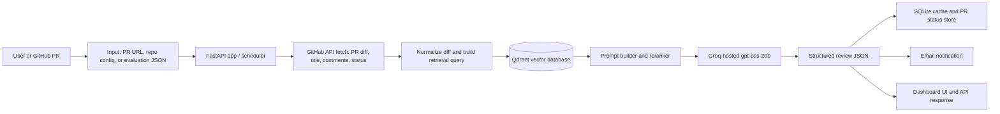

# Comprehensive Documentation Report

## A. Overview

### Purpose

The project is an automated pull request code-review system for Python code. Given a GitHub PR diff, it identifies a small set of guideline violations and returns structured review comments. The final system was designed to answer one core question: does retrieval-augmented generation improve code-review quality and grounding compared with a direct LLM baseline and static analysis tools?

The system focuses on five review categories:

- indentation
- naming_convention
- unused_import
- mutable_default
- documentation_formatting

### Architecture Summary

The deployed pipeline is a local FastAPI application that orchestrates GitHub ingestion, Qdrant retrieval, Groq-hosted LLM inference, SQLite persistence, and a Jinja2 dashboard. The high-level flow is:



In input-to-output terms:

1. Input arrives as a PR URL, raw code for evaluation, or a scheduled repo scan.
2. The application fetches diff and metadata from GitHub.
3. Relevant guideline chunks are retrieved from Qdrant and combined into a grounded prompt.
4. Groq returns a structured JSON review.
5. Results are cached in SQLite, shown in the dashboard, and optionally emailed to the configured maintainer.

### Deployed Components

| Component | What it does | Where it lives |
|---|---|---|
| Frontend dashboard | Jinja2-rendered HTML UI for inference, schedule, configuration, and evaluation | [src/deployment/templates/index.html](../../src/deployment/templates/index.html) |
| API server | REST endpoints, health/status routes, config routes, repo management, and inference entry points | [src/deployment/app.py](../../src/deployment/app.py) |
| Retrieval and review worker | GitHub polling, Qdrant sync, email notifications, repository rule management | [src/deployment/worker.py](../../src/deployment/worker.py) |
| Persistence layer | SQLite schema, caching, PR state, and dashboard stats | [src/deployment/db.py](../../src/deployment/db.py) |
| Retrieval corpus | Base guideline chunks and repository-specific rules | [src/deployment/corpus/retrival_corpus.json](../../src/deployment/corpus/retrival_corpus.json), [src/deployment/corpus/repo_corpus.json](../../src/deployment/corpus/repo_corpus.json) |
| Prompt templates | Review prompt used for RAG and naive LLM modes | [src/deployment/prompts/v1.txt](../../src/deployment/prompts/v1.txt) |
| Configuration | Runtime keys, retrieval settings, scheduler interval, and email configuration | [src/deployment/config.properties](../../src/deployment/config.properties) |
| Python dependencies | Install set for the live app | [src/deployment/requirements.txt](../../src/deployment/requirements.txt) |

The runtime stack is local by design: FastAPI on `localhost:8080`, Qdrant on `localhost:6333`, and SQLite in `src/deployment/review_app.db`.

---

## B. Technical Documentation

### 1. Environment Setup

#### Runtime requirements

- Python 3.10 or newer. The evaluation notes in Milestone 5 were produced on Python 3.12.6, Windows 11, and an 8 GB RAM machine.
- Docker for Qdrant.
- Internet access for GitHub API and Groq API calls.
- A GitHub personal access token, a Groq API key, and SMTP credentials for email notifications.

#### Dependency set

The live deployment uses [src/deployment/requirements.txt](../../src/deployment/requirements.txt). The root project also has a broader [requirements.txt](../../requirements.txt) for notebooks and supporting scripts.

Core runtime packages include:

- FastAPI and Uvicorn for the web server (includes a built-in asyncio background scheduler)
- Jinja2 for the HTML dashboard
- Groq for LLM inference
- qdrant-client for semantic retrieval
- sentence-transformers for embeddings
- pylint and flake8 for static-analysis baselines

#### Installation steps

```bash
git clone https://github.com/budhilnigam/Group-1-DS-and-AI-Lab-Project.git
cd Group-1-DS-and-AI-Lab-Project

docker run -d -p 6333:6333 qdrant/qdrant

cd src/deployment
pip install -r requirements.txt

python -m uvicorn app:app --host 0.0.0.0 --port 8080
```

#### Hardware notes

The app does not require a local GPU because the generative model is hosted by Groq. A standard development laptop is sufficient for the local deployment, although retrieval, GitHub polling, and Qdrant benefit from stable network connectivity and at least 8 GB RAM.

### 2. Data Pipeline

The project uses two main data streams: evaluation data and retrieval knowledge.

#### Evaluation data

- Final evaluation data lives in [data/processed/evaluation.json](../../data/processed/evaluation.json).
- The dataset contains 97 PR samples and 675 ground-truth review comments.
- This file is used by the evaluation endpoint and by the final quantitative analysis in Milestone 5.

#### Retrieval knowledge

- Base guideline chunks live in [src/deployment/corpus/retrival_corpus.json](../../src/deployment/corpus/retrival_corpus.json).
- Repository-specific rule chunks live in [src/deployment/corpus/repo_corpus.json](../../src/deployment/corpus/repo_corpus.json).
- At startup, the deployment loads this corpus into Qdrant through `sync_corpus_to_qdrant()`.

#### Preprocessing summary

The earlier milestones established the data-cleaning and labeling pipeline:

- PR diffs and comments were collected from GitHub.
- Comments were filtered to remove self-comments and bot noise.
- A linter-in-the-loop step mapped comments to the five target violation categories.
- Chunking was refined to preserve semantic code blocks instead of raw line windows.

Milestone 4 documents the final chunking and dataset refinement approach in detail, while Milestone 5 documents the evaluation dataset and the final scoring protocol.

#### Licensing and data location notes

- Project-owned artifacts are stored under `data/`, `outputs/`, `results/`, and `src/deployment/corpus/`.
- GitHub-sourced PR data should be treated as derivative of the original repositories and GitHub terms.
- The repository does not currently include a standalone open-source license file; see [docs/LICENSES.md](../LICENSES.md) for the current licensing note.

### 3. Model Architecture

The final deployed architecture is a retrieval-augmented review pipeline, not a fine-tuned local model.

#### Final architecture

1. The PR diff is normalized and queried against the retrieval corpus.
2. Qdrant returns semantically similar guideline chunks.
3. A reranker uses semantic similarity, lexical overlap, category bonus, and rank penalty.
4. The prompt builder assembles the diff and retrieved chunks into a strict JSON instruction.
5. Groq serves `openai/gpt-oss-20b` for generation.
6. The result is parsed into review comments and cached.

#### Selected hyperparameters

| Setting | Value | Notes |
|---|---|---|
| Model | `openai/gpt-oss-20b` | Hosted by Groq |
| Embedding model | `BAAI/bge-large-en-v1.5` | Used for retrieval vectors |
| Collection name | `guideline_embeddings` | Qdrant collection |
| Top-N candidates | 25 | Rerank input size |
| Final Top-K | 7 | Chunks passed to the prompt |
| Lexical weight | 0.35 | Reranking weight |
| Category bonus | 0.15 | Reranking boost |
| Rank penalty | 0.01 | Penalizes lower-ranked chunks |
| Max per category | 2 | Diversity cap |
| Scheduler interval | 1 minute | Default polling cadence |
| LLM retries | 2 | Retry cap for generation failures |

The reranking formula used in the final evaluation is:

$$
\text{rerank\_score} = \text{semantic\_score} + 0.35\cdot\text{lexical\_overlap} + \text{category\_bonus} - 0.01\cdot\text{rank\_idx}
$$

#### Architecture diagram


### 4. Development and Optimization Work

The project employs a **Retrieval-Augmented Generation (RAG)** approach rather than traditional fine-tuning. The core "training" process consists of data engineering and inference-time optimization.

#### 4.1 Data Preparation Pipeline

**Linter-in-the-Loop Strategy** (Milestone 4):
- Automated violation labeling using Flake8 and Pylint to map human PR comments to five violation categories
- Deterministic ground-truth assignment via static analysis tools rather than LLM-based labeling
- Mapping: `F401` → unused_import, `E1xx` → indentation, `W0102` → mutable_default, `C0103` → naming_convention, documentation via comment heuristics

**AST-Aware Chunking**:
- Structural parsing using Tree-sitter to preserve semantic code context
- Full function/class scope extraction instead of fixed ±10 line windows
- Fallback to sliding window for syntax-error files (old PRs)
- Ensures the LLM receives complete semantic context matching a human reviewer's perspective

**Multi-Stage Filtering**:
- Author-reviewer identity check to exclude self-comments
- Regex-based bot filtering (codecov, github-actions, etc.)
- Semantic signal word filtering (prioritize keywords like "should", "avoid", "naming", "fix")
- Diff context constraints (discard PRs >200 lines to focus on targeted changes)

#### 4.2 Synthetic Data Generation (Milestone 5)

**Controlled Violation Generation**:
- Created synthetic repositories for five frameworks: Flask, FastAPI, Django, pandas, scikit-learn
- Generated clean baseline code using LLM with explicit PEP 8 constraints
- Systematically injected single violation types per PR using LLM-guided corruption
- Collected review comments from GitHub discussions to create ground-truth annotations

**Evaluation Dataset Assembly**:
- Merged 97 PR samples with 675 ground-truth comments
- Multi-category violation examples with file snapshots
- Categories: unused_import (28.59%), naming_convention (26.67%), indentation (20.44%), documentation_formatting (13.63%), mutable_default (10.67%)

#### 4.3 Retrieval Corpus Development

**Guideline Knowledge Base**:
- 1000+ semantic chunks extracted from authoritative sources:
  - PEP 8, PEP 257 (Python standards)
  - Ruff, Flake8, Pylint (linter documentation)
  - Django, Flask, pandas, scikit-learn style guides
- Per-repository custom rules loaded into Qdrant for context-aware retrieval
- Metadata enrichment: category tags, source attribution, chunk IDs for citation

#### 4.4 Inference-Time Optimization

**Prompt Engineering**:
- Developed variant prompts for naive LLM review (prompt v1 selected)
- Tested different system instructions and JSON schema constraints
- Unified template used for both RAG and naive modes

**Query Strategy Development**:
- Variant 1: Simple query from diff text
- **Variant 2 (selected)**: AST-aware signal-based queries that emit semantic hints about potential violations
- 25 → 7 candidate reranking pipeline

**Reranking Formula Optimization**:
$$\text{score} = \text{semantic\_sim} + 0.35 \times \text{lexical\_overlap} + 0.15 \times \text{category\_bonus} - 0.01 \times \text{rank\_idx}$$
- Blended semantic, lexical, and category signals
- Top-K sweeps (tested K=5 to K=15)
- Per-category diversity caps (max 2 chunks per violation type)

**Hyperparameter Tuning**:
- Embedding model: BAAI/bge-large-en-v1.5
- Vector database migration: FAISS → Qdrant (for metadata filtering and hybrid search)
- Tested LLM temperature settings in earlier experiments
- Scheduler interval: 1 minute polling cadence
- LLM retry policy: max 2 retries on generation failures

#### 4.5 Development Summary

| Item | Details |
|---|---|
| Fine-tuning | Not performed; inference-only system |
| Model training | LLM hosted by Groq (`openai/gpt-oss-20b`); no local training |
| Data engineering effort | Significant: linter-in-the-loop labeling, AST chunking, filtering pipeline |
| Synthetic data | 5 frameworks, ~25 PRs per framework with injected violations |
| Experimentation | Query strategies, reranking weights, retrieval top-K, prompt variants |
| Evaluation cycles | Multiple runs on `data/processed/evaluation.json` (97 PRs, 675 comments) |
| Key outcome | Optimized RAG pipeline achieving 0.8322 F1 on successful outputs; identified reliability as primary constraint |

### 5. Evaluation Summary

Milestone 5 provides the final quantitative evaluation on `data/processed/evaluation.json`.

#### Main results

| Method | Empty/Non-JSON Rate | Micro Precision | Micro Recall | Micro F1 |
|---|---:|---:|---:|---:|
| Static Tool v2 | 0.0% | 0.7275 | 0.8385 | 0.7791 |
| Naive LLM v1 | 49.5% | 0.9677 | 0.6618 | 0.7860 |
| RAG + LLM | 74.2% | 0.9520 | 0.7391 | 0.8322 |

#### Interpretation

- RAG gave the best Micro F1 on successful outputs.
- Static Tool v2 remained the most reliable end-to-end because it never failed to return output.
- The main weakness of RAG in the current deployment is response reliability, not category quality.

#### Category-level insights

- `unused_import` and `mutable_default` were strongest for the RAG pipeline when valid JSON was returned.
- `documentation_formatting` and `indentation` were the hardest categories.
- Naive LLM remained strong on `naming_convention`, but it had lower recall than RAG.

### 6. Inference Pipeline

The deployed inference path is implemented in [src/deployment/app.py](../../src/deployment/app.py) and supported by [src/deployment/worker.py](../../src/deployment/worker.py) and [src/deployment/db.py](../../src/deployment/db.py).

#### Flow

1. Receive a PR URL or evaluation input.
2. Validate the repo and PR state.
3. Fetch the PR diff and comments from GitHub.
4. Build a RAG prompt using the configured corpus and retrieval settings.
5. Call the Groq model.
6. Parse the JSON response into review findings.
7. Cache the result and optionally send an email.

#### Example API call

```bash
curl -X POST "http://localhost:8080/api/inference" \
  -H "Content-Type: application/json" \
  -d '{
    "pr_url": "https://github.com/owner/repo/pull/123",
    "run_rag": true,
    "run_naive": false,
    "run_static": false
  }'
```

#### Example response shape

```json
{
  "RAG": [
    {
      "file": "app.py",
      "line": 42,
      "violation_category": "naming_convention",
      "description": "Variable name is not descriptive",
      "suggestion": "Use a clearer snake_case name"
    }
  ],
  "retrieved_chunks": ["..."],
  "prompts_used": {"RAG": "..."},
  "pr_meta": {
    "repo": "owner/repo",
    "number": 123,
    "title": "..."
  }
}
```

### 7. Deployment Details

#### Platform used

The current deployment is a local Python deployment on the developer machine. It is not hosted on Hugging Face Spaces, Render, or Streamlit in the present repository snapshot.

#### Hosting model

- Web app: FastAPI on `http://localhost:8080`
- Vector store: Qdrant on `http://localhost:6333`
- Database: local SQLite file in `src/deployment/review_app.db`
- LLM: Groq-hosted inference for `openai/gpt-oss-20b`

#### How to interact

- Open the dashboard at `http://localhost:8080`.
- Use the Inference tab for one-off PR review.
- Use the Evaluation tab for benchmark runs.
- Use the Schedule tab to manage repo polling and manual runs.
- Use the Configuration tab to inspect runtime values.

#### Example launch command

```bash
cd src/deployment
python -m uvicorn app:app --host 0.0.0.0 --port 8080
```

#### Example setup scripts

- Windows: `src/deployment/setup.bat`
- Unix-like systems: `src/deployment/setup.sh`

### 8. System Design Considerations

#### Modularity

The codebase separates concerns cleanly:

- `app.py` handles HTTP and dashboard logic.
- `worker.py` handles GitHub polling, Qdrant sync, and email delivery.
- `db.py` isolates SQLite state and cached results.
- `single_pr_model_output_metrics.py` encapsulates retrieval, prompt assembly, inference, and evaluation.

This structure makes it easier to swap one subsystem without rewriting the others.

#### Data flow

The data flow is intentionally staged so the system can support both online and offline use cases:

- Online usage: GitHub PR -> API -> retrieval -> LLM -> dashboard/email.
- Offline usage: evaluation JSON -> inference function -> metrics.

#### RAG-specific design choices

- Qdrant stores both embeddings and metadata payloads.
- Retrieval happens before generation so the LLM sees project-specific guidance.
- Repository-specific rules can be added without retraining.
- The reranker blends semantic, lexical, and category signals to reduce prompt noise.

#### Scalability considerations

- SQLite keeps the local deployment simple, but it is not ideal for high-concurrency production use.
- Qdrant supports persistent vector storage and could scale better than in-memory similarity search.
- The scheduler lock prevents overlapping full-run execution.
- Prompt-hash caching reduces duplicate inference cost when the same PR is reprocessed.

### 9. Error Handling and Monitoring

The current deployment uses practical, lightweight safeguards rather than a full observability stack.

#### Implemented safeguards

- Invalid PR URLs are rejected with clear error messages.
- Non-tracked repositories are blocked from inference.
- Closed PRs are rejected from the review path.
- GitHub comment fetch is best-effort and can fall back to an empty comment list.
- Scheduled runs are protected by a lock so only one run can execute at a time.
- `/health` and `/status` provide simple runtime checks.
- SQL caching and prompt hashes reduce repeated processing.

#### Monitoring notes

- Logging is handled through Python `logging` in the application and worker modules.
- Dashboard status pages show recent processed PRs and last-checked timestamps.
- The evaluation reports make output fragility visible through empty/non-JSON rates and line-localization counts.

### 10. Reproducibility Checklist

Use this list to reproduce the final deployment and evaluation state.

#### Required paths

- [src/deployment/app.py](../../src/deployment/app.py)
- [src/deployment/worker.py](../../src/deployment/worker.py)
- [src/deployment/db.py](../../src/deployment/db.py)
- [src/deployment/config.properties](../../src/deployment/config.properties)
- [src/deployment/requirements.txt](../../src/deployment/requirements.txt)
- [data/processed/evaluation.json](../../data/processed/evaluation.json)
- [src/deployment/corpus/retrival_corpus.json](../../src/deployment/corpus/retrival_corpus.json)
- [src/deployment/corpus/repo_corpus.json](../../src/deployment/corpus/repo_corpus.json)

#### Required secrets and config values

- `GITHUB_TOKEN`
- `GROQ_TOKEN`
- `QDRANT_URL`
- `SMTP_HOST`
- `SMTP_PORT`
- `SMTP_USER`
- `SMTP_PASSWORD`
- `REPOS_MAIL_MAP`

#### Reproducibility controls

- `SCHEDULE_INTERVAL=1`
- `CACHE_ENABLED=true`
- `LLM_MAX_RETRIES=2`
- Final retrieval settings from `config.properties`
- Selected retrieval run seed recorded in Milestone 5 as `RANDOM_SEED=42`

#### Reproducibility notes

- No fine-tuned checkpoints exist because the system is inference-only.
- The evaluation dataset and output artifacts are preserved in `data/processed/`, `outputs/`, and `results/`.
- To rerun the deployment, start Qdrant first, then the FastAPI app.

---

## C. User Documentation

This system is user-facing through the local dashboard at `http://localhost:8080`.

### App Overview

The app automatically reviews configured GitHub repositories for open pull requests. It is useful for:

- reviewing newly opened PRs
- checking whether a PR violates common Python style guidelines
- comparing RAG, naive LLM, and static-tool outputs
- reprocessing a PR after a new commit

### Input Description

Users can interact with the system in three main ways:

- paste a GitHub PR URL into the Inference tab
- run evaluation on code and ground truth data in the Evaluation tab
- configure repositories and schedules in the Schedule tab

### Output Description

The app returns structured findings with:

- file path
- line number
- violation category
- short description
- suggestion or correction

The dashboard also shows summary charts, processed PR history, repo status, and configuration state.

### Step-by-Step Instructions

#### How to launch the app

1. Start Qdrant with Docker.
2. Install dependencies from `src/deployment/requirements.txt`.
3. Populate `src/deployment/config.properties` with your own tokens and repo map.
4. Start the app with Uvicorn.
5. Open `http://localhost:8080`.

#### How to interact with it

1. Open the Inference tab to review a specific PR URL.
2. Select the analysis mode: RAG, naive LLM, or static tool.
3. Run the evaluation tab if you want metric comparison.
4. Use the Schedule tab to enable, disable, refresh, or reprocess tracked repositories.

#### Example queries or interactions

- `https://github.com/owner/repo/pull/123`
- run RAG only for a single PR
- reprocess a PR after a force-push
- trigger a manual schedule run

### Troubleshooting

- If the dashboard does not load, confirm that Uvicorn is running on port 8080.
- If retrieval fails, confirm that Qdrant is running on port 6333.
- If PR reviews return authentication errors, check `GITHUB_TOKEN` and repo permissions.
- If email does not send, verify SMTP values and use a Gmail app password if needed.
- If the app reports a closed PR, push a new commit or refresh PR status.

### Screenshots

This markdown report does not embed screenshots directly. For a final submitted PDF, capture the following from the running dashboard and insert them near this section:

- dashboard home page
- one completed inference result
- schedule activity log
- configuration tab with masked secrets

---

## D. API Documentation

### Base URL

For local deployment:

```text
http://localhost:8080
```

### Key Endpoints

#### `GET /health`

Health check with basic system status.

Example response:

```json
{
  "status": "ok",
  "processed_prs": 5,
  "repos_tracked": ["owner/repo"]
}
```

#### `GET /status`

Returns recent processed PRs and the last-checked timestamp for each tracked repository.

#### `POST /api/inference`

Runs code review for a single PR.

Request body:

```json
{
  "pr_url": "https://github.com/owner/repo/pull/123",
  "run_rag": true,
  "run_naive": false,
  "run_static": false
}
```

Example curl:

```bash
curl -X POST "http://localhost:8080/api/inference" \
  -H "Content-Type: application/json" \
  -d '{"pr_url":"https://github.com/owner/repo/pull/123","run_rag":true,"run_naive":false,"run_static":false}'
```

#### `POST /api/evaluate`

Runs the evaluation pipeline on either a single code sample or a batch of entries from `evaluation.json`.

#### `GET /api/schedule`

Lists tracked repositories and whether scheduled scanning is enabled.

#### `POST /api/schedule`

Enables or disables scheduled scanning for a repository.

#### `POST /api/schedule/run`

Triggers an immediate review cycle for all enabled repositories.

#### `GET /api/schedule/status`

Returns the paginated processed PR activity log.

#### `POST /api/schedule/refresh-status`

Refreshes open and closed PR state from GitHub.

#### `POST /api/schedule/reprocess`

Reprocesses a single PR by repo and PR number.

#### `GET /api/config` and `POST /api/config`

Reads and updates runtime configuration values. Sensitive values are masked in responses.

#### `GET /api/repos`, `POST /api/repos`, `DELETE /api/repos`

Manages tracked repositories and their notification email addresses.

#### `GET /api/repos/rules` and `POST /api/repos/rules`

Reads and adds repository-specific guideline rules.

#### `GET /api/prompts`, `POST /api/prompts`, `POST /api/prompts/reset`

Views and edits runtime prompt overrides.

#### `GET /api/dashboard`

Returns dashboard statistics, optionally filtered by repository.

### Response Format Notes

- Inference responses are JSON objects containing review lists and metadata.
- Errors are returned as JSON with an `error` field.
- Batch evaluation returns per-entry results plus aggregate metrics.

### Example response schema

```json
{
  "status": "ok",
  "repo": "owner/repo",
  "findings": 3,
  "used_cache": true,
  "email_sent": false
}
```

---

## E. Licensing and Dataset References

### Code license

- MIT License

### Dataset references

- `data/processed/evaluation.json` is the final evaluation dataset used for Milestone 5.
- `src/deployment/corpus/retrival_corpus.json` and `src/deployment/corpus/repo_corpus.json` are the deployed retrieval corpora.
- Any GitHub-derived PR data should respect source repository licenses and GitHub terms.

### Model sources

- Groq-hosted `openai/gpt-oss-20b`
- `BAAI/bge-large-en-v1.5` embedding model
- Qdrant for vector storage and retrieval

---

## F. Future Work and Maintenance Notes

### Possible extensions

- Add more violation categories beyond the current five.
- Add stronger parsing and repair logic for malformed LLM JSON.
- Move from local SQLite to a production database if concurrency increases.
- Add persistent observability dashboards for latency, error rate, and cache hit rate.
- Expose a hosted deployment on Render, Streamlit, or Hugging Face Spaces if public access is needed.

### Known limitations

- RAG currently has the best successful-output F1 but also the highest empty/non-JSON failure rate.
- SQLite is adequate for local development but not ideal for multi-user production workloads.
- The system is focused on Python style issues and does not yet generalize to broader semantic code review.
- Screenshots and public hosting are not part of the current repository snapshot.

### How to retrain or update the model

To update the system:

1. Edit the retrieval corpus or repository rules.
2. Update prompt templates.
3. Refresh Qdrant with the new chunks.
4. Re-run evaluation on `data/processed/evaluation.json`.
5. Compare the new metrics to the Milestone 5 baseline.

### Maintainers

Primary maintainers are the project team listed in [README.md](../../README.md). For handoff purposes, future maintainers should preserve:

- `config.properties` schema
- corpus file formats
- API response shapes
- evaluation dataset structure
